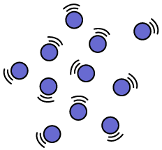
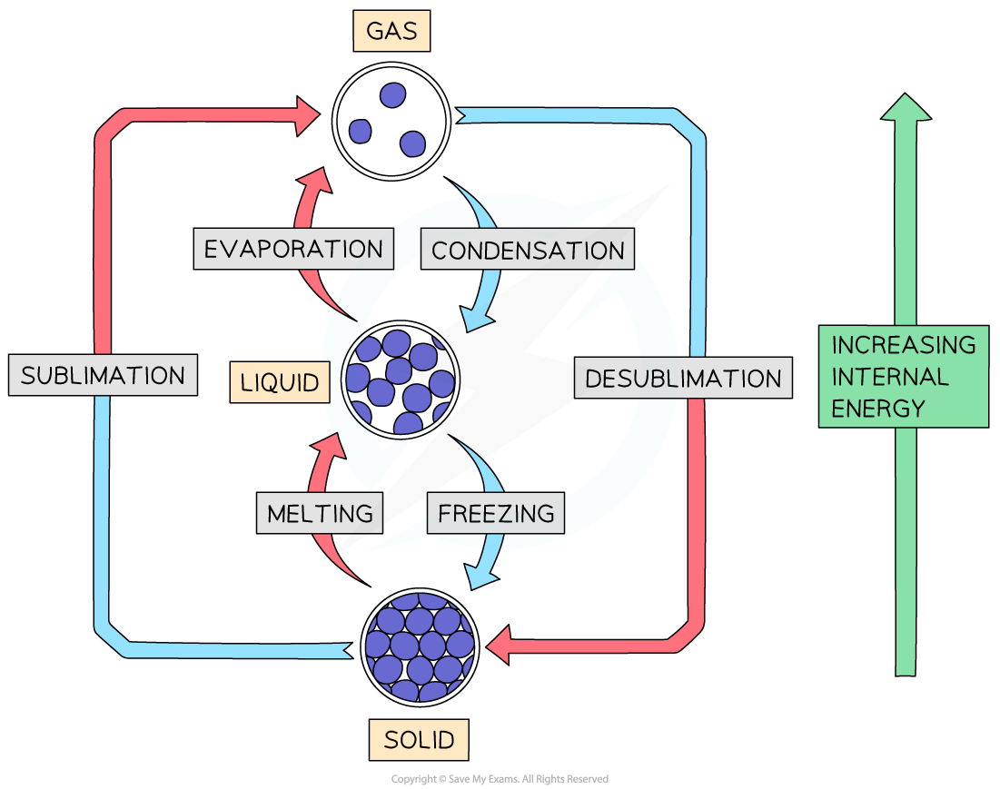

# Changing states of matter - IGCSE Chemistry Revision Notes

> ## Excerpt
> Learn abuot changing states of matter for IGCSE Chemistry. Understand how temperature affects state changes like melting, boiling, freezing, and condensation.

---
-   The three states of matter are **solids**, **liquids** and **gases**
    
-   A substance can usually exist in all three states, dependent on temperature (and pressure)
    
-   State changes occur at the **melting point** (solid to liquid, liquid to solid) and at the **boiling point** (liquid to gas and gas to liquid)
    
    -   Melting and freezing occur at the melting point
        
    -   Boiling and condensing take place at the boiling point
        
-   Individual atoms themselves do not share the same properties as bulk matter
    
-   The three states of matter can be represented by a simple model
    
    -   In this model, the particles are represented by small solid spheres
        

#### Summary of the properties of the three states of matter

|  | Solid | Liquid | Gas |
|--------------------------|------------------------------------------------------------------------|-------------------------------------------------------------------------------------------------------------|--------------------------------------------------------------------------------------------|
| **Diagram** |  |  |  |
| **Arrangement of particles** | Regular arrangement | Randomly arranged | Randomly arranged |
| **Movement of particles** | Vibrate about a fixed position | Move around each other | Move quickly in all directions |
| **Closeness of particles** | Very close | Close | Far apart |

## Changing states of matter

-   The amount of energy needed to change state from solid to liquid and from liquid to gas depends on the strength of the forces between the particles
    
-   The stronger the forces between the particles, the more energy that is needed to overcome them 
    
-   Therefore, the stronger the forces between the particles the higher the melting point and boiling point of the substance
    
-   Changing states is a **physical change**
    
    -   The particles themselves remain the same, it is just the forces between the particles which change 
        

### Melting

-   Melting is when a solid changes into a liquid
    
-   Heat / thermal energy absorbed by the particles is transformed into **kinetic** energy
    
-   This causes the particles to vibrate more and start to move / flow
    
-   Melting happens at a specific temperature, known as the **melting point** (m.p.) 
    

### Boiling / evaporation

-   Boiling and evaporation are both when a liquid changes into a gas
    
    -   However, there is a key difference between boiling and evaporation
        
-   In boiling, heat / thermal energy causes bubbles of gas to form **inside** the liquid, allowing for liquid particles to escape from the surface and within the liquid
    
-   Boiling happens at a specific temperature, known as the **boiling point** (b.p.)
    
-   Evaporation occurs over a **range** of temperatures
    
    -   It can happen at temperatures below the boiling point of the liquid
        
-   Evaporation occurs only at the **surface** of liquids where high energy particles can escape from the liquid's surface at **low** temperatures
    
-   The larger the surface area and the warmer the liquid surface, the more quickly a liquid can evaporate
    

### Freezing

-   Freezing is when a liquid changes into a solid
    
-   This is the reverse of melting and occurs at the **same** **temperature** as melting
    
    -   So, the melting point and freezing point of a pure substance are the same
        
    -   For example, water freezes and melts at 0 ºC
        
-   Freezing needs a significant decrease in temperature (or loss of thermal energy) and occurs at a specific temperature 
    

### Condensation

-   Condensation occurs when a gas changes into a liquid on cooling and takes place over a **range** of temperatures
    
-   When a gas is cooled its particles lose energy and when they bump into each other they lack the energy to bounce away again, instead, they group together to form a liquid
    

### Sublimation

-   When a solid changes directly into a gas
    
-   This happens to only a few solids, such as iodine or solid carbon dioxide
    
-   The reverse reaction also happens and is called desublimation or deposition
    

#### Changing states of matter

_**State changes require a change in the energy of the particles**_
