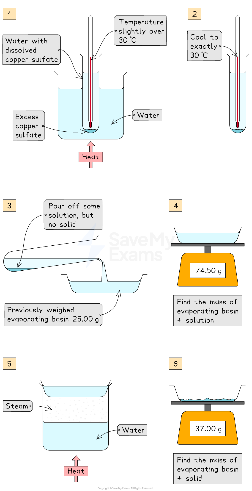

# Investigating solubility - IGCSE Chemistry Revision Notes

> ## Excerpt
> For IGCSE Chemistry, investigate how solubility is affected by temperature using ammonium chloride. Plot solubility curves for clearer analysis.

---
## Practical: Investigate the solubility of a solid in water at a specific temperature

### Aim

-   To find the solubility of a solid in water at a given temperature by preparing a saturated solution, evaporating the solvent, and measuring the mass of the solid obtained
    

### Method

1.  Weigh an empty evaporating basin using a balance and record its mass
    
2.  Warm a boiling tube of water to just above 30°C using a water bath or beaker of hot water
    
3.  Add copper(II) sulfate crystals to the water in the boiling tube and stir thoroughly until no more will dissolve and some undissolved solid remains at the bottom.  
    This ensures that the solution is saturated
    
4.  Allow the saturated solution to cool to exactly 30°C
    
5.  Pour a portion of the clear solution (without any solid) into the pre-weighed evaporating basin
    
    -   It is important that no undissolved copper(II) sulfate is transferred
        
6.  Weigh the evaporating basin and the solution together and record the total mass
    
7.  Gently heat the evaporating basin to evaporate all the water, taking care to avoid spitting or loss of solid
    
8.  When the water appears to have evaporated completely, allow the basin to cool slightly and then weigh it again
    
9.  Reheat, cool, and reweigh the basin once more
    
10.  Repeat this process until the mass remains constant
    
    -   This is called **heating to constant mass** and confirms that all water has been removed
        
11.  Calculate the solubility of copper(II) sulfate in water at 30°C using the masses recorded
    

_**Practical: Investigate the Solubility of a Solid in Water at a Specific Temperature**_

### Results

-   Mass of empty evaporating basin, mb = **25.00 g**
    
-   Mass of basin + saturated solution, mb\+ soln = **74.50 g**
    
-   Mass of basin + dry copper(II) sulfate (after heating to constant mass), mb + solid = **37.00 g**
    

#### Calculation

**Step 1**: Find the masses you need

-   **Mass of solution**
    

m(soln) = mb + soln − mb = 74.50 − 25.00 = **49.50 g**

-   **Mass of dissolved solute (CuSO**<b>4</b>**.5H**<b>2</b>**O)**
    

m(solute) = mb + solid − mb = 37.00 − 25.00 = **12.00 g**

-   **Mass of water**
    

m(water) = m(soln) − m(solute) = 49.50 − 12.00 = **37.50 g**

**Step 2**: Calculate solubility (g solute per 100 g water)

Solubility at 30 °C = $\frac{m(\mathrm{solute})}{m(\mathrm{water})}$ x 100

$\frac{12.00}{37.50}$ x 100 = 32.0 g per 100 g 

**Step 3**: Express as mass percentage of the solution

% solute in solution = $\frac{12.00}{49.50}$ x 100 = 24.2%   

#### Examiner Tips and Tricks

“Heating to constant mass” means:

1.  Reheating
    
2.  Cooling
    
3.  Reweighing until two consecutive masses are the same
    

This confirms all water has been removed.
