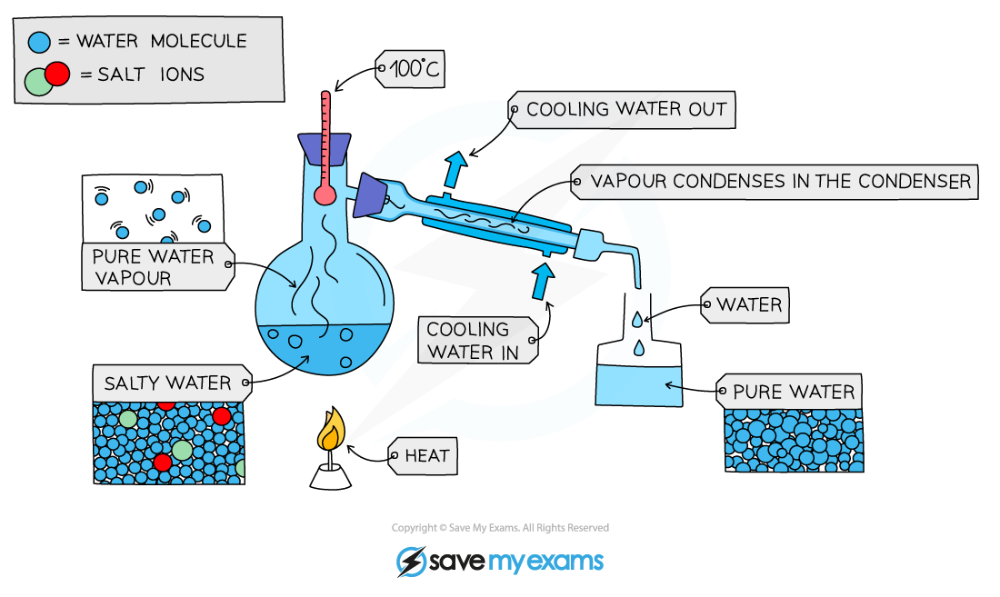
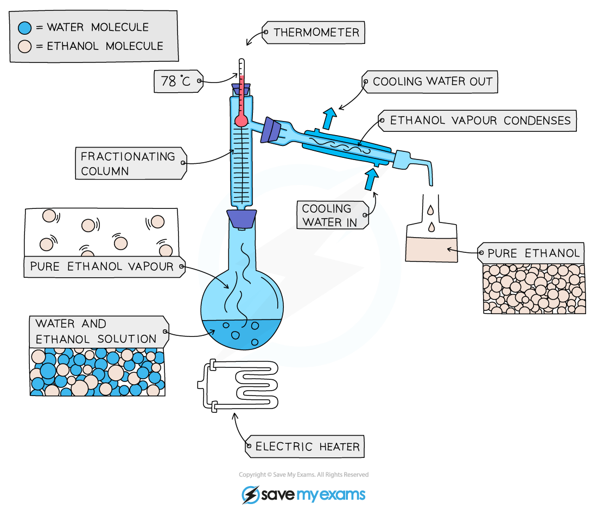
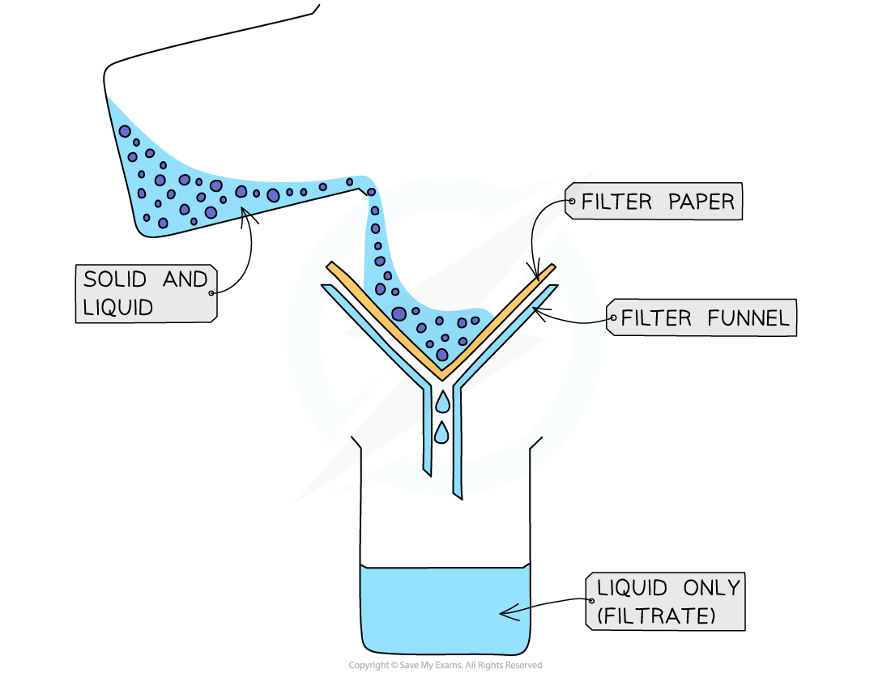

# Separation techniques - IGCSE Chemistry Revision Notes

> ## Excerpt
> For IGCSE Chemistry, learn about separation techniques like simple and fractional distillation, filtration, crystallisation and chromatography, with examples.

---
## Simple distillation

-   Simple distillation is used to separate a liquid and **soluble solid** from a solution (e.g., water from a solution of salt water) or a pure liquid from a mixture of liquids
    
-   The solution is heated, and pure water evaporates producing a vapour which rises through the neck of the round bottomed flask
    
-   The vapour passes through the condenser, where it cools and condenses, turning into the pure liquid that is collected in a beaker
    
-   After all the water is evaporated from the solution, only the solid solute will be left behind
    

#### Simple distillation

_**Diagram showing the distillation of a mixture of salt and water**_

#### Examiner Tips and Tricks

If asked to draw or label a diagram of simple distillation, make sure that the water goes in at the bottom of the condenser near the collecting beaker, and comes out at the top near the column.

## Fractional distillation

-   Fractional distillation is used to separate two or more liquids that are **miscible** with one another (e.g., ethanol and water from a mixture of the two)
    
-   The solution is heated to the temperature of the substance with the lowest boiling point
    
-   This substance will rise and evaporate first, and vapours will pass through a condenser, where they cool and condense, turning into a liquid that will be collected in a beaker
    
-   All of the substance is evaporated and collected, leaving behind the other components(s) of the mixture
    
-   For water and ethanol
    
    -   Ethanol has a boiling point of 78 ºC and water of 100 ºC
        
    -   The mixture is heated until it reaches 78 ºC, at which point the ethanol boils and distills out of the mixture and condenses into the beaker
        
-   When the temperature starts to increase to 100 ºC heating should be stopped. Water and ethanol are now separated
    

#### Fractional distillation apparatus

_**Fractional distillation of a mixture of ethanol and water**_

## Filtration

-   Filtration is used to separate an **undissolved solid** from a mixture of the solid and a liquid / solution ( e.g., sand from a mixture of sand and water)
    
    -   Centrifugation can also be used for this mixture
        
-   A piece of filter paper is placed in a filter funnel above a beaker
    
-   A mixture of insoluble solid and liquid is poured into the filter funnel
    
-   The filter paper will only allow small liquid particles to pass through as filtrate
    
-   Solid particles are too large to pass through the filter paper so will stay behind as a residue
    

#### The filtration process

_**Filtration of a mixture of sand and water**_

## Crystallisation

-   Crystallisation is used to separate a **dissolved solid** from a solution, when the solid is much more soluble in hot solvent than in cold (e.g., copper sulphate from a solution of copper (II) sulphate in water)
    
-   The solution is heated, allowing the solvent to evaporate, leaving a saturated solution behind
    
-   Test if the solution is saturated by dipping a clean, dry, cold glass rod into the solution
    
    -   If the solution is saturated, crystals will form on the glass rod
        
-   The saturated solution is allowed to cool slowly
    
-   Crystals begin to grow as solids will come out of solution due to decreasing solubility
    
-   The crystals are collected by filtering the solution, they are washed with cold distilled water to remove impurities and are then allowed to dry
    

#### The process of crystallisation

_**Diagram showing the process of crystallisation**_

## Paper chromatography

-   Paper chromatography is used to separate substances that have **different** **solubilities** in a given solvent (e.g. different coloured inks that have been mixed to make black ink)
    
-   A **pencil** **line** is drawn on chromatography paper and spots of the sample are placed on it
    
    -   Pencil is used for this as ink would run into the chromatogram along with the samples
        
-   The paper is then lowered into the solvent container
    
    -   The pencil line must sit **above** the level of the solvent so the samples don´t wash into the solvent container
        
-   The solvent travels up the paper by **capillary action**, taking some of the coloured substances with it
    
-   Different substances have different solubilities so will travel at different rates
    
    -   This causes the substances to separate
        
    -   Those substances with higher solubility will travel further than the others
        
-   This will show the different components of the ink / dye
    

_**Analysis of the composition of ink using paper chromatography**_

#### Worked Example

Sodium chloride is a soluble solid.

Name the technique used to separate a soluble solid from a solution?

| **A** | filtration |
|-----|---------------------|
| **B** | simple distillation |
| **C** | crystallisation |
| **D** | chromatography |

  
**Answer**

-   The correct answer is **C**
    
-   Soluble solids are separated by gently heating the solution until the solvent evaporates and the solid crystallises
    
-   Notice the question asks for the separation of the solid, not the liquid from the solution. If it asked for the liquid, **B** would be the correct answer
    

#### Examiner Tips and Tricks

Paper chromatography is the name given to the **overall** separation technique while a **chromatogram** is the name given to the **visual** **output** of a chromatography run. This is the piece of chromatography paper with the visibly separated components after the run has finished.

Was this revision note helpful?
