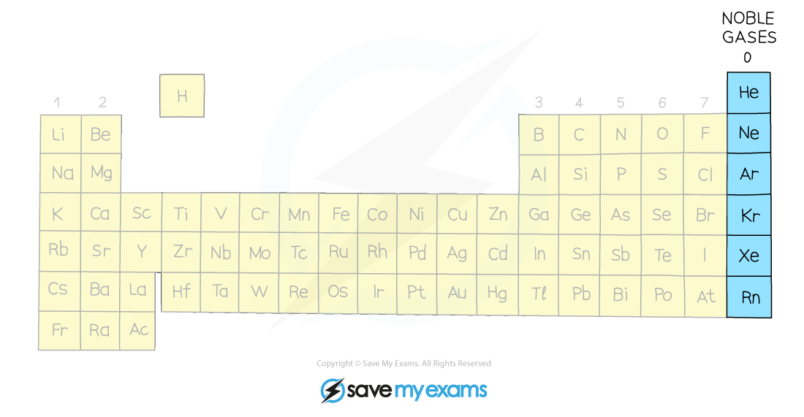

# Electronic Configuration & Reactivity | Edexcel IGCSE Chemistry Revision Notes 2017

> ## Excerpt
> Revision notes on Electronic Configuration & Reactivity for the Edexcel IGCSE Chemistry syllabus, written by the Chemistry experts at Save My Exams.

---
## Chemical properties

#### Chemical properties of elements in the same group

-   Elements in the same group in the Periodic Table will have **similar chemical properties**
    
-   This is because they have the **same number of outer electrons** so will react and bond similarly
    
-   The group number of an element which is given on the Periodic Table indicates the number of electrons in the outer shell
    
    -   This rule holds true for all elements except helium; although is in Group 0, it has only one shell, the first and innermost shell, which holds only 2 electrons
        

-   We can use the group number to predict how elements will react as the number of outer shell electrons in an element influences how the element reacts.
    
-   Therefore, elements in the same group react similarly
    
    -   By observing the reaction of one element from a group, you can predict how the other elements in that group will react
        
    -   By reacting two or more elements from the same group and observing what happens in those reactions you can make predictions about reactivity and establish trends in reactivity in that group
        
-   For example, lithium, sodium and potassium are in Group 1 and can all react with elements in Group 7 to form an ionic compound
    
-   The Group 1 metals become **more reactive** as you move down the group while the Group 7 elements show a **decrease** in reactivity moving down the group
    

## Why are noble gases unreactive?

-   The elements in Group 0 of the [Periodic Table](https://www.savemyexams.com/igcse/chemistry/edexcel/19/revision-notes/1-principles-of-chemistry/1-4-the-periodic-table/1-4-1-periodic-table-basics/) are called the noble gases
    
-   Noble gases are:
    
    -   Non-metals
        
    -   Monatomic (exist as single atoms)
        
    -   Colourless and non-flammable gases at room temperature
        
-   Most elements participate in reactions to complete their outer shells by losing, gaining, or sharing electrons
    
-   Group 0 elements do **not** do this because they have **full outer shells of electrons** 
    
    -   They are therefore **unreactive (inert)** and do not form molecules easily
        
-   Most noble gases have 8 electrons in their outer shell, except helium which has 2
    
-   [Electronic configurations](https://www.savemyexams.com/igcse/chemistry/edexcel/19/revision-notes/1-principles-of-chemistry/1-4-the-periodic-table/1-4-2-electronic-configurations/) of the noble gases:
    
    -   He = 2
        
    -   Ne = 2, 8
        
    -   Ar =  2, 8, 8
        
    -   Kr =  2, 8, 18, 8
        
    -   Xe = 2, 8, 18, 18, 8
        

#### The noble gases

_**Noble gases are located in the last group on the right hand side of the Periodic Table**_

#### Examiner Tips and Tricks

You do not need to know specific uses of noble gases but be aware that they are useful in many applications due to their inertness.

Was this revision note helpful?
