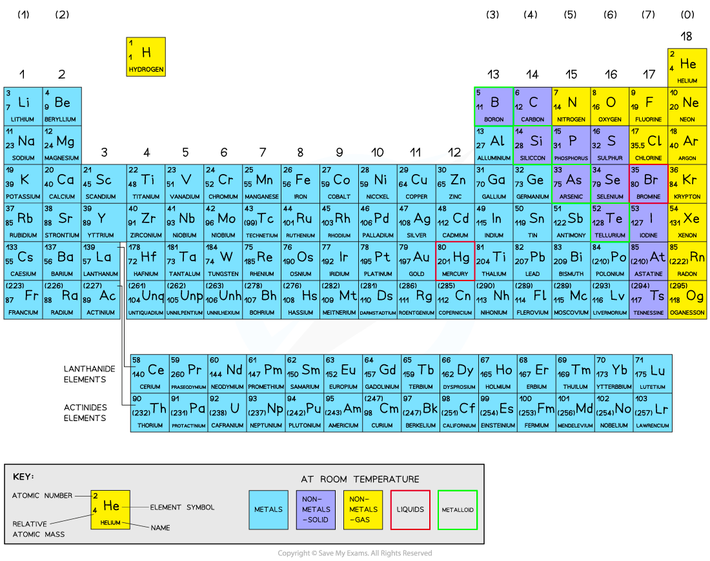

# Periodic Table: Basics | Edexcel IGCSE Chemistry Revision Notes 2017

> ## Excerpt
> Edexcel IGCSE ChemistryRevision NotesPeriodic Table: Basics Exam code: 4CH1Download PDFWritten by: Stewart HirdReviewed by: Lucy KirkhamUpdated on 21 August 2024Guided study available on this topicUnd

---
[Edexcel IGCSE Chemistry](https://www.savemyexams.com/igcse/chemistry/edexcel/)[Revision Notes](https://www.savemyexams.com/igcse/chemistry/edexcel/19/revision-notes/)

# Periodic Table: Basics

**Exam code:** 4CH1

Download PDF

**Written by:** [Stewart Hird](https://www.savemyexams.com/authors/stewart-hird/)

**Reviewed by:** [Lucy Kirkham](https://www.savemyexams.com/authors/lucy-kirkham/)

Updated on 21 August 2024

Guided study available on this topic

Understand this topic with deeper explanations and understanding checks.

Start guided study

## The periodic table

-   There are over 100 chemical elements which have been isolated and identified
    
-   Elements are arranged on the Periodic table in order of **increasing atomic number**
    
    -   Each element has one proton **more** than the element preceding it
        
    -   This is done so that elements end up in columns with other elements which have similar properties
        
-   The table is arranged in vertical columns called **groups** and in rows called **periods**
    
    -   **Period:** These are the horizontal rows that show the number of shells of electrons an atom has and are numbered from 1 - 7
        
        -   E.g. Elements in Period 2 have two electron shells, elements in Period 3 have three electron shells
            
    -   **Group:** These are the vertical columns that show how many outer electrons each atom has and are numbered from 1 – 7, with a final group called Group 0 (instead of group 8)
        
        -   E.g. Group 4 elements have atoms with 4 electrons in the outermost shell, Group 6 elements have atoms with 6 electrons in the outermost shell and so on
            

#### The periodic table

_**The Periodic Table of the Elements**_

#### Examiner Tips and Tricks

The atomic number is unique to each element and could be considered as an element's “fingerprint”.

The number of electrons changes during chemical reactions, but the atomic number does not change.

[Test yourself](https://www.savemyexams.com/igcse/chemistry/edexcel/19/topic-questions/1-principles-of-chemistry/1-4-the-periodic-table/exam-questions/)[Flashcards](https://www.savemyexams.com/igcse/chemistry/edexcel/19/flashcards/1-principles-of-chemistry/1-4-the-periodic-table/)

Was this revision note helpful?

YesNo

[

Previous:Calculate Relative Atomic Mass](https://www.savemyexams.com/igcse/chemistry/edexcel/19/revision-notes/1-principles-of-chemistry/1-3-atomic-structure/1-3-2-calculate-relative-atomic-mass/)[Next:Electronic Configurations

](https://www.savemyexams.com/igcse/chemistry/edexcel/19/revision-notes/1-principles-of-chemistry/1-4-the-periodic-table/1-4-2-electronic-configurations/)

Ask about this

Download notes on Periodic Table: Basics
