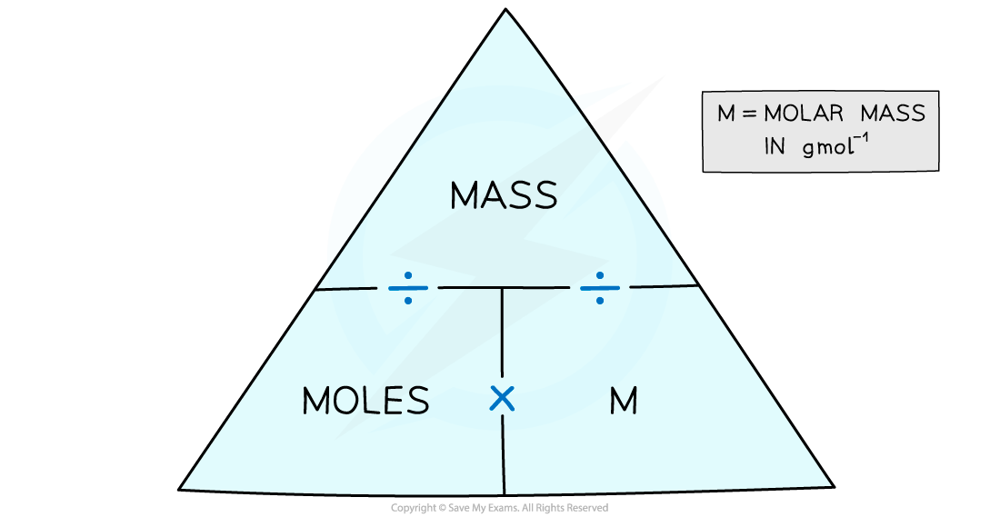

# Calculating moles and mass - IGCSE Chemistry Revision Notes

> ## Excerpt
> Learn how to calculate moles and mass for IGCSE Chemistry. Explore Avogadro's constant and molar mass, all with helpful worked examples and formulas.

---
## The mole

-   Chemical amounts are measured in moles
    
-   The symbol for the unit mole is **mol**
    
-   One mole of a substance contains the same number of the stated particles, atoms, molecules, or ions as one mole of any other substance
    
-   The number of atoms, molecules or ions in a mole (1 mol) of a given substance is the **Avogadro constant**.
    
    -   The value of the Avogadro constant is **6.02 x 10**<b>23 </b> **per mole**
        
-   **For example:**
    
    -   One mole of sodium (Na) contains  6.02 x 1023  **atoms** of sodium
        
    -   One mole of hydrogen (H2) contains  6.02 x 1023  **molecules** of hydrogen
        
    -   One mole of sodium chloride (NaC_l_) contains  6.02 x 1023  **formula units** of sodium chloride
        

-   The mass of 1 mole of a substance is known as the **molar mass**
    
    -   For an element, it is the same as the **[relative atomic mas](https://www.savemyexams.com/igcse/chemistry/edexcel/19/revision-notes/1-principles-of-chemistry/1-3-atomic-structure/1-3-2-calculate-relative-atomic-mass/)****s** written in grams
        
    -   For a compound, it is the same as the **[relative molecular](https://www.savemyexams.com/igcse/chemistry/edexcel/19/revision-notes/1-principles-of-chemistry/1-5-chemical-formulae-equations-calculations/1-5-2-calculate-relative-mass/)** or **formula mass** in grams
        
-   If you had 6.02 x 1023 atoms of carbon in your hand, that number of carbon atoms would have a mass of 12 g (because the Ar  of carbon is 12)
    
-   So one mole of helium atoms would have a mass of 4 g (Ar  of He is 4), one mole of lithium would have a mass of 7 g (Ar  of Li is 7) and so on
    
-   To find the mass of one mole of a compound, we add up the relative atomic masses
    
    -   So one mole of water would have a mass of (2 x 1) + 16 = 18 g
        
    -   So one carbon atom has the same mass as 12 hydrogen atoms
        

#### Examiner Tips and Tricks

You need to appreciate that the measurement of amounts in moles can apply to atoms, molecules, ions, electrons, formulae and equations. E.g. in one mole of carbon (C) the number of atoms is the same as the number of molecules in one mole of carbon dioxide (CO2).

## Calculating moles and masses

-   Although elements and chemicals react with each other in **molar ratios**, in the laboratory we use digital balances and grams to measure quantities of chemicals as it is impractical to try and measure out moles
    
-   Therefore we have to be able to convert between moles and grams
    
-   We can use the following formula to convert between moles, mass in grams and the molar mass:
    

_**Formula triangle for moles, mass and molar mass**_

#### Worked Example

What is the mass of 0.250 moles of zinc?

**Answer:**

-   From the Periodic Table the relative atomic mass of Zn is 65.38
    
-   So, the molar mass is 65.38 g mol-1
    
-   The mass is calculated by **moles x molar mass**
    
-   This comes to 0.250 mol x 65.38 g mol-1 = **16.3 g**
    

#### Worked Example

How many moles are in 2.64 g of sucrose, C12H22O11&nbsp;  (_M_r = 342.3)?

**Answer:**

-   The molar mass of sucrose is 342.3 g mol-1
    
-   The number of moles is found by **mass ÷ molar mass**
    
-   This comes to  2.64 g ÷ 342.3 g mol-1 = **7.71 x 10**<b>-3</b> **mol**
    

#### Examiner Tips and Tricks

Always show your workings in calculations as its easier to check for errors and you may pick up credit if you get the final answer wrong.

Was this revision note helpful?
