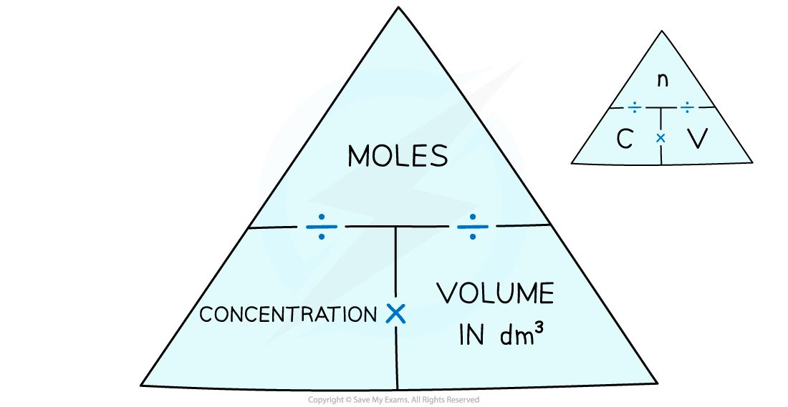

# Solution concentration - IGCSE Chemistry Revision Notes

> ## Excerpt
> Learn how to calculate solution concentration in IGCSE Chemistry, including converting between cm³ and dm³ and using moles in worked examples.

---
## Calculate Concentrations of Solutions

-   A **solute** is a solid substance that dissolves into a liquid 
    
    -   The amount of solute can be expressed in **grams (g)** or **moles (mol)**
        
-   A **solvent** is the liquid that a solute dissolves in 
    
    -   The amount / volume of a solvent is measured in **cm**<b>3</b> or **dm**<b>3</b>
        
-   Most chemical reactions occur between solutes which are dissolved in solvents, such as water or an organic solvent
    
-   A **solution** is the mixture formed when a solute dissolves in a solvent 
    
    -   The amount / volume of a solution measured in **cm**<b>3</b> or **dm**<b>3</b> 
        
-   **Concentration** refers to the amount of solute there is in a specific volume of the solvent
    
    -   The greater the amount of solute in a given volume, the greater the concentration
        
    -   Concentration is sometimes commonly referred to as strength
        
        -   For example, dissolving more coffee in hot water results in a stronger coffee
            

-   Typically, concentration is expressed in terms of the amount of substance per dm3  
    
    -   Therefore, the units of concentration are:
        
        -   **g / dm**<b>3</b> 
            
        -   **mol / dm**<b>3</b>
            
-   It is more useful to a chemist to express concentration in terms of moles per unit volume rather than mass per unit volume
    
-   To calculate concentration in mol / dm3 we use the following equation:
    

$\mathrm{concentration}\text{}(\mathrm{mol}/\mathrm{dm}^{3})\text{}=\text{}\frac{\mathrm{number}\text{}\mathrm{of}\text{}\mathrm{moles}\text{}\mathrm{of}\text{}\mathrm{solute}\text{}(\mathrm{mol})}{\mathrm{volume}\text{}\mathrm{of}\text{}\mathrm{solution}\text{}(\mathrm{dm}^{3})}$

_**The concentration-moles formula triangle**_ 

-   Volumes are often expressed in cm3, but dm3 must be used when calculating concentration 
    
    -   To convert cm3 to dm3, divide by 1000
        
    -   To convert dm3 to cm3, multiply by 1000
        

_**Converting between cm**_<i><b>3</b></i> _**and dm**_<i><b>3</b></i>

#### Worked Example

Calculate the amount of solute, in moles, present in 2.5 dm3 of a solution whose concentration is 0.2 mol / dm3.

**Answer:**

-   Write down the information you are given in the question:
    
    -   Concentration of solution: 0.2 mol / dm3
        
    -   Volume of solution: 2.5 dm3 
        
-   Calculate the number of moles:
    
    -   Moles = concentration x volume
        
    -   Moles = 0.2 x 2.5 = **0.5 mol**
        

#### Worked Example

Calculate the concentration of a solution of sodium hydroxide, NaOH, in mol / dm3, when 80 g is dissolved in 500 cm3&nbsp; of water.

Relative atomic masses, _A_r:  Na = 23;   H = 1;   O = 16

**Answer:**

-   Calculate the _M_r of NaOH:
    
    -   23 + 16 + 1 = 40
        
-   Determine the number of moles of NaOH:
    
    -   40 g = 1 mole
        
    -   So, 80 g = 2 moles
        
-   Convert cm3 to dm3:
    
    -   $\frac{500}{1000}$ = 0.5 dm3 
        
-   Calculate the concentration:
    
    -   Concentration = $\frac{\mathrm{moles}}{\mathrm{volume}}$
        
    -   Concentration = $\frac{2}{0.5}$ = 4 mol / dm3
        

#### Worked Example

25.0 cm3 of 0.050 mol / dm3 sodium carbonate was completely neutralised by 20.00 cm3 of dilute hydrochloric acid. Calculate the concentration in mol / dm3 of the hydrochloric acid.

Na2CO3 + 2HCl → 2NaCl + H2O + CO2 

**Answer:**

-   Calculate the moles of sodium carbonate:
    
    -   Moles of Na2CO3 = concentration x volume
        
        -   **Remember:** The volume needs to be in dm3 
            
    -   Moles of Na2CO3 = 0.05 x $\frac{25.0}{1000}$ = 0.00125
        
-   Calculate the moles of hydrochloric acid:
    
    -   The balanced symbol equation shows that 1 mole of Na2CO3 reacts with 2 moles of HCl
        
    -   So, 0.00125 moles of Na2CO3 reacts with 0.00250 moles of HCl
        
-   Calculate the concentration of hydrochloric acid:
    
    -   Concentration = $\frac{\mathrm{moles}}{\mathrm{volume}}$
        
        -   **Remember:** The volume needs to be in dm3 
            
        -   20 cm3 ÷ 1000 = 0.02 dm3 
            
    -   Concentration = $\frac{0.00250}{0.02}$ = 0.125 mol / dm3 
        

#### Examiner Tips and Tricks

Don't forget your unit conversions:

To go from cm3 to dm3  : divide by 1000

To go from dm3 to cm3  : multiply by 1000

Was this revision note helpful?
