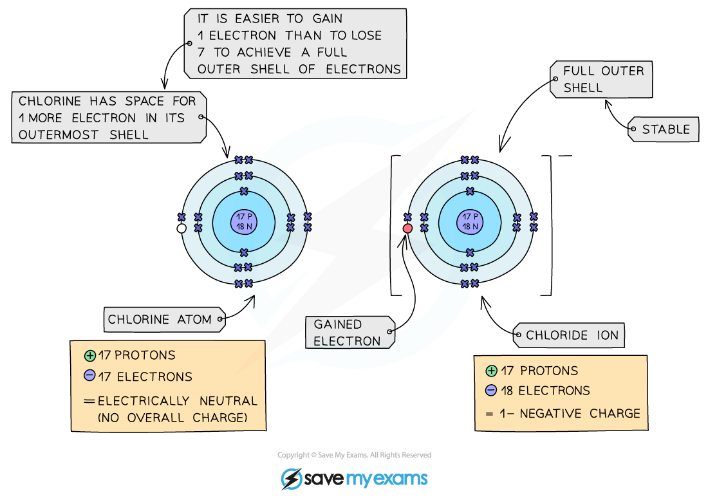

# Formation of ions - IGCSE Chemistry Revision Notes

> ## Excerpt
> Edexcel IGCSE ChemistryRevision NotesFormation of Ions Exam code: 4CH1Download PDFWritten by: Stewart HirdReviewed by: Lucy KirkhamUpdated on 23 October 2024Guided study available on this topicUnderst

---
[Edexcel IGCSE Chemistry](https://www.savemyexams.com/igcse/chemistry/edexcel/)[Revision Notes](https://www.savemyexams.com/igcse/chemistry/edexcel/19/revision-notes/)

# Formation of Ions

**Exam code:** 4CH1

Download PDF

**Written by:** [Stewart Hird](https://www.savemyexams.com/authors/stewart-hird/)

**Reviewed by:** [Lucy Kirkham](https://www.savemyexams.com/authors/lucy-kirkham/)

Updated on 23 October 2024

Guided study available on this topic

Understand this topic with deeper explanations and understanding checks.

Start guided study

## Formation of ions

-   An ion is an **electrically** **charged** atom or group of atoms formed by the **loss** or **gain** of **electrons**
    
-   This loss or gain of electrons takes place to obtain a **full** **outer** **shell** of electrons
    
-   The electronic structure of ions of elements in groups 1, 2, 3, 5, 6 and 7 will be the same as that of a noble gas - such as helium, neon, and argon
    
-   Negative ions are called **anions** and form when atoms **gain** electrons, meaning they have more electrons than protons
    
-   Positive ions are called **cations** and form when atoms **lose** electrons, meaning they have more protons than electrons
    
-   All metals **lose** electrons to other atoms to become positively charged ions
    
-   All non-metals **gain** electrons from other atoms to become negatively charged ions
    

#### Formation of cations

_**Diagram showing the formation of the sodium ion**_

#### Formation of anions

_**Diagram showing the formation of the chloride ion**_

#### Examiner Tips and Tricks

The number of electrons that an atom gains or loses is the same as the charge.

For example, if a magnesium atom loses 2 electrons, then the charge will be 2+, if a bromine atom gains 1 electron then the charge will be 1-.

[Test yourself](https://www.savemyexams.com/igcse/chemistry/edexcel/19/topic-questions/1-principles-of-chemistry/1-6-ionic-bonding/exam-questions/)[Flashcards](https://www.savemyexams.com/igcse/chemistry/edexcel/19/flashcards/1-principles-of-chemistry/1-6-ionic-bonding/)

Was this revision note helpful?

YesNo

[

Previous:Calculate Volumes of Gases](https://www.savemyexams.com/igcse/chemistry/edexcel/19/revision-notes/1-principles-of-chemistry/1-5-chemical-formulae-equations-calculations/1-5-10-calculate-volumes-of-gases/)[Next:Common Ions

](https://www.savemyexams.com/igcse/chemistry/edexcel/19/revision-notes/1-principles-of-chemistry/1-6-ionic-bonding/1-6-2-common-ions/)

Ask about this

Download notes on Formation of Ions
