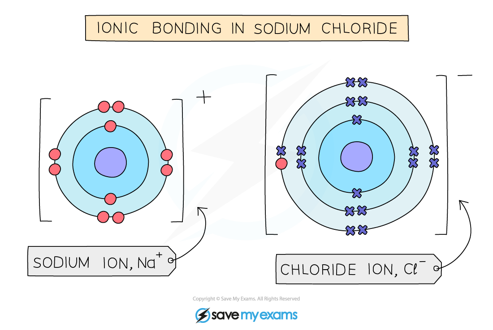

# Ionic bonding and lattices - IGCSE Chemistry Revision Notes

> ## Excerpt
> For IGCSE Chemistry, explore ionic bonding and lattices. Learn why ionic compounds have high melting points and conduct electricity when molten or in solution.

---
-   An ionic compounds consists of a regular arrangement of alternating positive and negative ions in which the ions are tightly packed together
    
-   Between positive and negative ions are **strong electrostatic forces of attraction** which act in all directions
    
-   These are what hold the ionic compound together 
    

_**Electrostatic forces of attraction exist between the oppositely charged ions**_

## Ionic lattices

-   Thousands of positive and negative ions in an ionic compound form a **giant lattice structure**
    
-   Compounds with giant ionic lattice have **high melting points** 
    

#### Giant ionic lattice of sodium chloride

_**Strong electrostatic forces act in all directions in an ionic solid such as sodium chloride**_

-   Ionic compounds have **high melting** and **boiling points** because:
    
    -   They have **giant** ionic lattices
        
    -   There are **strong** electrostatic forces of attraction between oppositely charged ions in all directions
        
    -   The forces need lots of **thermal energy** to overcome them 
        
-   The greater the charge on the ions, the stronger the electrostatic forces and the higher the melting point will be
    
    -   For example, magnesium oxide consists of Mg2+&nbsp; and O2- so will have a higher melting point than sodium chloride which contains the ions, Na+ and Cl-
        

## Conductivity of ionic compounds

-   For electrical current to flow there must be freely moving charged particles such as electrons or ions present 
    
-   Ionic compounds are **poor conductors in the solid state**
    
    -   The ions are in fixed positions in the lattice
        
    -   They are therefore unable to move and carry a charge 
        
-   Ionic compounds are **good conductors of electricity in the molten state or in solution** 
    
    -   When the ionic compound is melted or dissolved in water, the ions are able to move and carry a charge
        

_**Molten or aqueous particles move and conduct electricity but cannot in the solid state**_

#### Examiner Tips and Tricks

A common mistake students make in exams is to say that ionic compounds conduct electricity because 'electrons' move and carry a charge, when they should say the **ions** can move and carry a charge. Don't make that mistake!

Was this revision note helpful?
