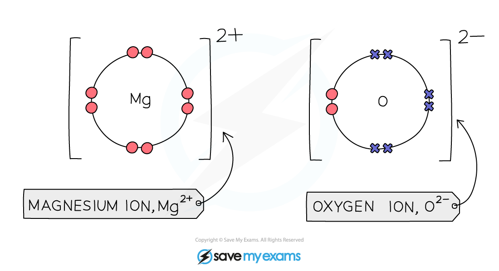

# Ionic bonding diagrams - IGCSE Chemistry Revision Notes

> ## Excerpt
> Learn about ionic bonding diagrams for IGCSE Chemistry. Understand how ionic bonding is shown using dot-and-cross diagrams, with NaCl and MgO examples.

---
## Dot and cross diagrams for ionic compounds

-   Ionic bonds can be represented diagrammatically using **dot-and-cross diagrams**

    -   The electrons from each atom should be represented by using solid dots and crosses

    -   If there are more than two atoms, then hollow circles or other symbols / colours may be used to make it clear

    -   The large square brackets should encompass each atom and the charge should be in superscript and on the right-hand side, outside the brackets

### Sodium chloride dot and cross diagram

-   Sodium is a Group 1 metal so will lose one outer electron to another atom to gain a full outer shell of electrons

-   A positive sodium ion with the charge 1+ is formed

-   Chlorine is a Group 7 non-metal so will need to gain an electron to have a full outer shell of electrons

-   One electron will be transferred from the outer shell of the sodium atom to the outer shell of the chlorine atom

-   A chlorine atom will gain an electron to form a negatively charged chloride ion with a charge of 1-

-   The formula of sodium chloride is NaCl

#### Dot and cross diagram for sodium chloride 

_**Sodium loses one electron, and chlorine gains one electron.**_ 

### Magnesium oxide dot and cross diagram

-   Magnesium is a group 2 metal so will lose two outer electrons to another atom to have a full outer shell of electrons

-   A positive ion with the charge 2+ is formed

-   Oxygen is a group 6 non-metal so will need to gain two electrons to have a full outer shell of electrons

-   Two electrons will be transferred from the outer shell of the magnesium atom to the outer shell of the oxygen atom

-   Oxygen atom will gain two electrons to form a negative ion with charge 2-

-   The formula of magnesium oxide is MgO

#### Dot and cross diagram for magnesium oxide

_**Magnesium loses two electrons and oxygen gains two electrons.**_ 

#### Examiner Tips and Tricks

For exam purposes you need only show the outer electrons in dot & cross diagrams.

You should be able to draw dot & cross diagrams for combinations of ions from groups 1,2,3,5,6 and 7.
