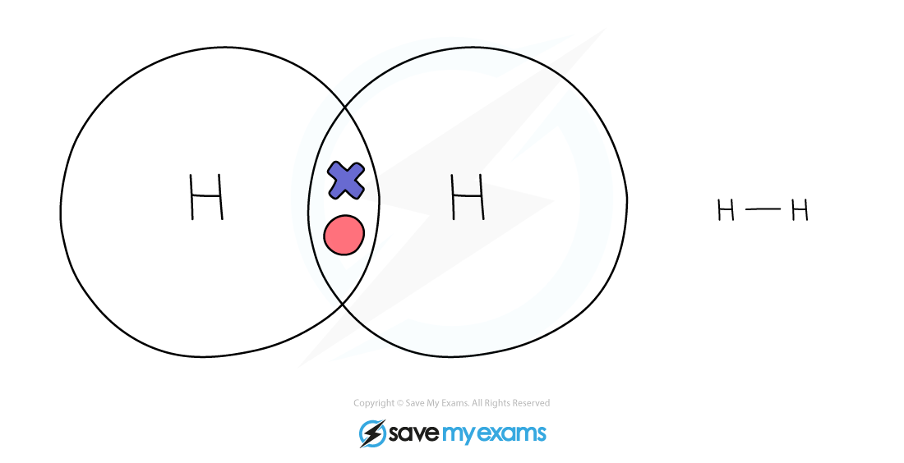
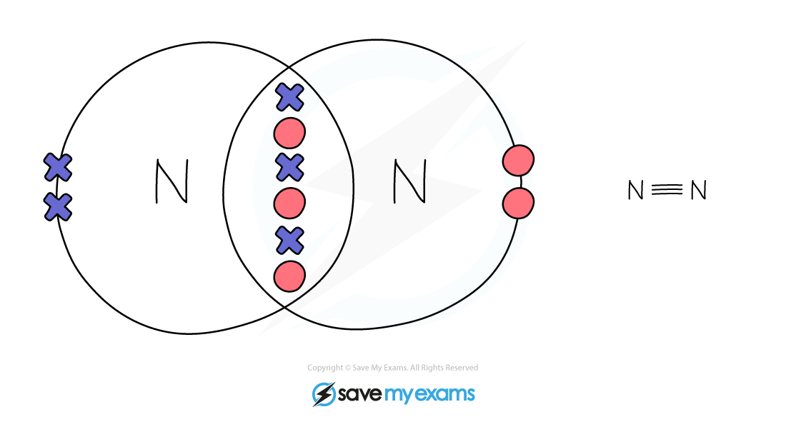
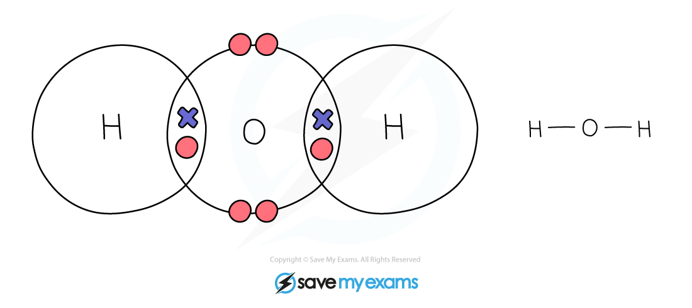
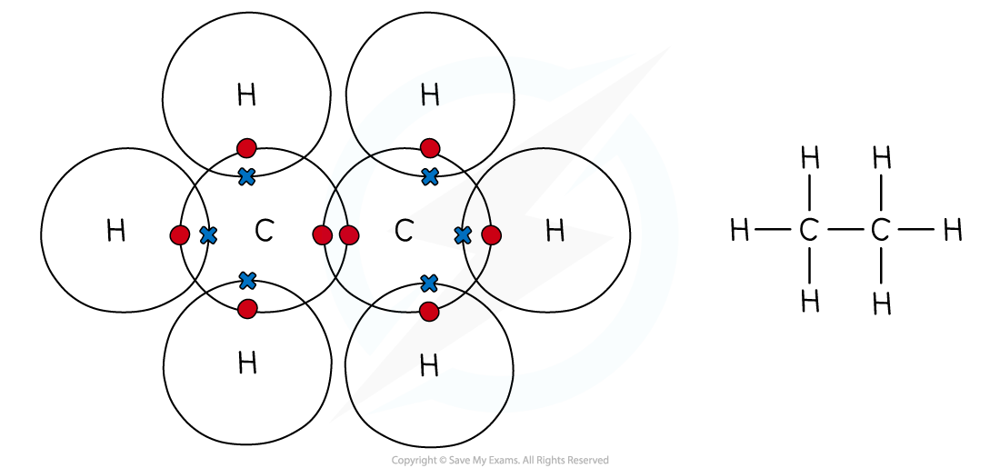
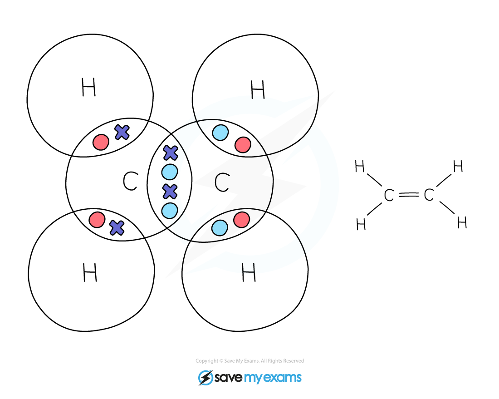

# Covalent Bonds: Dot & Cross Diagrams | Edexcel IGCSE Chemistry Revision Notes 2017

> ## Excerpt
> Revision notes on Covalent Bonds: Dot & Cross Diagrams for the Edexcel IGCSE Chemistry syllabus, written by the Chemistry experts at Save My Exams.

---
## Dot and cross diagrams for covalent compounds

-   Covalent substances tend to have simple molecular structures, such as Cl2, H2O or CO2
    
-   These small molecules are known as **simple molecules**
    
-   Small covalent molecules can be represented by dot and cross diagrams
    
-   You need to be able to describe and draw the structures of the molecules below: 
    

### Diatomic Molecules

_**Dot & cross representation of a molecule of hydrogen**_

_**Dot & cross representation of a molecule of chlorine**_

_**Dot & cross representation of a molecule of oxygen**_

_**Dot & cross representation of a molecule of nitrogen**_

_**Dot & cross representation of a molecule of hydrogen chloride**_

#### Inorganic Molecules

_**Dot & cross representation of a molecule of water**_

_**Dot & cross representation of a molecule of ammonia**_

_**Dot & cross representation of a molecule of carbon dioxide**_

### Organic Molecules

_**Dot & cross representation of a molecule of methane**_

_**Dot & cross representation of a molecule of ethane**_

_**Dot & cross representation of a molecule of ethene**_

#### Examiner Tips and Tricks

Each covalent bond represents one shared pair of electrons. 

For example, there are two covalent bonds between the two oxygen atoms in O2 so four electrons are shared.
