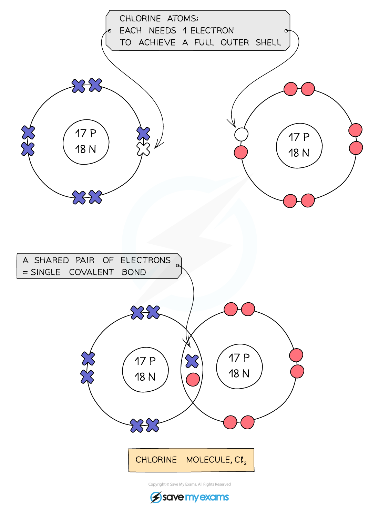

# Forming covalent bonds - IGCSE Chemistry Revision Notes

> ## Excerpt
> Learn about forming covalent bonds in IGCSE Chemistry. Discover how non-metal atoms share electrons to form bonds in simple and giant covalent structures.

---
## Formation of covalent bonds

-   Non-metal atoms can **share** electrons with other non-metal atoms to obtain a **full** **outer** **shell** of electrons
    
-   When atoms share pairs of electrons, they form covalent bonds
    
-   Covalent bonds between atoms are very **strong**
    
-   Covalently bonded substances may be [simple molecular structures](https://www.savemyexams.com/igcse/chemistry/edexcel/19/revision-notes/1-principles-of-chemistry/1-7-covalent-bonding/1-7-3-simple-molecular-structures/) or [giant covalent structures](https://www.savemyexams.com/igcse/chemistry/edexcel/19/revision-notes/1-principles-of-chemistry/1-7-covalent-bonding/1-7-4-giant-covalent-structures/)
    
    -   Simple molecular structures include oxygen and water 
        
    -   Giant covalent structures include diamond and graphite
        
-   Shared electrons are called **bonding electrons** and occur in **pairs**
    
-   Electrons on the outer shell which are not involved in the covalent bond(s) are called **non-bonding** electrons
    

#### Covalent bonding

_**Two chlorine atoms share one electron each to form a covalent bond with a shared pair of electrons**_

#### Examiner Tips and Tricks

A key difference between covalent bonds and ionic bonds is that in covalent bonds the electrons are shared between the atoms, they are not transferred (donated or gained) and no ions are formed.

## Electrostatic attractions

-   There is a strong electrostatic attraction between the shared pair of electrons and the nuclei of the atoms involved, since the electrons are negatively charged and the nuclei are positively charged
    

_**The attraction between the shared pair of electrons and the nuclei of the atoms involved in a covalent bond**_

-   In a normal covalent bond, each atom provides one of the electrons in the bond
    
-   A covalent bond is represented by a short straight line between the two atoms, H-H
    
-   Covalent bonds should not be regarded as shared electron pairs in a fixed position; the electrons are in a state of constant motion and are best regarded as **charge clouds**
    
-   Sharing electrons in the covalent bond allows each of the 2 atoms to achieve an electron configuration similar to a noble gas
    
    -   This makes each atom more stable
        

Was this revision note helpful?
