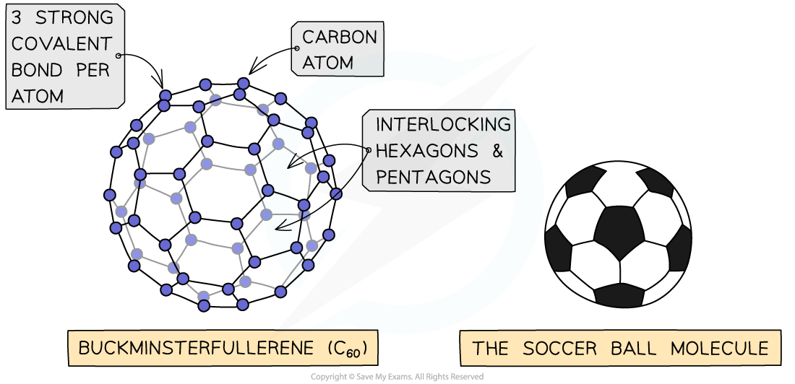
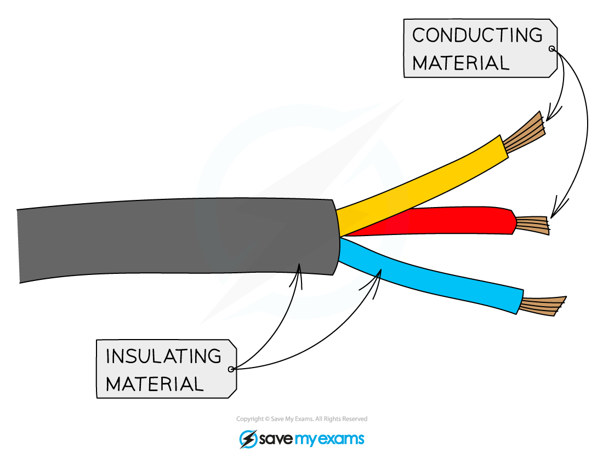

# Simple molecular structures - IGCSE Chemistry Revision Notes

> ## Excerpt
> Explore simple molecular structures in IGCSE Chemistry. Learn about their intermolecular forces, melting points, conductivity and the properties of fullerenes.

---
## Simple molecular structures

-   Simple molecular structures have covalent bonds joining the atoms together, but intermolecular forces that act between neighbouring molecules are weak
    
-   They have relatively **low melting and boiling points** because: 
    
    -   There are weak intermolecular forces between the molecules
        
    -   These forces require little energy to overcome 
        
-   Most simple molecular structures are either gases or liquids at room temperature 
    
-   They can be solids with low melting and boiling points but this is less common
    
-   As the molecules increase in size, the melting and boiling points generally increase because the strength of these intermolecular forces increases and so more energy is needed to break them 
    

_**Covalent bonds are strong but intermolecular forces are weak**_

### C60 fullerene

-   Fullerenes are a group of carbon allotropes which consist of molecules that form **hollow tubes** or **spheres**
    
-   Fullerenes can be used to trap other molecules by forming around the target molecule and capturing it, making them useful for targeted **drug delivery** systems
    
-   They also have a **huge surface area** and are useful for trapping **catalyst** molecules onto their surfaces making them easily accessible to reactants, so catalysis can take place
    
-   Some fullerenes are excellent lubricants and are starting to be used in many industrial processes
    
-   The first fullerene to be discovered was buckminsterfullerene which is affectionately referred to as a “buckyball”
    
-   In this fullerene, 60 carbon atoms are joined together forming 20 hexagons and 12 pentagons which produce a hollow sphere that is the exact shape of a soccer ball
    
-   C60 is a **simple molecular structure**  
    
    -   C60 can not conduct electricity 
        
        -   Although the fourth electron in C60 is not bonded, the electrons are only freely moving within the buckyballs and cannot migrate from one buckyball to another, so C60 does not conduct electricity
            
    -   There are weak intermolecular forces between individual buckyballs
        
    -   Little energy is needed to overcome these forces
        
    -   Substances consisting of buckyballs are slippery and have relatively low melting points
        

#### C60 fullerene

_**The structure and bonding in C60 fullerene - the football shaped molecule**_

#### Examiner Tips and Tricks

**Remember**: When explaining the low melting and boiling point of simple molecular structures, it is not the covalent bonds between the atoms which are broken, but the weak intermolecular forces.

## Melting and boiling point patterns

-   As the relative molecular mass of a substance increases, the melting and boiling point will increase as well
    
-   An increase in the relative molecular mass of a substance means that there are more electrons in the structure, so there are more intermolecular forces of attraction that need to be overcome when a substance changes state
    
-   So larger amounts of heat energy are needed to overcome these forces, causing the compound to have a higher melting and boiling point
    
-   The family of organic molecules called alkanes show a clear increase in boiling point as the size of the molecule increases
    

#### The relationship between molecular mass and boiling point 

_**As the molecular mass increases, so does the boiling point**_

## Conductivity of simple molecular structures

Simple molecular structures are **poor conductors** of electricity (even when molten) because:

-   There are **no** free ions or electrons to move and carry the charge.
    
-   Most covalent compounds do not conduct at all in the solid state and are thus insulators
    
-   Common insulators include the plastic coating around household electrical wiring, rubber and wood
    

_**The plastic coating around electrical wires is made from covalent substances that do not allow a flow of charge**_

Was this revision note helpful?
