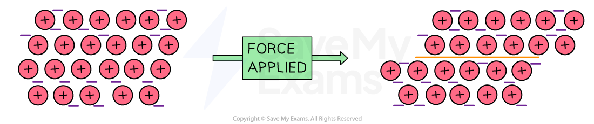

# Metallic bonding - IGCSE Chemistry Revision Notes

> ## Excerpt
> Learn about metallic bonding for IGCSE Chemistry. Discover how metallic bonding causes a metal's high melting points, electrical conductivity, and malleability.

---
-   Metals consist of **giant** structures of atoms arranged in a regular pattern 
    
-   Within the metal lattice, the atoms lose their outer electrons and become positively charged metal **ions**
    
    -   The outer electrons no longer belong to any specific metal atom and are said to be **delocalised**
        
    -   This means they can move freely between the positive metal ions and act like a _“sea of electrons”_
        
-   The metallic bond is the strong force of **attraction** between the positive metal ions and the delocalised electrons
    
-   This type of bonding occurs in metals and metal alloys, which are mixtures of metal
    

#### Metallic bonding

_**Metallic bonds exist between positive metal ions and delocalised electrons**_

-   Most metals have **high melting and boiling points** 
    
    -   There are strong electrostatic forces of attraction between the positive metal ions and the negative delocalised electrons within the metal lattice structure
        
    -   These needs lots of energy to be broken 
        
-   Metals **conduct electricity**
    
    -   There are **delocalised** **electrons** available to move and carry charge
        
-   Most metals are **malleable**
    
    -   This means they can be hammered into shape
        
    -   This is because the atoms/ions are arranged in layers which can slide over each other when a force is applied 
        

#### The malleability of metals

_**The atoms are able to slide over each other as they are arranged in layers**_

#### Examiner Tips and Tricks

It's very important you are able to explain these three properties and use the correct terminology. 

For example, you **must** refer to atoms/ions in your answer for malleability, not just particles.

Was this revision note helpful?
