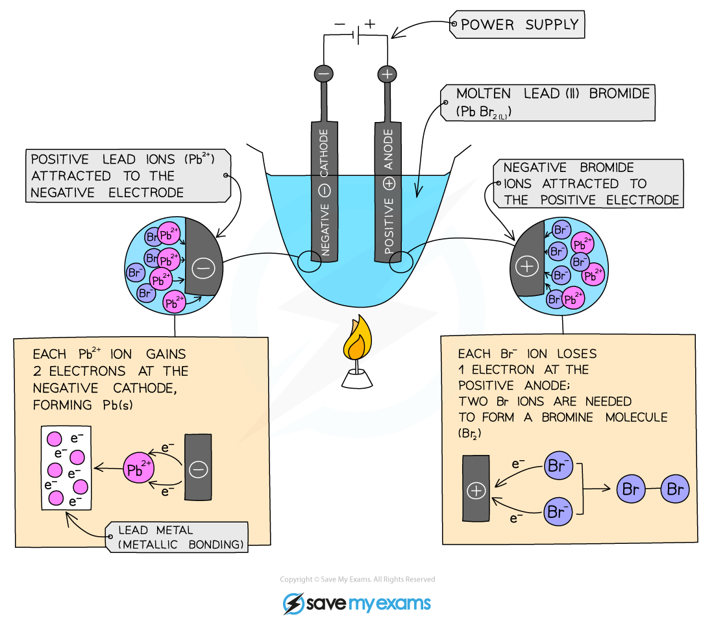
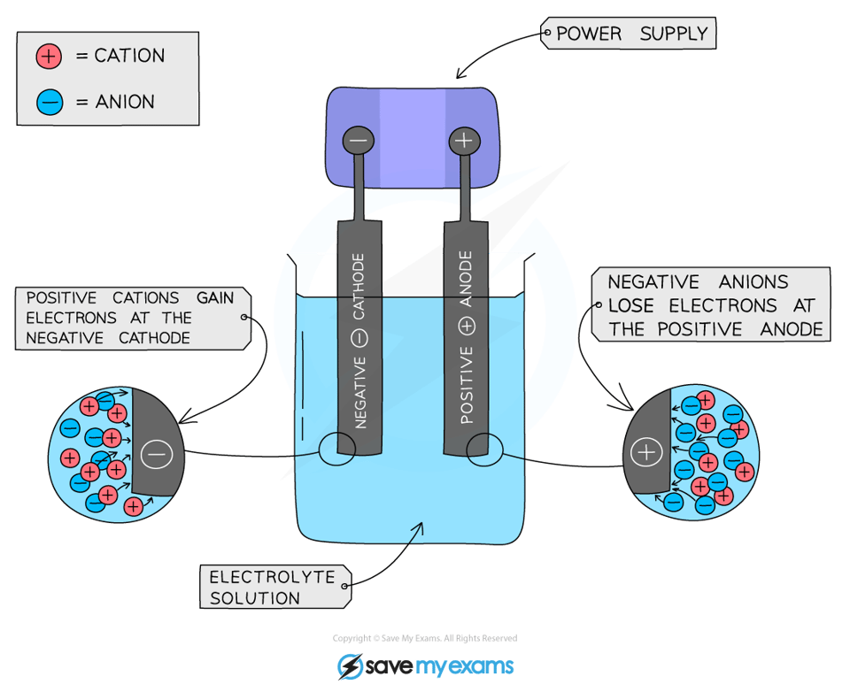

# Electrolysis diagram - IGCSE Chemistry Revision Notes

> ## Excerpt
> Explore electrolysis experiments with clear explanations and a labelled electrolysis diagram for IGCSE Chemistry. Learn about the electrochemical processes.

---
## Electrolysis of molten compounds

-   Binary ionic compound are compounds consisting of just two elements joined together by ionic bonding
    
    -   E.g. lead(II) bromide
        
-   When these compounds are heated beyond their melting point, they become molten and can conduct electricity as their ions can move freely and carry the charge
    
-   These compounds undergo electrolysis and always produce their corresponding element
    
-   To predict the products of any binary molten compound first identify the ions present
    
-   The **positive** ion will migrate towards the **cathode** and the **negative** ion will migrate towards the **anode**
    
-   Therefore the **cathode** product will always be the metal and the product formed at the **anode** will always be the **non-metal**
    

### The electrolysis of molten lead(II) bromide 

#### Method

1.  Add lead(II) bromide into a crucible and heat so it will turn molten, allowing ions to be free to move and conduct an electric charge
    
2.  Add two graphite rods as the electrodes and connect this to a power pack or battery
    
3.  Turn on the power pack or battery and allow electrolysis to take place
    

#### Diagram showing the electrolysis of lead(II) bromide

_**Lead ions are attracted to the cathode, and bromide ions to the anode**_

#### What happens at the anode?

-   Negative bromide ions move to the positive electrode (anode)
    
-   At the anode, they lose two electrons to form bromine molecules
    
-   There is bubbling at the anode as brown **bromine gas** is given off
    

#### What happens at the cathode?

-   Positive lead ions move to the negative electrode (cathode)
    
-   At the cathode they gain electrons to form grey **lead metal** 
    
-   The lead deposits on the bottom of the electrode
    

#### Worked Example

Identify the product formed during electrolysis at the anode and cathode for the following binary ionic compounds. 

1.  Molten copper chloride 
    
2.  Molten magnesium oxide
    

**Answers:**

1.  Molten copper chloride 
    
    -   Copper ions have a positive charge so are attracted to the cathode and form copper metal 
        
    -   Chloride ions have a negative charge so are attracted to the anode and form chlorine
        
2.  Molten magnesium oxide
    
    -   Magnesium ions have a positive charge so are attracted to the cathode and form magnesium metal
        
    -   Oxide ions have a negative charge so are attracted to the anode and form oxygen
        

#### Examiner Tips and Tricks

**Remember:** Opposites attract! 

Therefore, the positive ions will be attracted to the negative electrode and the negative ions to the positive electrode.

## Electrolysis of aqueous solutions

-   Aqueous solutions will always contain water molecules (H2O)
    
-   In the electrolysis of aqueous solutions, the water molecules dissociate producing H+ and OH– ions:
    

**H**<b>2</b>**O ⇌ H**<b>+</b> **+ OH**<b>–</b>

-   These ions are also involved in the electrolysis process and their chemistry must be considered
    
-   We now have an electrolyte that contains ions from the compound plus ions from the water
    
-   Which ions get discharged and at which electrode depends on the **relative reactivity** of the elements involved
    

### What is produced at the anode?

-   Negatively charged OH– ions and non-metal ions are attracted to the positive electrode
    
-   If halide ions (Cl-, Br-, I-) and OH- are present then the halide ion is discharged at the anode, loses electrons and forms a halogen (chlorine, bromine or iodine)
    
-   If no halide ions are present, then OH- is discharged at the anode, loses electrons and forms oxygen
    
-   In both cases the other negative ion remains in solution
    

### What is produced at the cathode?

-   Positively charged H+ and metal ions are attracted to the negative electrode but only one will gain electrons
    
-   Either hydrogen gas or the metal will be produced
    
-   If the metal is **above hydrogen** in the reactivity series, then hydrogen will be produced and bubbling will be seen at the cathode
    
-   This is because the more reactive ions will remain in solution, causing the least reactive ion to be discharged
    
-   Therefore at the cathode, **hydrogen gas** will be produced unless the positive ions from the ionic compound are less reactive than hydrogen, in which case the **metal** is produced
    

#### The electrolysis of aqueous solutions

-   The apparatus can be modified for the collection of gases by using inverted test tubes over the electrodes
    
-   The electrodes are made from graphite which is inert and does not interfere with the electrolysis reactions
    

#### Examiner Tips and Tricks

When answering questions on this topic, it helps if you first write down all of the ions present first. Only then you should start comparing their reactivity and deducing the products formed.

You must be able to identify the products formed at each electrode for the following aqueous solutions:

-   Sodium chloride  
    
-   Dilute sulfuric acid 
    
-   Copper(II) sulfate
    

These can be found [here](https://www.savemyexams.com/igcse/chemistry/edexcel/19/revision-notes/1-principles-of-chemistry/1-9-electrolysis/1-9-4-practical-investigate-the-electrolysis-of-aqueous-solutions/).

Was this revision note helpful?
