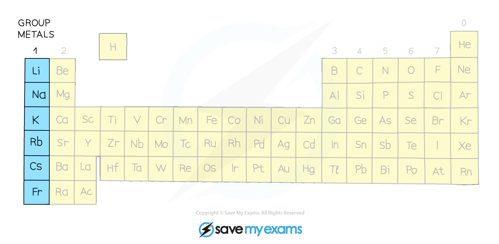

# Group 1 reactivity & trends - IGCSE Chemistry Revision Notes

> ## Excerpt
> Learn about Group 1 reactivity and trends for IGCSE Chemistry. Understand the reactions with water and oxygen and how properties change moving down the group.

---
## Group 1 elements

-   The Group 1 metals are known as the alkali metals
    
    -   They form **alkaline solutions** when they react with water
        
-   The Group 1 metals are lithium, sodium, potassium, rubidium, caesium and francium and they are found in the first column of the periodic table
    
-   The alkali metals share similar characteristic chemical properties because they each have one electron in their outermost shell
    
-   Some of these properties are:
    
    -   They are all **soft** metals which can easily be cut with a knife
        
    -   They have relatively **low** densities and **low** melting points
        
    -   They are **very reactive** (they only need to lose one electron to become highly stable)
        

#### Group 1 elements in the Periodic Table

_**The alkali metals lie on the far left of the periodic table, in the very first group**_ 

### Reaction with water

-   The reaction of the Group 1 metals with water provides evidence for categorising these elements into the same chemical family
    
-   The general pattern shown is:
    

**Group 1 metal + water ⟶ metal hydroxide + hydrogen**

      **2M (s) + 2H**<b>2</b>**O (l) ⟶ 2MOH (aq) + H**<b>2</b> **(g)** 

where **M** is Li, Na, K, Rb or Cs

-   The hydroxides formed all have the same general formula and are colourless, aqueous solutions
    
-   The metals are so named because they form alkalis in water
    

-   The differences between the reactions of the group 1 metals with water and oxygen provide evidence of trends within the group
    

### Reactions with water

-   The reactions of the alkali metals with water get more vigorous as you descend the group
    

**Summary of the reactions of the first three alkali metals with water**

| **Element** | **Reaction** | **Observations** |
|---------|-------------------------------------------------------------------------------------------------------|--------------------------------------------------------------------------------------------------------------------------------------------------------|
| Li | lithium + water   →   lithium hydroxide + hydrogen 

2Li (s) + 2H2O (l)   →   2LiOH (aq) +   H2 (g) | -   Relatively slow reaction
    
-   Fizzing
    
-   Lithium moves on the surface of the water |
| Na | sodium + water   →   sodium hydroxide + hydrogen 

2Na (s) + 2H2O (l)   →   2NaOH (aq) +   H2 (g) | -   More vigorous fizzing 
    
-   Moves rapidly on the surface of the water
    
-   Dissolves quickly |
| K | potassium + water   →   potassium hydroxide + hydrogen 

2K (s) + 2H2O (l)   →   2KOH (aq) +   H2 (g) | -   Reacts more vigorously than sodium 
    
-   Burns with a lilac flame 
    
-   Moves very rapidly on the surface 
    
-   Dissolves very quickly |

### Reactions with oxygen

-   The alkali metals react with oxygen in the air forming **metal oxides,** which is why the alkali metals **tarnish** when exposed to the air
    
-   The metal oxide produced is a dull coating which covers the surface of the metal
    
-   The metal tarnish more rapidly as you go down the group
    

**Summary of the reactions of the first three alkali metals with oxygen**

| **Element** | **Reaction** |
|---------|---------------------------------------------------------------------|
| Li | lithium + oxygen → lithium oxide 

4Li (s) + O2 (g) →   2Li2O (s) |
| Na | sodium + oxygen → sodium oxide 

4Na (s) + O2 (g) →   2Na2O (s) |
| K | potassium + oxygen → potassium oxide 

4K (s) + O2 (g) →   2K2O (s) |

### Physical trends

-   Apart from the chemical trends there are also patterns to be seen in the physical properties
    
-   The alkali metals are **soft** and easy to cut, getting softer as you move down the group
    
-   The first three alkali metals are less dense than water
    
-   They all have relatively **low** melting points which **decrease** as you move down the group, due to **decreasing attractive forces** between outer electrons and positive ions
    

#### Graph to show the physical trends in Group 1

_**The melting point of the Group 1 metals decreases as you descend the group**_

## Predicting properties in Group 1

-   Following these trends, we can say that:
    
    -   Rubidium, caesium and francium will react even more vigorously with air and water than the first three alkali metals
        
-   Of the alkali metals, lithium is the **least** reactive (as it is at the top of Group 1) and francium would be the **most** reactive (as it’s at the bottom of Group 1)
    
-   Using the information given in the trends we would predict that **rubidium**:
    
    -   would be a **soft grey solid**
        
    -   appears **shiny when freshly cut**
        
    -   is **more dense** than potassium (> 0.86 g cm-3)
        
    -   has a **lower melting point** than potassium (< 63.5 oC)
