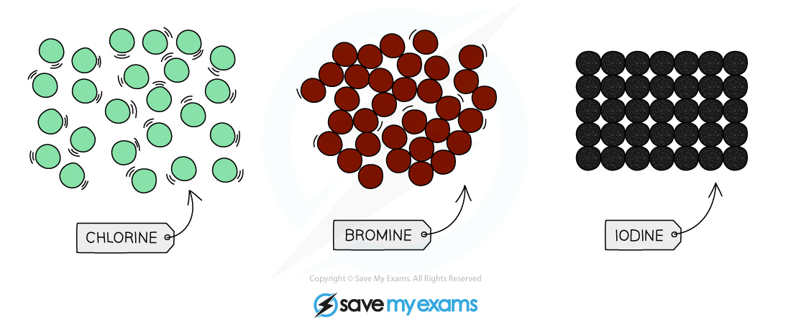

# Group 7 properties - IGCSE Chemistry Revision Notes

> ## Excerpt
> Learn about Group 7 properties for IGCSE Chemistry including displacement reactions of halogens, their physical properties and trend down the Group 7 elements.

---
## Physical properties of Group 7 elements

-   The elements in Group 7 are known as the halogens

    -   These are fluorine, chlorine, bromine, iodine and astatine

-   These elements are non-metals that are **poisonous**

-   All halogens have similar reactions as they each have seven electrons in their outermost shell

-   Halogens are **diatomic**, meaning they form molecules made of pairs of atoms sharing electrons (forming a single covalent bond between the two halogen atoms)

### Trends in physical properties

-   At room temperature, the halogens exist in different states and colours, with different characteristics

**The properties of the Group 7 elements**

| **Halogen** | **State & appearance at room temperature** | **Characteristics** | **Colour in solution** |
|----------|----------------------------------------|-------------------------------------------------------------------|--------------------|
| Fluorine | Yellow gas | Very reactive, poisonous gas | - |
| Chlorine | Pale yellow-green gas | Reactive, poisonous and dense gas | Pale green |
| Bromine | Red-brown liquid | Dense red-brown volatile liquid | Orange |
| Iodine | Grey solid | Shimmery, crystalline solid that sublimes to form a purple vapour | Dark brown |

-   The melting and boiling points of the halogens **increase** as you go down the group

-   This is due to increasing intermolecular forces as the atoms become larger, so more energy is required to overcome these forces

#### Graph to show the melting and boiling points of Group 7 elements

_**This graph shows the melting and boiling points of the Group 7 halogens**_ 

-   At room temperature (20 °C), the physical state of the halogens changes as you go down the group

    -   Fluorine and chlorine are **gases**, bromine is a **liquid** and iodine is crumbly **solid**

-   The colours of the halogens also change as you descend the group - they become darker

#### Appearance of Group 7 elements

_**The physical states and colours of chlorine, bromine and iodine at room temperature**_ 

## Predicting properties in Group 7

-   Chlorine, bromine and iodine react with metals and non-metals to form compounds

### Metal halides

-   The halogens react with some metals to form **ionic compounds** which are **metal** **halide** **salts**

-   The halide ion carries a -1 charge so the ionic compound formed will have different numbers of halogen atoms, depending on the **valency** of the metal

-   E.g., sodium is a group 1 metal:

    -   2 Na + Cl2 → 2 NaCl

-   Calcium is a group 2 metal:

    -   Ca + Br2 → CaBr2

-   The halogens **decrease** in **reactivity** moving down the group, but they still form halide salts with some metals including iron

-   The rate of reaction is **slower** for halogens which are **further** down the group such as bromine and iodine

#### Formation of sodium chloride

_**Sodium donates its single outer electron to a chlorine atom and an ionic bond is formed between the positive sodium ion and the negative chloride ion**_

### Non-metal halides

-   The halogens react with non-metals to form simple molecular covalent structures

-   For example, the halogens react with hydrogen to form **hydrogen halides** (e.g., hydrogen chloride)

-   Reactivity decreases down the group, so iodine reacts less vigorously with hydrogen than chlorine (which requires light or a high temperature to react with hydrogen)

-   Fluorine is the most reactive (reacting with hydrogen at low temperatures in the absence of light)

## Displacement reactions

### Displacement reactions

-   A **halogen displacement reaction** occurs when a more reactive halogen displaces a less reactive halogen from an aqueous solution of its halide

-   The reactivity of Group 7 elements decreases as you move down the group

-   You only need to learn the displacement reactions with chlorine, bromine and iodine

    -   Chlorine is the most reactive and iodine is the least reactive

### Chlorine with bromides & iodides

-   If you add chlorine solution to colourless potassium bromide or potassium iodide solution a displacement reaction occurs:

    -   The solution becomes orange as bromine is formed or

    -   The solution becomes brown as iodine is formed

-   Chlorine is **above** bromine and iodine in Group 7 so it is more reactive

-   Chlorine will **displace** bromine or iodine from an aqueous solution of the metal halide

**Cl**<b>2</b> **+ 2KBr → 2KCl + Br**<b>2</b>

chlorine + potassium bromide **→**  potassium chloride + bromine

**Cl**<b>2</b> **+ 2KI → 2KCl + I**<b>2</b>

chlorine + potassium iodide **→**  potassium chloride + iodine

### Bromine with iodides

-   Bromine is above iodine in group 7 so it is **more** reactive

-   Bromine will displace iodine from an aqueous solution of the metal iodide

**bromine + potassium iodide →  potassium bromide + iodine**

**Br**<b>2</b> **+ 2KI → 2KBr + I**<b>2</b>

**Summary table of the displacement reactions of the halogens: chlorine, bromine and iodine** 

|  | **Chlorine (Cl****2****)** | **Bromine (Br****2****)** | **Iodine (I****2****)** |
|---------------------------|-------------------------------------------------------------------------------|-------------------------------------------------------------------|-------------|
| Potassium chloride

(KCl) | x | No reaction | No reaction |
| Potassium bromide

(KBr) | Chlorine displaces the bromide ions 

Yellow-orange colour of bromine seen | x | No reaction |
| Potassium Iodide 

(KI) | Chlorine displaces the iodide ions

Brown colour of iodine is seen | Bromine displaces the iodide ions

Brown colour of iodine is seen | x |
