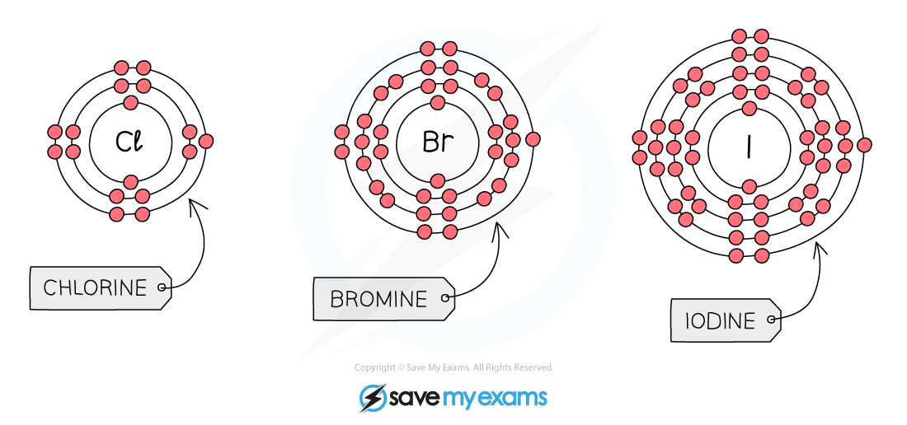

# Group 7 reactivity - IGCSE Chemistry Revision Notes

> ## Excerpt
> Learn about the Group 7 elements in IGCSE Chemistry. Understand how their electronic configurations affect reactivity trends and halogen ion formation.

---
## Electronic configuration of Group 7 elements

-   When halogen atoms gain an electron during reactions, they form -1 ions called halide ions
    
-   We can use electronic configuration to explain the trends in chemical reactivity down Group 7
    

#### Electronic configuration of Group 7 elements

_**The atoms of the elements of Group 7 all have 7 electrons in their outer shell**_

-   Reactivity of Group 7 non-metals **decreases** as you go down the group
    
    -   As you go down Group 7, the number of shells of electrons **increases**, the same as with all other groups
        
-   However, halogen atoms form negative ions when they **gain an electron** to obtain a full outer shell
    
    -   This means that the increased distance from the outer shell to the nucleus as you go down a group makes the halogens become **less reactive**
        
-   Fluorine is the smallest halogen, which means its outermost shell is the **closest** to the positive nucleus of all the halogen
    
    -   Therefore, the ability to **attract an electron** is strongest in fluorine making it the most reactive
        
    -   As you move down the group, the forces of **attraction** between the nucleus and the outermost shell **decreases**
        
    -   This makes it **harder** for the atoms to gain electrons as you descend the group
        
    -   Therefore, the halogens are less reactive the further down the group you go
