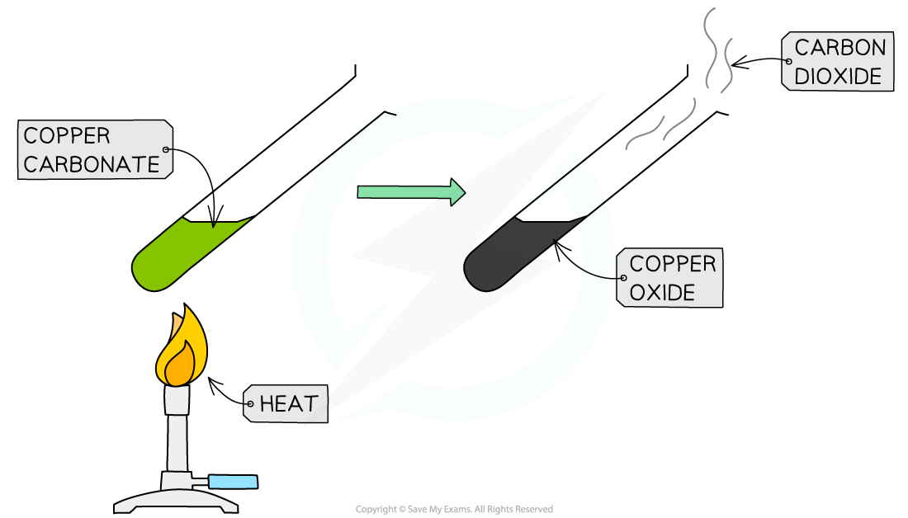

# Thermal decomposition - IGCSE Chemistry Revision Notes

> ## Excerpt
> Use our revision notes to understand how thermal decomposition of carbonates forms carbon dioxide for your IGCSE chemistry exam. Learn more.

---
### What is thermal decomposition?

-   **Thermal decomposition** is the term used to describe reactions where a substance breaks down due to the action of heat
    
-   One such reaction is the thermal decomposition of **metal carbonates**
    
-   Carbonates of metals from the lower half of the reactivity series tend to decompose on heating to produce the **metal oxide** and **carbon dioxide** gas:
    

**metal carbonate → metal oxide + carbon dioxide**

#### Thermal decomposition of copper(II) carbonate

_**The thermal decomposition of copper(II)carbonate produces copper(II) oxide and carbon dioxide**_

-   The thermal decomposition of copper(II)carbonate occurs readily on heating
    
-   **Copper(II) carbonate** is a green powder and slowly darkens as black **copper(II) oxide** is produced
    
-   The carbon dioxide given off can be tested by passing the gas through **limewater** and looking for it to turn milky
    
-   The equation for the reaction is
    

**CuCO**<b>3</b> **(s) →  CuO (s)+ CO**<b>2</b>  **(g)** 

**copper(II) carbonate → copper(II) oxide + carbon dioxide**
