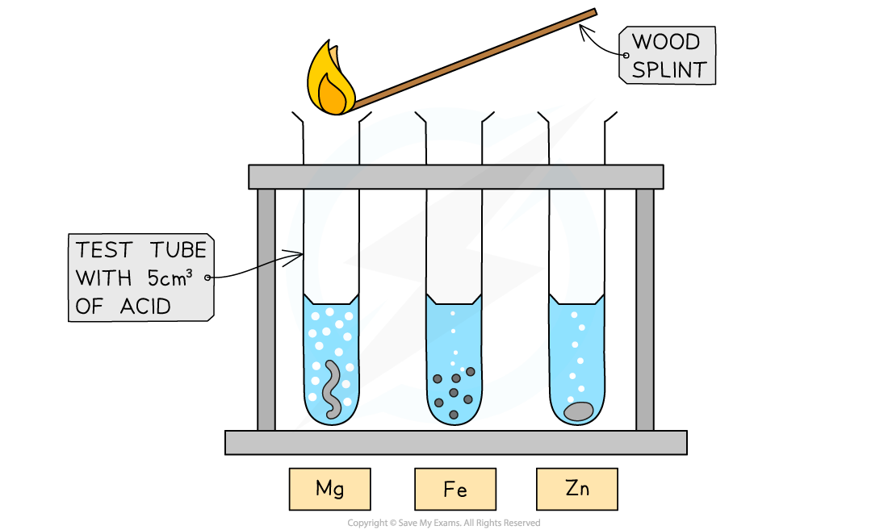

# Metals reacting with acids - IGCSE Chemistry Revision Notes

> ## Excerpt
> Explore metals reacting with acids for IGCSE Chemistry. Analyse results and understand the chemical reactions of magnesium, iron, and zinc with acids

---
### Aim

To investigate the reactions between dilute hydrochloric and sulfuric acids with the metals magnesium, iron and zinc

### Diagram

#### Mg, Fe and Zn reacting with acid

_**Investigating the reactions of dilute acids with metals**_

### Method

1.  Wear some safety glasses before handling acids
    
2.  Using a small measuring cylinder, add 5 cm3  of dilute hydrochloric acid to each of three test tubes
    
3.  Add about 1 cm length of magnesium ribbon to the first tube, observe and note down what you see
    
4.  Use a lighted splint to test for any gases given off
    
5.  To the second test tube add a few pieces of iron filings and to the third some zinc turnings
    
6.  Observe what happens, test for any gases and note down your observations
    
7.  Repeat the experiment with dilute sulfuric acid
    

### Results

#### Metals with Acids Observations Table

| **Metal** | **With dilute hydrochloric acid** | **With dilute sulfuric acid** |
|-----------|-----------------------------------------------------------------------------------------------------------|-------------------------------------------------------------------|
| Magnesium | Dissolves quickly, gets hot, gas given off which goes pop with a lighted splint, colourless solution left | Rapid bubbling, splint goes pop, metal dissolves |
| Iron | Very slow bubbling | Slow reaction, small bubbles seen |
| Zinc | Bubbles given off, metal slowly dissolves | Metal dissolves forming colourless solution, gas given off slowly |

#### Table of acid-metal reactions

| **Metal** | **Sulfuric acid** | **Hydrochloric acid** |
|------------|--------------------------------------------|-------------------------------------------|
|  Magnesium |  Mg (s) + H2SO4 (aq) → MgSO4 (aq) + H2 (g) |  Mg (s) + 2HCl (aq) → MgCl2 (aq) + H2 (g) |
|  Zinc | Zn (s) + H2SO4 (aq) → ZnSO4 (aq) + H2 (g) |  Zn (s) + 2HCl (aq) → ZnCl2 (aq) + H2 (g) |
|  Iron | Fe (s) + H2SO4 (aq) → FeSO4 (aq) + H2 (g) |  Fe (s) + 2HCl (aq) → FeCl2 (aq) + H2 (g) |

### Conclusion

-   The metals can be ranked in reactivity order Mg > Zn > Fe
    
-   The three metals react in the same way with both acids
    
-   Hydrogen and a metal salt solution is produced
    

Was this revision note helpful?
