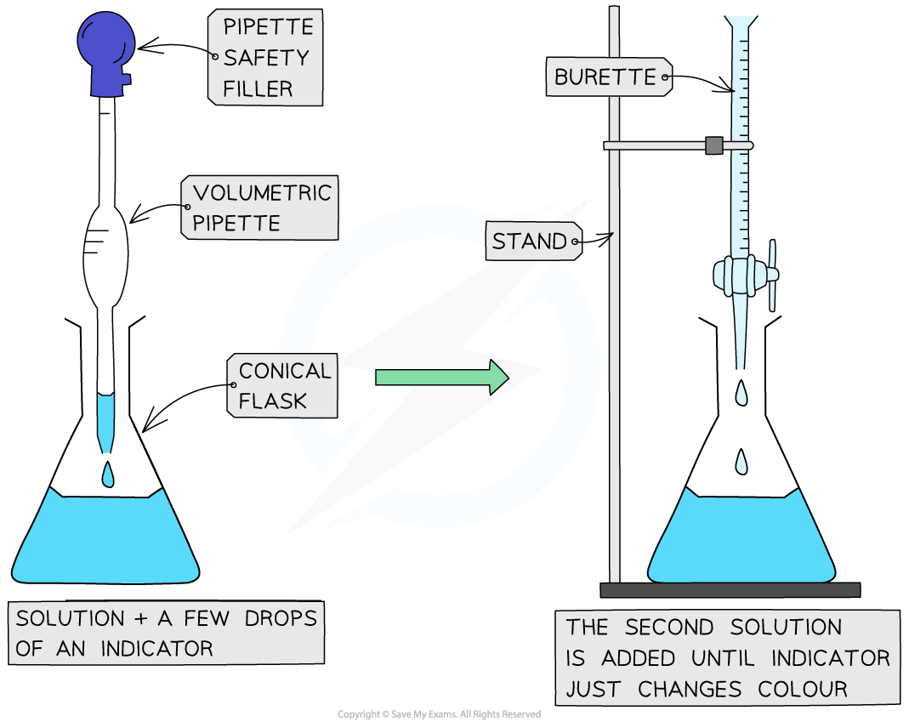

# Acid-Alkali Titrations | Edexcel IGCSE Chemistry Revision Notes 2017

> ## Excerpt
> Revision notes on Acid-Alkali Titrations for the Edexcel IGCSE Chemistry syllabus, written by the Chemistry experts at Save My Exams.

---
## What is a titration?

-   Titrations are a method of analysing the **concentration** of solutions
    
-   Acid-base titrations are one of the most important kinds of titrations
    
-   They can determine exactly how much alkali is needed to neutralise a quantity of acid – and vice versa
    
-   You may be asked to calculate the **moles** present in a given amount, the **concentration** or **volume** required to **neutralise** an acid or a base
    
-   Titrations can also be used to prepare **salts**
    

#### How to carry out a titration

_**Performing a titration**_

### Method

1.  Use the pipette and pipette filler and place exactly 25 cm3 sodium hydroxide solution into the conical flask
    
2.  Fill the burette with hydrochloric acid
    
    -   Ensure an empty beaker is underneath the tap to catch in case the tap is accidentally open
        
3.  Run a small portion of hydrochloric acid through the burette to remove any air bubbles
    
    -   The main air bubble is likely to be in the "jet space", which is the area between the tap and the tip of the burette
        
4.  Record the starting point on the burette to the nearest 0.05 cm3
    
    -   You can add more hydrochloric acid so that the burette reading starts at 0.0 cm3
        
5.  Place the conical flask on a white tile
    
    -   The purpose of the white tile is to make colour changes more obvious
        
6.  Add a few drops of a [suitable indicator](https://www.savemyexams.com/igcse/chemistry/edexcel/19/revision-notes/2-inorganic-chemistry/2-6-acids-alkalis--titrations/2-6-1-indicators/) to the solution to the conical flask
    
7.  Ensure the tip of the burette is inside the conical flask
    
8.  Perform a rough titration by taking the burette reading and running in the solution in 1 – 3 cm3 portions
    
    -   Remember to swirl the flask vigorously
        
9.  Quickly close the tap when the end-point is reached
    
    -   The end-point wil be indicated by a sharp colour change
        
10.  Record the final volume
    
    -   Ensure you read off the meniscus at eye level
        
11.  Now repeat the titration with a fresh batch of sodium hydroxide
    
12.  As the rough end-point volume is approached, add the solution from the burette one drop at a time until the indicator just changes colour
    
13.  Record the volume to the nearest 0.05 cm3
    
14.  Repeat until you achieve two concordant results (two results that are within 0.1 cm3 of each other) to increase accuracy
    

### Results

#### Results table for a titration

| **Rough titre (cm****3****)** | **Titre 1 (cm****3****)** | **Titre 2 (cm****3****)** | **Mean (cm****3****)** |
|-------------------|---------------|---------------|------------|
| 15.50 | 14.90 | 15.00 | 14.95 |
