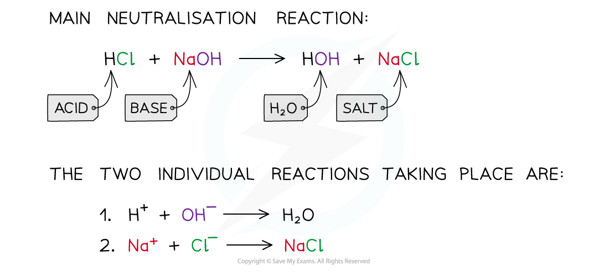

# Acids, Alkalis & Neutralisation - IGCSE Revision Notes

> ## Excerpt
> Explore acids, alkalis & neutralisation for IGCSE Chemistry. Learn what is required for neutralisation, and the ionic equation for neutralisation.

---
## Acids & alkalis

-   When **acids** are added to water, they form positively charged **hydrogen ions** (H+)
    
    -   The presence of H+ ions is what makes a solution acidic
        
-   When **alkalis** are added to water, they form negative hydroxide ions (OH–)
    
    -   The presence of the OH– ions is what makes the aqueous solution an alkali
        
-   The pH scale is a numerical scale which is used to show how **acidic** or **alkaline** a solution is
    
    -   It is a measure of the amount of the hydrogen ions present in solution
        

## Neutralisation

-   A neutralisation reaction occurs when an acid reacts with an alkali
    
-   When these substances react together in a neutralisation reaction, the **H**<b>+</b> ions react with the **OH**<b>–</b> ions to produce water
    
-   Not all reactions of acids are neutralisations
    
    -   For example when a metal reacts with an acid, although a salt is produced there is no water formed so it does not fit the definition of neutralisation
        
-   For example, when hydrochloric acid is neutralised a sodium chloride and water are produced:
    

-   The net ionic equation of **all acid-base neutralisations** and is what leads to a neutral solution, since water has a pH of 7:
    

**H**<b>+&nbsp; </b>  **(aq)** **+  OH**<b>– </b> **(aq)⟶ H**<b>2</b>**O (l)**

-   Neutralisation is very important in the treatment of soils to raise the pH as some crops cannot tolerate pH levels below 7
    
    -   This is achieved by adding bases to the soil such as limestone and quicklime
        

#### Examiner Tips and Tricks

Not all reactions of acids are neutralisations. For example, when a metal reacts with an acid, although a salt is produced there is no water formed so it does not fit the definition of neutralization.

Was this revision note helpful?
