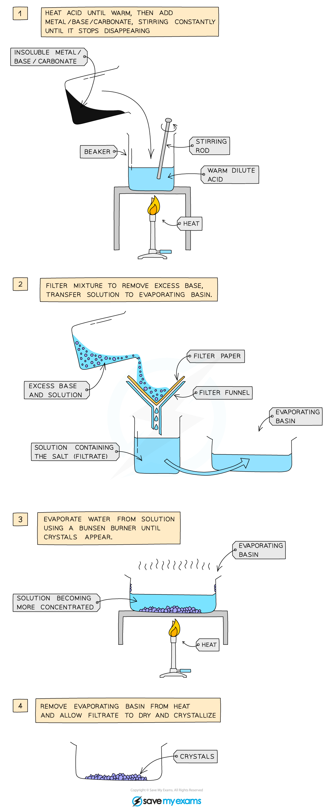

# Preparing copper sulfate - IGCSE Chemistry Revision Notes

> ## Excerpt
> Learn to prepare copper sulfate for IGCSE Chemistry. Follow step-by-step instructions using filtration, evaporation, and crystallisation techniques

---
## Practical: Prepare Copper(II) Sulfate

### Aim

To prepare a pure, dry sample of hydrated copper(II) sulfate crystals

### Materials

-   1.0 mol / dm3 dilute sulfuric acid
    
-   Copper(II) oxide
    
-   Spatula & glass rod
    
-   Measuring cylinder & 100 cm3 beaker
    
-   Bunsen burner
    
-   Tripod, gauze & heatproof mat
    
-   Filter funnel & paper, conical flask
    
-   Evaporating basin and dish.
    

### Diagram

#### Preparation of a soluble salt from an insoluble base and acid

_**The preparation of copper(II) sulfate by the insoluble base method**_

### Method

1.  Add 50 cm3 dilute acid into a beaker and warm gently using a Bunsen burner
    
2.  Add the copper(II) oxide slowly to the hot dilute acid and stir until the base is in excess (i.e. until the base stops dissolving and a suspension of the base forms in the acid)
    
3.  Filter the mixture into an evaporating basin to remove the excess base
    
4.  Gently heat the solution in a water bath or with an electric heater to evaporate the water and to make the solution saturated
    
5.  Check the solution is saturated by dipping a cold glass rod into the solution and seeing if crystals form on the end
    
6.  Leave the filtrate in a warm place to dry and crystallise
    
7.  Decant excess solution and allow the crystals to dry
    

#### Practical Tip

-   The base is added in excess to use up all of the acid, which would become dangerously concentrated during the evaporation and crystallisation stages
    

### Results

-   Hydrated copper(II) sulfate crystals should be bright blue and regularly shaped
