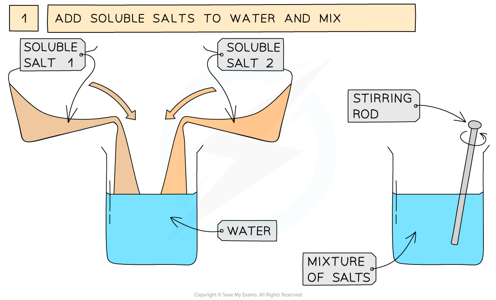
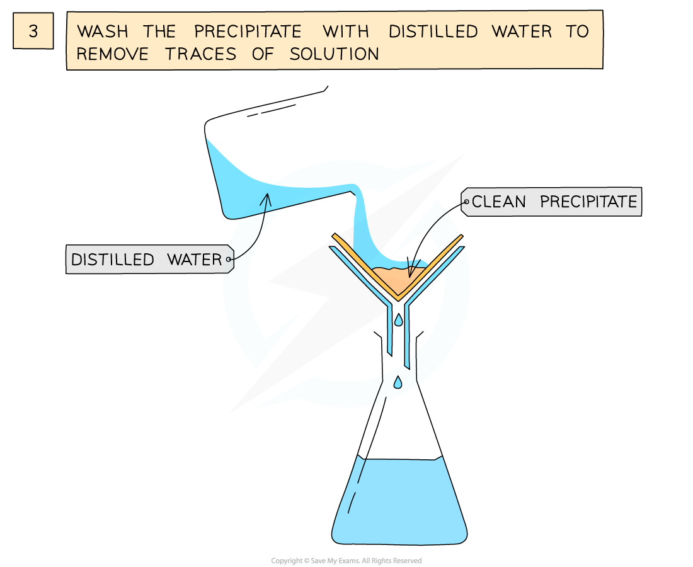
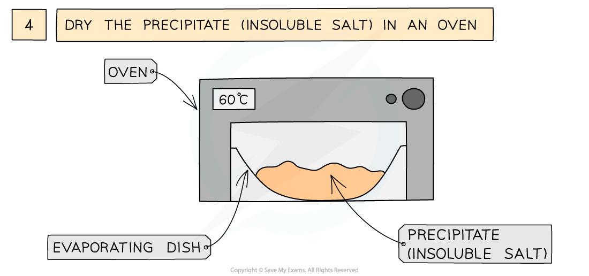

# Preparing lead sulfate - IGCSE Chemistry Revision Notes

> ## Excerpt
> Learn to prepare lead(II) sulfate for IGCSE Chemistry. Follow the precipitation method with lead(II) nitrate and potassium sulfate to obtain the insoluble salt.

---
## Practical: Prepare Lead(II) Sulfate

### Aim

-   To prepare a dry sample of lead(II) sulfate
    
-   The solid salt obtained is the precipitate, thus in order to successfully use this method the solid salt being formed must be insoluble in water, and the reactants must be soluble
    

### Diagram

#### Preparation of an insoluble salt via precipitation

_**The preparation of lead(II)sulfate by precipitation from two soluble salts**_

### Method

1.  Measure out 25 cm3  of 0.5 mol dm-3  lead(II)nitrate solution and add it to a small beaker
    
2.  Measure out 25 cm3  of 0.5 mol dm-3  of potassium sulfate add it to the beaker and mix together using a stirring rod
    
3.  Filter to remove precipitate from mixture
    
4.  Wash filtrate with distilled water to remove traces of other solutions
    
5.  Leave in an oven to dry
    

**Soluble salt 1 =** lead(II) nitrate       

**Soluble salt 2 =** potassium sulfate

**lead(II) nitrate + potassium sulfate → lead(II) sulfate + potassium nitrate**

**Pb(NO**<b>3</b>**)**<b>2</b>  **(aq) + K**<b>2</b>**SO**<b>4</b> **(aq) → PbSO**<b>4</b> **(s) + 2KNO**<b>3</b> **(aq)**
