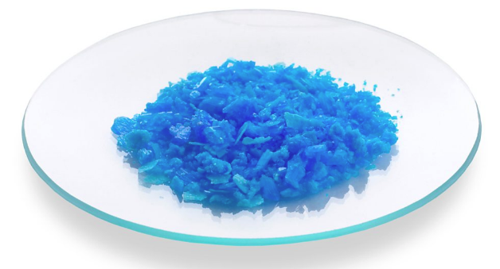

# Chemical test for water - IGCSE Chemistry Revision Notes

> ## Excerpt
> Edexcel IGCSE ChemistryRevision NotesTests for Water Exam code: 4CH1Download PDFWritten by: Stewart HirdReviewed by: Lucy KirkhamUpdated on 21 August 2024Guided study available on this topicUnderstand

---
[Edexcel IGCSE Chemistry](https://www.savemyexams.com/igcse/chemistry/edexcel/)[Revision Notes](https://www.savemyexams.com/igcse/chemistry/edexcel/19/revision-notes/)

# Tests for Water

**Exam code:** 4CH1

Download PDF

**Written by:** [Stewart Hird](https://www.savemyexams.com/authors/stewart-hird/)

**Reviewed by:** [Lucy Kirkham](https://www.savemyexams.com/authors/lucy-kirkham/)

Updated on 21 August 2024

Guided study available on this topic

Understand this topic with deeper explanations and understanding checks.

Start guided study

## Test for water

-   Water can be identified using a chemical test and/or a physical test
    

### Chemical test for water

-   **Anhydrous** copper(II) sulfate turns from **white** to **blue** on the addition of water
    
-   The equation is:
    

**CuSO**<b>4 </b> **(s) + 5H**<b>2</b>**O (l) → CuSO**<b>4</b>**.5H**<b>2</b>**O (s)**

_**Copper sulfate turns a light blue colour in the presence of water**_

### Physical test for water

-   A physical test to see if a sample of water is pure is to check its boiling point
    
-   A sample of the liquid is placed in a suitable container such as a boiling tube and gently heated
    
-   Using a thermometer, you can check if the boiling point is exactly 100 oC
    
-   Any impurities present will usually tend to raise the boiling point and depress the melting point of pure substance
    

#### Examiner Tips and Tricks

A lot of students are tempted to say you can identify water because it has no taste or smell. While this may be true, it would be extremely hazardous to taste anything in the lab and water is not the only colourless liquid to have no taste or smell!

[Test yourself](https://www.savemyexams.com/igcse/chemistry/edexcel/19/topic-questions/2-inorganic-chemistry/2-8-chemical-tests/exam-questions/)[Flashcards](https://www.savemyexams.com/igcse/chemistry/edexcel/19/flashcards/2-inorganic-chemistry/2-8-chemical-tests/)

Was this revision note helpful?

YesNo

[

Previous:Tests for Anions](https://www.savemyexams.com/igcse/chemistry/edexcel/19/revision-notes/2-inorganic-chemistry/2-8-chemical-tests/2-8-4-tests-for-anions/)[Next:Exothermic & Endothermic

](https://www.savemyexams.com/igcse/chemistry/edexcel/19/revision-notes/3-physical-chemistry/3-1-energetics/3-1-1-exothermic-and-endothermic/)

Ask about this

Download notes on Tests for Water
