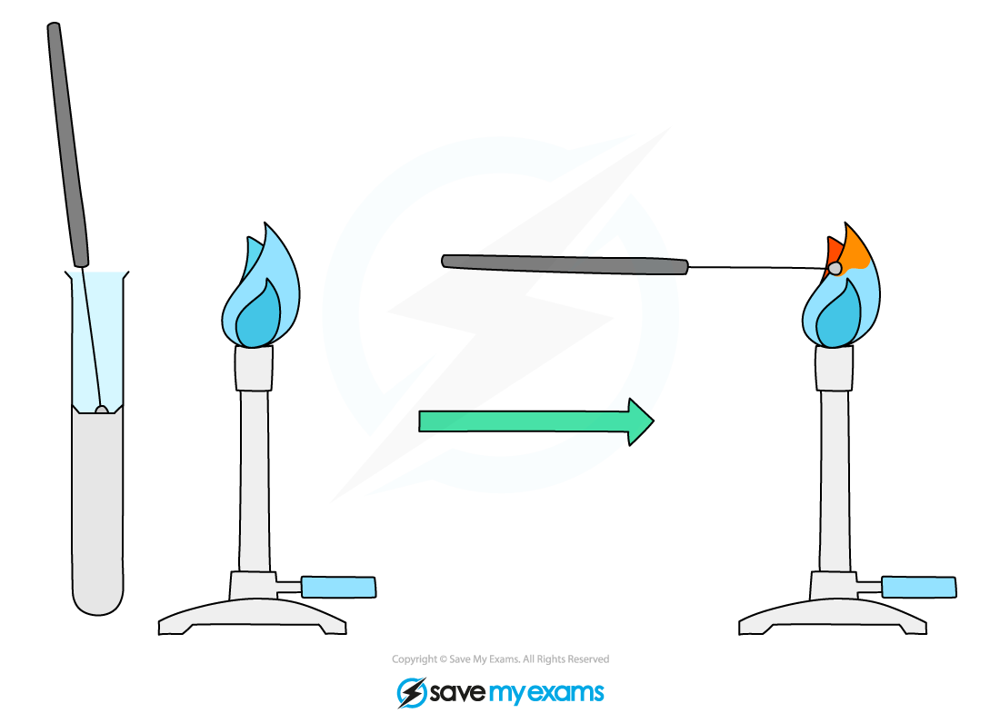
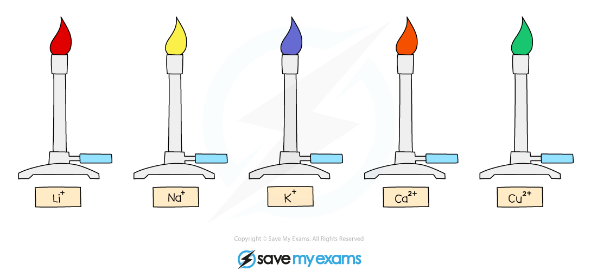

# Flame tests - IGCSE Chemistry Revision Notes

> ## Excerpt
> Edexcel IGCSE ChemistryRevision NotesFlame Tests Exam code: 4CH1Download PDFWritten by: Stewart HirdReviewed by: Lucy KirkhamUpdated on 23 October 2024Guided study available on this topicUnderstand th

---
[Edexcel IGCSE Chemistry](https://www.savemyexams.com/igcse/chemistry/edexcel/)[Revision Notes](https://www.savemyexams.com/igcse/chemistry/edexcel/19/revision-notes/)

# Flame Tests

**Exam code:** 4CH1

Download PDF

**Written by:** [Stewart Hird](https://www.savemyexams.com/authors/stewart-hird/)

**Reviewed by:** [Lucy Kirkham](https://www.savemyexams.com/authors/lucy-kirkham/)

Updated on 23 October 2024

Guided study available on this topic

Understand this topic with deeper explanations and understanding checks.

Start guided study

## Flame tests

-   The **flame test** is used to identify the positive metal ion (cations) by the colour of the flame they produce
    
    -   Ions from different metals produce different colours
        
-   To carry out a flame test:
    
    -   Dip the loop of an unreactive metal wire such as **nichrome** or **platinum** in dilute acid
        
    -   Hold it in the blue flame of a Bunsen burner until there is no colour change
        
    -   Dip the loop into the solid sample / solution and place it in the edge of the **blue** Bunsen flame
        
-   It is important to place the wire into acid first to prevent contamination
    
    -   Not doing this might result in two or more ions being present on the wire meaning the colours will mix
        
    -   One colour could mask another colour and you will not be able to identify the ion
        

_**Diagram showing the technique for carrying out a flame test**_

-   The colour of the flame is observed and used to identify the metal ion present
    

| **Cation** | **Flame Colour** |
|--------|--------------|
| Li+ | Red |
| Na+ | Yellow |
| K+ | Lilac |
| Ca2+ | Orange-red |
| Cu2+ | Blue-green |

_**Diagram showing the colours formed in the flame test for metal ions**_

#### Examiner Tips and Tricks

The sample needs to be heated strongly, so the Bunsen burner flame should be on a blue flame.

[Test yourself](https://www.savemyexams.com/igcse/chemistry/edexcel/19/topic-questions/2-inorganic-chemistry/2-8-chemical-tests/exam-questions/)[Flashcards](https://www.savemyexams.com/igcse/chemistry/edexcel/19/flashcards/2-inorganic-chemistry/2-8-chemical-tests/)

Was this revision note helpful?

YesNo

[

Previous:Tests for Gases](https://www.savemyexams.com/igcse/chemistry/edexcel/19/revision-notes/2-inorganic-chemistry/2-8-chemical-tests/2-8-1-tests-for-gases/)[Next:Tests for Cations

](https://www.savemyexams.com/igcse/chemistry/edexcel/19/revision-notes/2-inorganic-chemistry/2-8-chemical-tests/2-8-3-tests-for-cations/)

Ask about this

Download notes on Flame Tests
