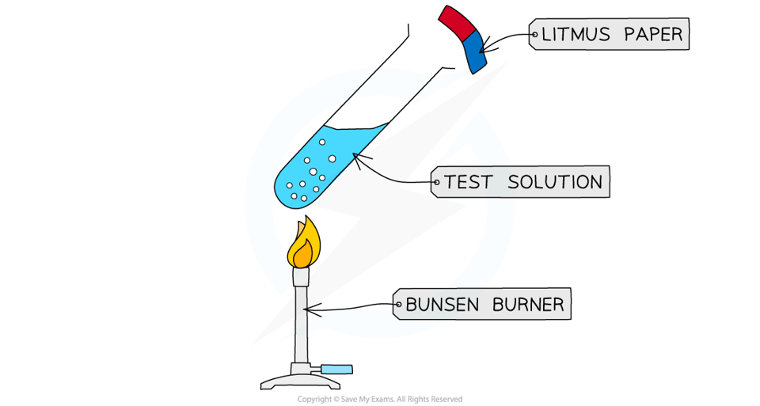
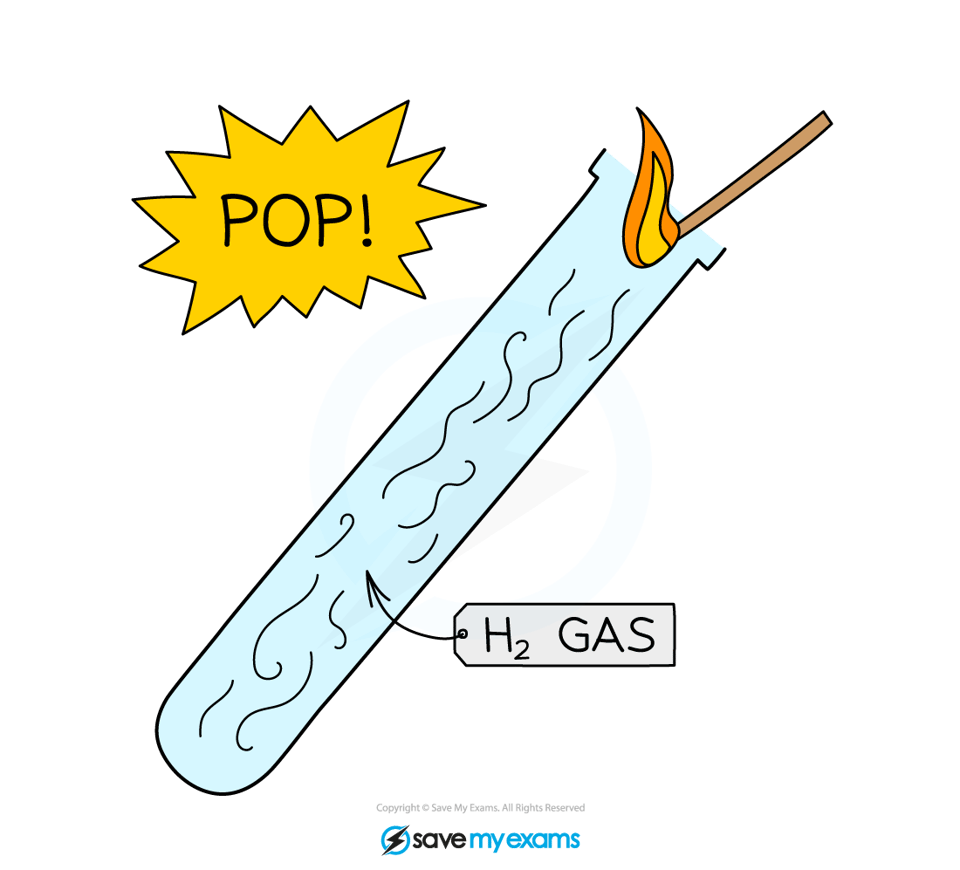
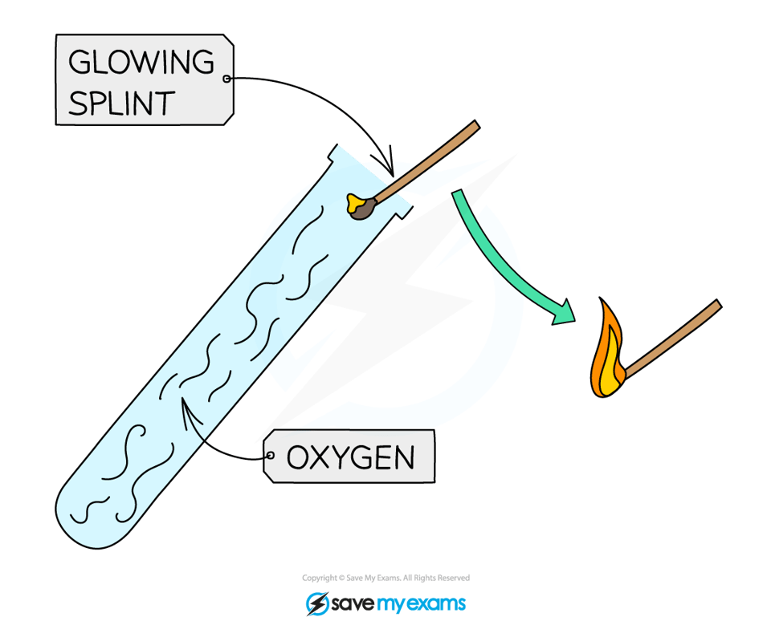

# Gas tests - IGCSE Chemistry Revision Notes

> ## Excerpt
> Learn the common gas tests for IGCSE Chemistry. With simple descriptions of how to test for ammonia, carbon dioxide, chlorine, hydrogen, and oxygen.

---
## Tests for gases

-   Several tests for anions and cations produce **gases** which then need to be tested
    
-   The gases included in the syllabus are:
    
    -   Ammonia
        
    -   Carbon dioxide
        
    -   Chlorine
        
    -   Hydrogen
        
    -   Oxygen
        

### Test for ammonia

-   Ammonia is a gas with a characteristic sharp choking smell that turns damp **red** litmus paper **blue**
    
-   Hold the litmus paper near the mouth of the test tube, but be careful to avoid touching the sides of the test tube
    
-   If you are testing for ammonia produced from ammonium ions and sodium hydroxide, avoiding touching the sides to prevent traces of sodium hydroxide from also turning the red litmus paper blue
    

#### Testing for ammonia gas

_**Damp red litmus paper turns blue in the presence of ammonia**_

#### Examiner Tips and Tricks

Make sure you understand the difference between ammonium and ammonia.

-   Ammonium refers to the aqueous cation, NH4+
    
-   Ammonia refers to the gas, NH3.
    

### Test for carbon dioxide 

-   The test for carbon dioxide involves bubbling the gas through an aqueous solution of **limewater** (calcium hydroxide)
    
-   If the gas is carbon dioxide, the limewater turns **cloudy white**
    

#### Testing for carbon dioxide gas

_**Limewater turns cloudy white in the presence of carbon dioxide**_

#### Examiner Tips and Tricks

Sometimes students think that extinguishing a burning splint indicates carbon dioxide gas.

However, while it is a property of carbon dioxide, other gases, such as nitrogen, will also do this.

So, the test is not definitive and should not be given as an exam answer.

### Test for chlorine gas

-   The test for chlorine makes use of **litmus paper**
    
-   If chlorine gas is present, damp blue litmus paper will turn red and then be **bleached white**
    
    -   It turns red initially as acids are produced when chlorine comes into contact with water
        
-   Chlorine also has a characteristic sharp, choking smell 
    
-   Chlorine should always be handled in a fume cupboard due to its toxicity
    

#### Testing for chlorine gas

_**Chlorine bleaches damp blue litmus paper white**_

#### Examiner Tips and Tricks

You should distinguish between properties of gases and tests for gases. Chlorine 'smells like swimming pools' is a characteristic, but it is not an acceptable means of identification. 

### Test for hydrogen gas

-   The test for hydrogen consists of holding a **burning splint** at the open end of a test tube of gas
    
-   If the gas is hydrogen it burns with a loud “**squeaky pop**” which is the result of the rapid combustion of hydrogen with oxygen to produce water
    
-   Be sure not to insert the splint right into the tube, just at the mouth, as the gas needs air to burn
    

#### Testing for hydrogen gas

_**A burning splint gives a 'squeaky pop' sound**_

#### Examiner Tips and Tricks

It is easy to confuse the tests for hydrogen and oxygen.

Try to remember that a lig**H**ted splint has an **H** for Hydrogen, while a gl**O**wing splint has an **O** for Oxygen.

### Test for oxygen

-   The test for oxygen consists of placing a **glowing splint** inside a test tube of gas
    
-   If the gas is oxygen, the splint will **relight**
    

#### Testing for oxygen gas

_**A glowing splint will relight in the presence of oxygen**_

#### Examiner Tips and Tricks

Sometimes the splint does not relight, but it glows very brightly, which is also a positive result. In an exam, however, it is best to state it relights the glowing splint.

Was this revision note helpful?
