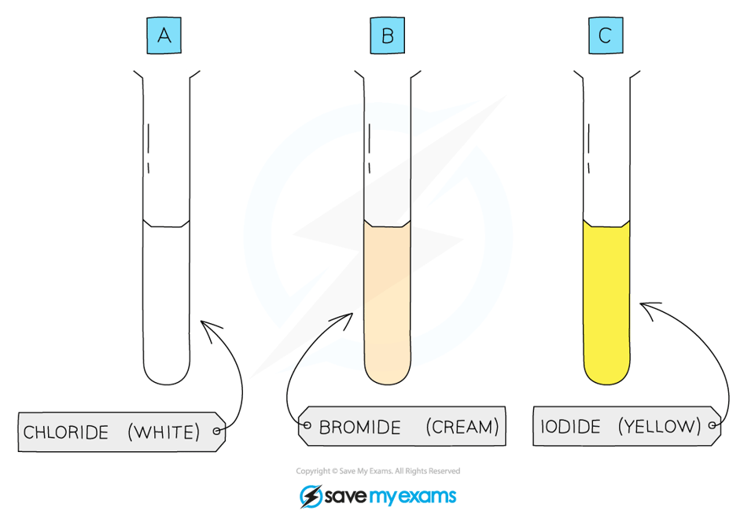

# Tests for Anions | Edexcel IGCSE Chemistry Revision Notes 2017

> ## Excerpt
> Revision notes on Tests for Anions for the Edexcel IGCSE Chemistry syllabus, written by the Chemistry experts at Save My Exams.

---
## Tests for anions

-   Negatively charged non-metal ions are known as **anions**
    
-   You must be able to **describe** the tests for the following ions:
    
    -   Carbonate ions, CO32– 
        
    -   Halide ions, Cl– , Br– , I– 
        
    -   Sulfate ions, SO42– 
        

### Test for carbonate ions

-   Carbonate compounds contain the carbonate ion, CO32-
    
-   The test for the carbonate ion is:
    
    -   Add **dilute acid** 
        
    -   Bubble the **gas** released through limewater
        
    -   Limewater turns cloudy if the carbonate ion is present
        
-   If a carbonate compound is present then fizzing / effervescence should be seen as **CO**<b>2</b> gas is produced, which forms a white precipitate of calcium carbonate when bubbled through limewater:
    

**CO**<b>3</b><b>2-&nbsp;</b> **(aq) + 2H**<b>+&nbsp;</b> **(aq) → CO**<b>2&nbsp;</b> **(g) + H**<b>2</b>**O (l)**

**CO**<b>2&nbsp;</b> **(g) + Ca(OH)**<b>2</b> **(aq) → CaCO**<b>3</b>**(s) + H**<b>2</b>**O(l)**

-   The white precipitate turns limewater **cloudy** 
    

#### Testing for carbonate ions

_**Limewater turns milky in the presence of carbon dixoide caused by the formation of insoluble calcium carbonate**_

### Test for halide ions

-   Halide ions are the negative ions / anions formed by the elements in Group 7 
    
-   The test for the halide ions is:
    
    -   Acidify the sample with nitric acid
        
    -   Add **silver nitrate solution,** AgNO3,  
        
    -   A silver halide **precipitate** forms if a halide ion is present
        
        -   The precipitate is indicated by the state symbol (s)
            
-   The colour of the silver halide precipitate depends on the halide ion:
    
    -   The chloride ion forms a **white** precipitate of silver chloride 
        

**potassium chloride +  silver nitrate   →  potassium nitrate + silver chloride** 

**KCl (aq)   +     AgNO**<b>3</b> **(aq)   →  KNO**<b>3</b> **(aq)  +  AgCl (s)** 

-   The bromide ion forms a **cream** precipitate of silver bromide 
    

**potassium bromide +  silver nitrate   →  potassium nitrate + silver bromide**

**KBr (aq)   +     AgNO**<b>3</b> **(aq)   →  KNO**<b>3</b> **(aq)  +  AgBr (s)** 

-   The iodide ions forms a **yellow** precipitate of silver iodide 
    

**potassium iodide +  silver nitrate   →  potassium nitrate + silver iodide**

**KI (aq)   +     AgNO**<b>3</b> **(aq)   →  KNO**<b>3</b> **(aq)  +  AgI (s)** 

#### Testing for halide ions

_**Each silver halide produces a precipitate of a different colour**_

### Test for sulfate ions

-   Sulfate compounds contain the sulfate ion, SO42-
    
-   The test for the sulfate ion is:
    
    -   Acidify the sample with **dilute hydrochloric acid** 
        
    -   Add a few drops of **barium chloride solution**
        
    -   A **white** precipitate of barium sulfate is formed, if the sulfate ion is present
        

**Ba**<b>2+</b> **(aq) + SO**<b>4</b><b>2-</b> **(aq) → BaSO**<b>4</b> **(s)**

-   The test can also be carried out with barium nitrate solution
    

#### Testing for sulfate ions 

_**A white precipitate of barium sulfate is a positive result for the presence of sulfate ions**_
