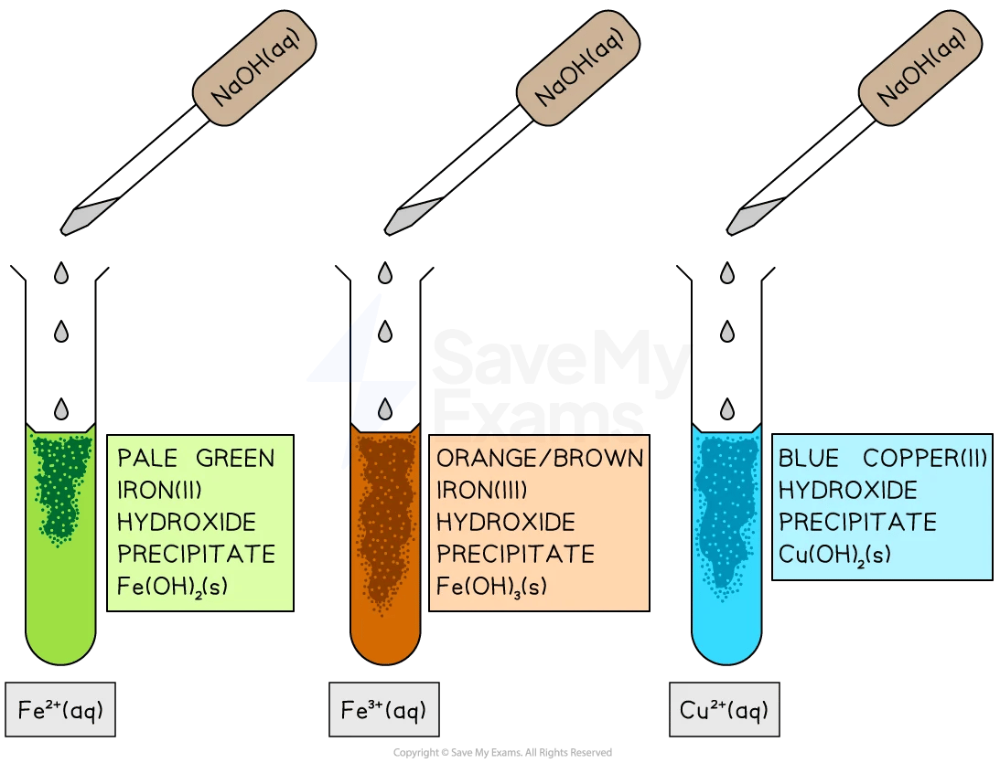

# Tests for cations - IGCSE Chemistry Revision Notes

> ## Excerpt
> Use our revision notes to learn the tests for cations for IGCSE Chemistry. Learn how to use sodium hydroxide to test for cations and the expected results.

---
## Tests for cations

### Testing for metal cations

-   Metal cations in aqueous solution can be identified by the **colour** of the precipitate formed when sodium hydroxide (NaOH) is added 
    
-   A few drops of NaOH is added at first and any colour changes or precipitates formed are noted
    

_**The addition of sodium hydroxide to the metal ions forms precipitates of different colours**_

-   A metal hydroxide **precipitate** typically forms if the hydroxide is insoluble in water
    
-   If **no precipitate** forms, the hydroxide may be soluble or there may not be enough of the metal ion present
    

-   A summary of the reactions is shown in the table below
    

#### Table showing the colour of the precipitates formed

| **Metal ion** | **Reaction** | **Colour** |
|-----------|-------------------------------------|----------------------------|
| Fe2+ | Fe2+ (aq) + 2OH– (aq) → Fe(OH)2 (s) | Pale green precipitate |
| Fe3+ | Fe3+ (aq) + 3OH– (aq) → Fe(OH)3 (s) | Orange / brown precipitate |
| Cu2+ | Cu2+ (aq) + 2OH– (aq) → Cu(OH)2 (s) | Blue precipitate |

#### Examiner Tips and Tricks

Examiners are often quite specific about the copper(II) ions, Cu2+ (aq). You need to specifically state **light blue** for the precipitate colour to be sure of the mark

### Test for ammonium ion, NH4+

-   Add NaOH and warm the mixture
    
-   Observation with NaOH**:** Ammonia gas is released
    
-   Ionic equation:
    

NH4+ (aq) + OH- (aq) → NH3 (g) + H2O (l)

-   [Test for ammonia gas](https://www.savemyexams.com/igcse/chemistry/edexcel/19/revision-notes/2-inorganic-chemistry/2-8-chemical-tests/2-8-1-tests-for-gases/): Ammonia turns damp red litmus paper blue
    

#### Examiner Tips and Tricks

Sometimes the cation may be present in very small amounts, so the precipitate might appear only as a slight cloudiness or faint colour change - this can still indicate a positive test result.

Was this revision note helpful?
