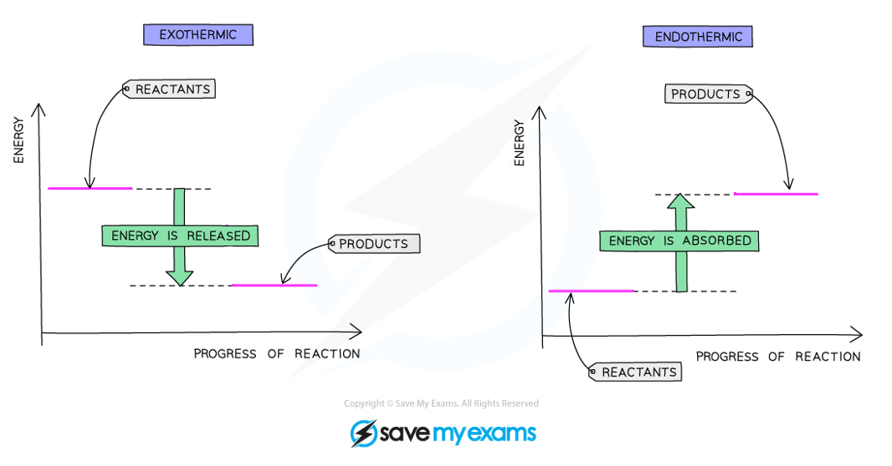

# Energy level diagrams - IGCSE Chemistry Revision Notes

> ## Excerpt
> Edexcel IGCSE ChemistryRevision NotesEnergy Level Diagrams Exam code: 4CH1Download PDFWritten by: Stewart HirdReviewed by: Lucy KirkhamUpdated on 23 October 2024Guided study available on this topicUnd

---
[Edexcel IGCSE Chemistry](https://www.savemyexams.com/igcse/chemistry/edexcel/)[Revision Notes](https://www.savemyexams.com/igcse/chemistry/edexcel/19/revision-notes/)

# Energy Level Diagrams

**Exam code:** 4CH1

Download PDF

**Written by:** [Stewart Hird](https://www.savemyexams.com/authors/stewart-hird/)

**Reviewed by:** [Lucy Kirkham](https://www.savemyexams.com/authors/lucy-kirkham/)

Updated on 23 October 2024

Guided study available on this topic

Understand this topic with deeper explanations and understanding checks.

Start guided study

## Energy level diagrams

-   Energy level diagrams are graphical representations of the relative energies of the reactants and products in chemical reactions
    
-   The energy of the reactants and products are displayed on the y-axis and the progress of the reaction is shown on the x-axis
    
-   Arrows on the diagrams indicate whether the reaction is exothermic (**downwards** pointing) or endothermic (**upwards** pointing)
    
-   The difference in height between the energy of reactants and products represents the **overall enthalpy change** of a reaction
    

#### Energy level diagrams

_**Energy level diagram of an exothermic reaction and an endothermic reaction**_

-   Energy is given out in exothermic reactions
    
    -   The energy of the products will be **lower** than the energy of the reactants, so the change in energy is **negative**
        
    -   This is represented on the energy level diagram with a **downwards arrow** as the energy of the products is lower than the reactants
        
-   Energy is taken in in endothermic reactions
    
    -   The energy of the products will be **higher** than the energy of the reactants, so the change in energy is **positive**
        
    -   This is represented on the energy level diagram with an **upwards arrow** as the energy of the products is higher than the reactants
        

#### Examiner Tips and Tricks

You should be able to draw clear and fully labelled energy level diagrams for both types of reactions and you should be able to identify a reaction from its energy level diagram.

[Reaction profiles,](https://www.savemyexams.com/igcse/chemistry/edexcel/19/revision-notes/3-physical-chemistry/3-2-rates-of-reaction/3-2-4-activation-energy/) covered in a later topic, are similar to energy level diagrams but also show how the energy changes during the course of a reaction. These can be used to indicate the activation energy and enthalpy change of the reaction.

[Test yourself](https://www.savemyexams.com/igcse/chemistry/edexcel/19/topic-questions/3-physical-chemistry/3-1-energetics/exam-questions/)[Flashcards](https://www.savemyexams.com/igcse/chemistry/edexcel/19/flashcards/3-physical-chemistry/3-1-energetics/)

Was this revision note helpful?

YesNo

[

Previous:Energetics Calculations](https://www.savemyexams.com/igcse/chemistry/edexcel/19/revision-notes/3-physical-chemistry/3-1-energetics/3-1-3-energetics-calculations/)[Next:Bond Energy

](https://www.savemyexams.com/igcse/chemistry/edexcel/19/revision-notes/3-physical-chemistry/3-1-energetics/3-1-5-bond-energy/)

Ask about this

Download notes on Energy Level Diagrams
