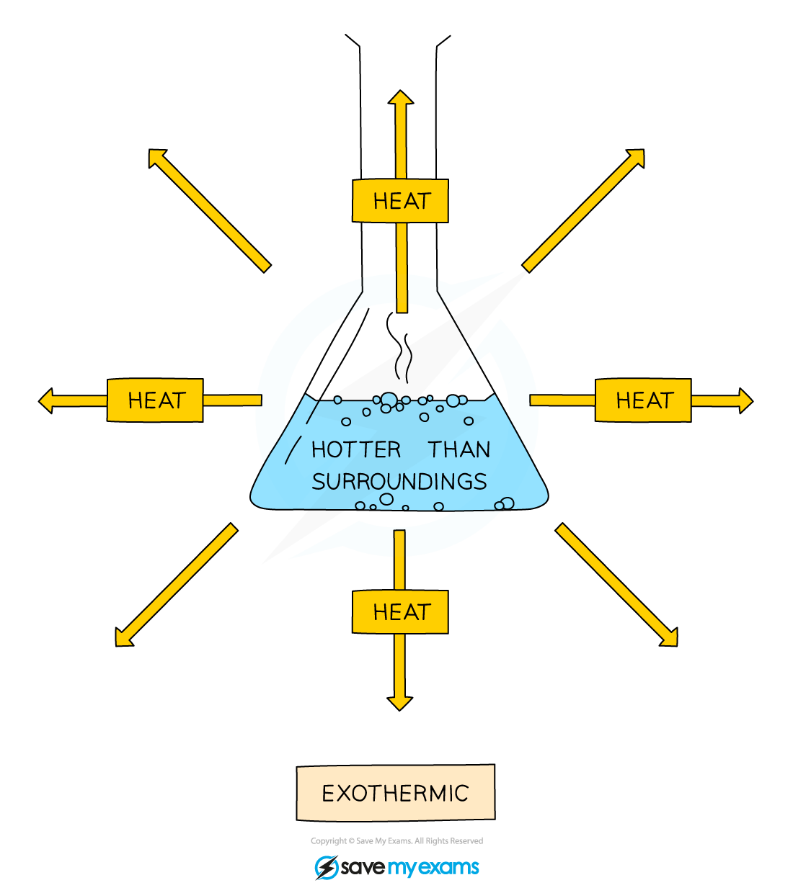
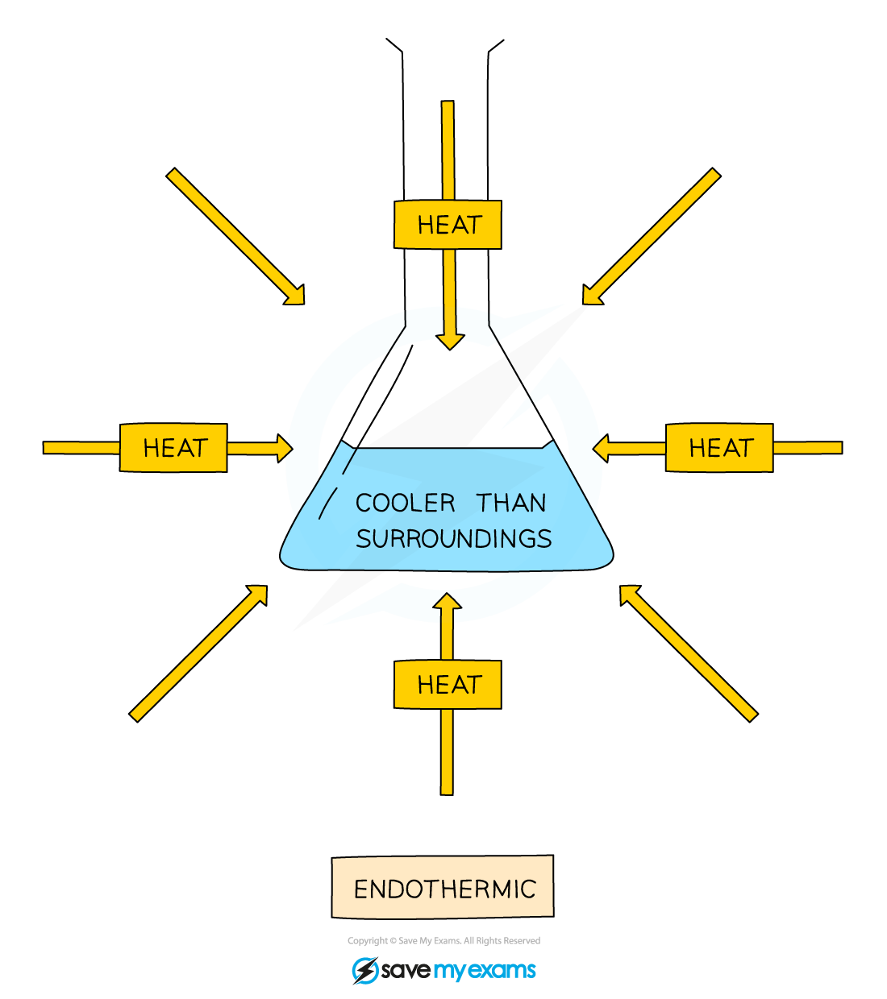

# Exothermic and endothermic - IGCSE Chemistry Revision Notes

> ## Excerpt
> Learn about exothermic and endothermic reactions for IGCSE Chemistry, including heat transfer, temperature changes, and examples of each type.

---
## Exothermic and endothermic reactions

-   The changes in heat content can be determined and **measured** with a thermometer
    
-   Note that the overall amount of energy does not change as energy is **conserved** in reactions
    
    -   This is known as the **law of conservation of energy**
        
-   This means that it cannot be **created** or **destroyed** but it can be **transferred**
    
-   So, if energy is transferred to the surroundings during a chemical reaction, then the products formed must have **less energy** than the reactants by the same amount as that transferred
    

### Exothermic reactions

-   An exothermic reaction releases heat energy into the surroundings
    
    -   This means that the temperature of the reaction mixture **and its surroundings** increases
        
    -   This change can be measured with a thermometer
        
-   Examples of exothermic reactions include neutralisation and combustion
    

#### Exothermic reaction diagram

_**In exothermic reactions, the temperature of the surroundings increases and the heat content of the system falls**_

### Endothermic reactions

-   An endothermic reaction takes heat energy in from the surroundings
    
    -   This means that the temperature of the reaction mixture **and its surroundings** decreases
        
    -   This change can be measured with a thermometer
        

#### Endothermic reaction diagram

_**In endothermic reactions, the temperature of the surroundings falls and the heat content of the system increases**_

-   The following are some examples of heat changes in reactions
    
    -   **Neutralisation** reactions:
        
        -   These always give energy **out**
            
    -   **Displacement** reactions:
        
        -   These can either take energy **in** or give it **out**
            
    -   **Combustion** reactions:
        
        -   These always give energy **out**
            

#### Worked Example

A student was investigating the temperature change for four different chemical reactions. The table shows the chemicals that the student combined for each reaction along with the initial and final temperatures of the reaction.

| **Experiment** | **Chemicals** | **Chemicals** | **Initial temperature** **(****o****C)** | **Final temperature** **(****o****C)** |
|------------|---------------|-----------------|-----------------------------|---------------------------|
| **1** | 10 cm3 NaOH | 10 cm3 HCl | 19 | 21 |
| **2** | 10 cm3 NaHCO3 | 2 g citric acid | 20 | 16 |
| **3** | 10 cm3 CuSO4 | 0.5 g Mg powder | 20 | 26 |
| **4** | 10 cm3 H2SO4 | 3 cm Mg ribbon | 19 | 31 |

a) Identify each reaction as endothermic or exothermic.

 b) Explain your answer.

**Answers:**

a)

Exothermic reactions = 1, 3 and 4

Endothermic reaction = 2 

b)

The exothermic reactions all show an **increase** in temperature, while the endothermic reaction shows a **decrease** in temperature
