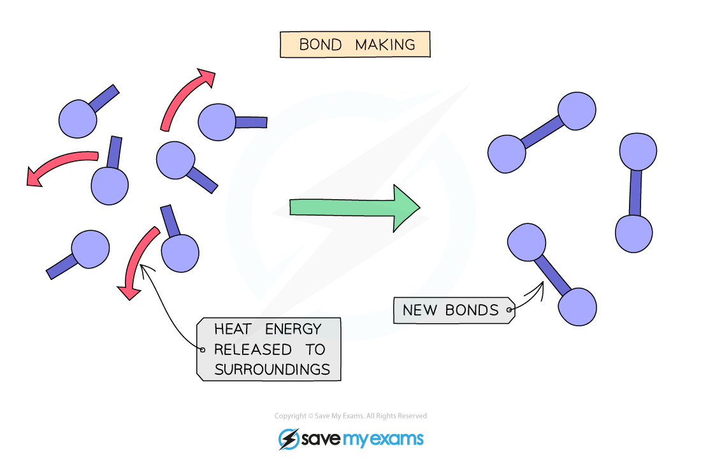
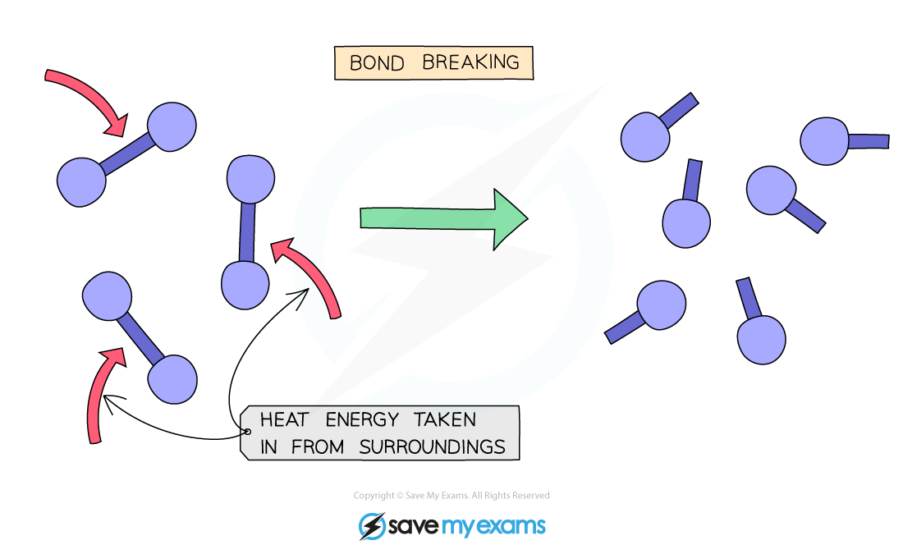

# What is bond energy? - IGCSE Chemistry Revision Notes

> ## Excerpt
> Learn what bond energy is using our revision notes for your IGCSE chemistry exam. Understand the difference in energy when bonds are broken and made.

---
## Bond energies

-   During a chemical reaction energy must be taken in to **break bonds**
    
    -   Because energy is being taken in, bond breaking is an [endothermic](https://www.savemyexams.com/igcse/chemistry/edexcel/19/revision-notes/3-physical-chemistry/3-1-energetics/3-1-1-exothermic--endothermic/) process
        
-   During a chemical reaction, energy is released when **new bonds** are formed
    
    -   Because energy is released, bond making is an [exothermic](https://www.savemyexams.com/igcse/chemistry/edexcel/19/revision-notes/3-physical-chemistry/3-1-energetics/3-1-1-exothermic--endothermic/) process
        
-   Whether a reaction is endothermic or exothermic overall depends on the difference between the energy needed to **break** existing bonds and the energy released when the new bonds are **formed**
    

### Exothermic reactions

-   In an exothermic reaction:
    
    -   The energy released when new bonds are formed is **greater** than the energy taken in to break bonds
        
    -   The change in energy is **negative** since the reactants have more energy than the products
        
    -   Therefore an exothermic reaction has a **negative** **Δ**_**H**_ value
        

_**Making new bonds gives off heat from the reaction to the surroundings**_

### Endothermic reactions

-   In an endothermic reaction:
    
    -   The energy needed to break existing bonds is greater than the energy released when new bonds are formed
        
    -   The change in energy is positive since the products have more energy than the reactants
        
    -   Therefore an endothermic reaction has a **positive** Δ_H_ value
        

#### Examiner Tips and Tricks

Remember bond breaking is ENDothermic and results in the END of the bond.

## Bond energy calculations

-   Each chemical bond has a specific **bond energy** associated with it
    
-   This is the amount of energy required to **break** the bond or the amount of energy given out when the bond is **formed**
    
-   This energy can be used to calculate how much heat would be released or absorbed in a reaction
    
-   To do this it is necessary to know the bonds present in both the reactants and products
    
-   We can calculate the total change in enthalpy for a reaction if we know the bond energies of all the species involved
    
-   Add together all the bond energies for all the bonds in the reactants – this is the ‘energy in’
    
-   Add together the bond energies for all the bonds in the products – this is the ‘energy out’
    
-   Calculate the enthalpy change using the equation:
    

**Enthalpy change (Δ**_**H**_**) = Energy taken in - Energy given out**

#### Worked Example

Hydrogen and chlorine react to form hydrogen chloride gas:

**H–H**  **\+ Cl–Cl ⟶ H–Cl   H–Cl**

The bond energies are given in the table below.

| **Bond** | **Energy (kJ)** |
|-------|-------------|
| H–H | 436 |
| Cl–Cl | 242 |
| H–Cl | 431 |

 Calculate the overall energy change for this reaction and use this value to explain whether the reaction is exothermic or endothermic.

**Answer:**

-   Calculate the energy in
    
    -   436 + 242 = 678 (kJ)
        
-   Calculate the energy out
    
    -   2 x 431 = 862 (kJ)
        
-   Calculate the energy change
    
    -   678 - 862 = **–184** (kJ)
        
-   Since the energy change is a negative number, energy is being released (to the surroundings)
    
    -   Therefore, the reaction is **exothermic**
        

#### Worked Example

Hydrogen bromide decomposes to form hydrogen and bromine:

**2HBr  ⟶ H**<b>2&nbsp;&nbsp;</b>  **\+ Br**<b>2</b>

The overall energy change for this reaction is +103 kJ.

The relevant bond energies are shown in the table below.

| **Bond** | **Energy (kJ)** |
|-------|-------------|
| H–Br | 366 |
| Br–Br |  |
| H–H | 436 |

 Calculate the bond energy of the Br–Br bond.

**Answer:**

-   Calculate the energy in
    
    -   2 x 366 = 732 (kJ)
        
-   State the energy out
    
    -   436 + Br–Br 
        
-   Overall energy change = energy in - energy out
    
    -   +103 = 732 - (436 + Br–Br)
        
    -   +103 = 732 - 436 - Br–Br
        
-   Calculate the bond energy of the Br–Br bond
    
    -   Br–Br = 732 - 436 - 103
        
    -   Br–Br = +**193 (kJ)**
        

#### Examiner Tips and Tricks

For bond energy questions, it is helpful to write down a displayed formula equation for the reaction before identifying the type and number of bonds, to avoid making mistakes. Don't forget to take into account the balancing numbers when working out how many of each type of bond is being broken/formed.

Was this revision note helpful?
