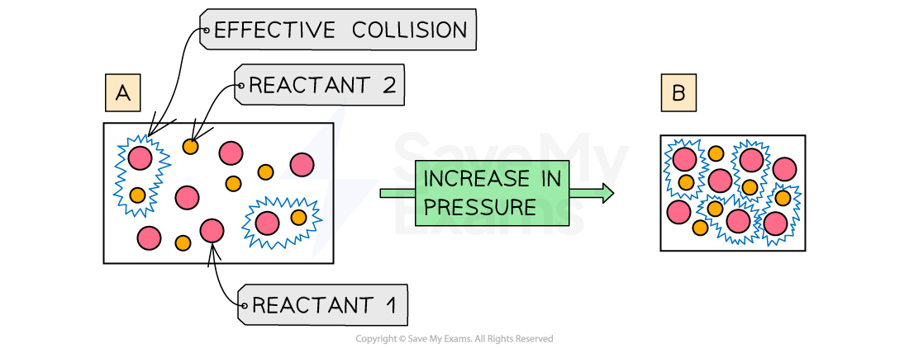
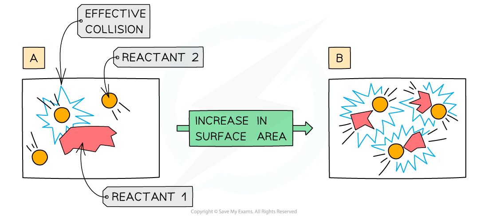

# Explaining Rates | Edexcel IGCSE Chemistry Revision Notes 2017

> ## Excerpt
> Revision notes on Explaining Rates for the Edexcel IGCSE Chemistry syllabus, written by the Chemistry experts at Save My Exams.

---
## Explaining rates of reaction

-   Increasing the number of successful collisions means that a greater proportion of reactant particles collide to form product molecules.
    
-   We have seen previously that the following factors influence the rate of reaction
    
    -   Increasing **concentration**
        
    -   Increasing **temperature**
        
    -   Increase the **surface** **area** of a solid reactant
        
    -   Use of a **catalyst**
        
-   We can use collision theory to explain why these factors influence the reaction rate:
    

### How increasing concentration affects rate

-   Increasing the concentration of a solution increases the rate of reaction 
    
-   Increasing the concentration means that there are more reactant particles in a given volume
    
    -   This causes more collisions per second
        
    -   Leading to more frequent and successful collisions per second
        
    -   Therefore, the rate of reaction increases 
        
-   If you double the number of particles, you will double the number of collisions per second
    
-   The number of collisions is **proportional** to the number of particles present
    

#### Diagram showing the effect of increasing concentration

_**A higher concentration of particles in (b) means that there are more particles present in the same volume than (a) so the number of collisions and successful collisions between particles increases causing an increased rate of reaction**_

### How increasing pressure affects rate

-   Increasing the pressure of a gas increases the rate of reaction 
    
-   Increasing the pressure means that there are the same number of reactant particles in a smaller volume
    
    -   This causes more collisions per second
        
    -   Leading to more frequent and successful collisions per second
        
    -   Therefore, the rate of reaction increases
        

#### Diagram showing the effect of increasing pressure

_**The higher pressure (b) means that there are the same number of particles present in a smaller volume than (a) so the number of collisions and successful collisions between particles increases causing an increased rate of reaction**_

### How increasing temperature affects rate

-   Increasing the temperature increases the rate of reaction 
    
-   Increasing the temperature means that the particles have more kinetic energy
    
    -   This causes more collisions per second
        
    -   Leading to more frequent and successful collisions per second
        
    -   Therefore, the rate of reaction increases
        
-   The effect of temperature on collisions is not so straightforward as concentration or surface area; a small increase in temperature causes a large increase in rate
    
-   For aqueous and gaseous systems, a rough rule of thumb is that for every 10 oC increase in temperature, the rate of reaction approximately doubles
    

#### Diagram showing the effect of increasing temperature

_**An increase in temperature causes an increase in the kinetic energy of the particles. The number of successful collisions increases**_ 

### How increasing the surface area affects rate

-   Increasing the surface area increases the rate of reaction 
    
-   Increasing the surface area means that a greater **surface area** of **particles** will be exposed to the other reactant
    
    -   This causes more collisions per second
        
    -   Leading to more frequent and successful collisions per second
        
    -   Therefore, the rate of reaction increases
        
-   If you double the surface area, you will double the number of collisions per second
    

#### Diagram showing the effect of increasing surface area

_**An increase in surface area means more collisions per second**_

#### Examiner Tips and Tricks

Temperature affects reaction rate by increasing the number of collisions and the energy of the collisions. Of the two factors, the increase in energy is the more important one.
