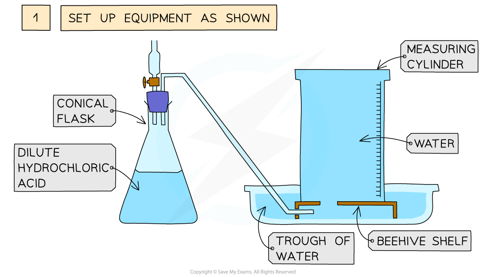
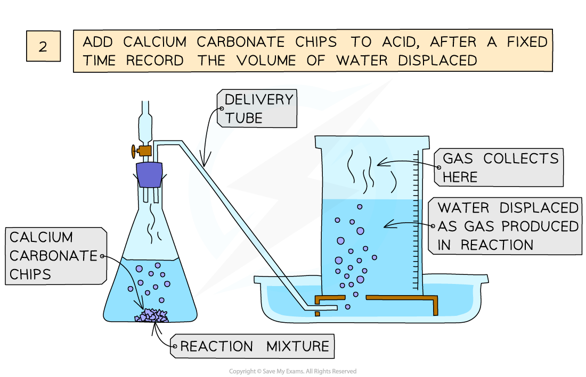
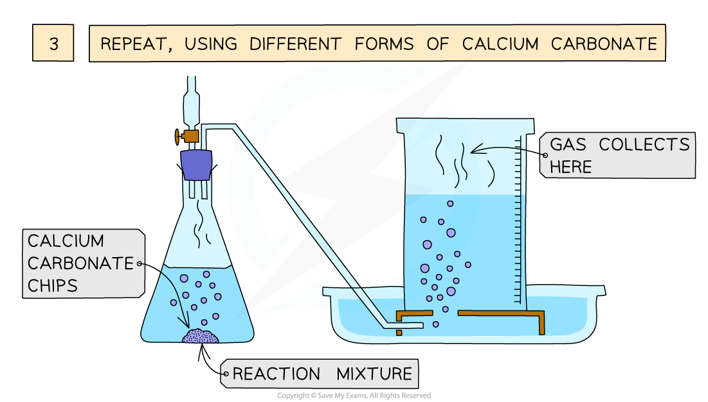

# How surface area affects rate - IGCSE Revision Notes

> ## Excerpt
> Investigate how surface area affects reaction rate in IGCSE Chemistry. Explore the reaction of marble chips with acid, using particle theory and reaction time.

---
## Practical: Effect of surface area on rate of reaction

### Aim:

To investigate the effect of changing [surface area](https://www.savemyexams.com/igcse/chemistry/edexcel/19/revision-notes/3-physical-chemistry/3-2-rates-of-reaction/3-2-2-explaining-rates/) on the rate of reaction

### Diagram:

_**Investigating the effect of different size marble chips on the rate of reaction between calcium carbonate and hydrochloric acid**_

### Method:

1.  Add a fixed volume of hydrochloric acid into a conical flask
    
2.  Use a delivery tube to connect this flask to an inverted measuring cylinder
    
3.  Add marble chips into the conical flask and close the bung
    
4.  Measure the volume of gas produced in a fixed time using the measuring cylinder
    
5.  Repeat with different sizes of marble chips
    

### Results:

-   Record your results in a table like this  
    
    | **Size of marble chip** | **Volume of gas produced in 30 seconds (cm****3****)** |
    |---------------------|--------------------------------------------|
    |  |  |
    |  |  |
    |  |  |
    |  |  |
    

### Conclusion:

-   Increasing the surface area of the marble chip, increases the rate of reaction 
    
-   This is because more surface area particles of the marble chips will be exposed to the dilute hydrochloric acid so there will be more frequent and successful collisions, increasing the rate of reaction
    

Was this revision note helpful?
