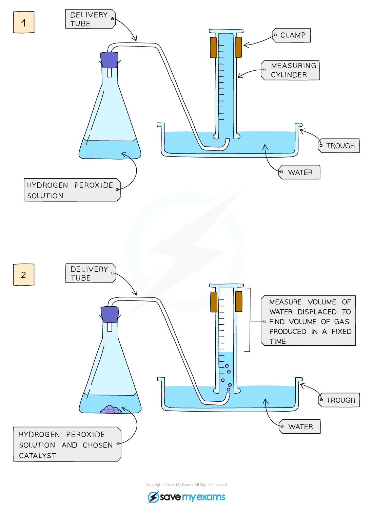

# Investigating catalysts - IGCSE Chemistry Revision Notes

> ## Excerpt
> Investigate how catalysts affect the decomposition of hydrogen peroxide in this IGCSE Chemistry experiment. Learn how to measure and compare reaction rates.

---
## Practical: Effect of catalysts on rate of reaction

### Aim:

To investigate the effect of different solids on the catalytic decomposition of hydrogen peroxide

### Diagram:

_**Diagram showing the apparatus needed to investigate the effect of a catalyst on the rate of reaction**_

### Method:

1.  Add hydrogen peroxide into a conical flask
    
2.  Use a delivery tube to connect this flask to a measuring cylinder upside down in water trough
    
3.  Add the chosen catalyst into the conical flask and close the bung
    
4.  Measure the volume of gas produced in a fixed time using the measuring cylinder
    
5.  Repeat experiment with different [catalysts](https://www.savemyexams.com/igcse/chemistry/edexcel/19/revision-notes/3-physical-chemistry/3-2-rates-of-reaction/3-2-3-catalysts/) and compare results
    
6.  Catalysts to try could include: manganese(IV) oxide, lead(II) oxide, iron(III) oxide and copper(II) oxide
    

### Result:

-   The data for different catalysts can be plotted on the same graph and the relative rates compared
    

Was this revision note helpful?
