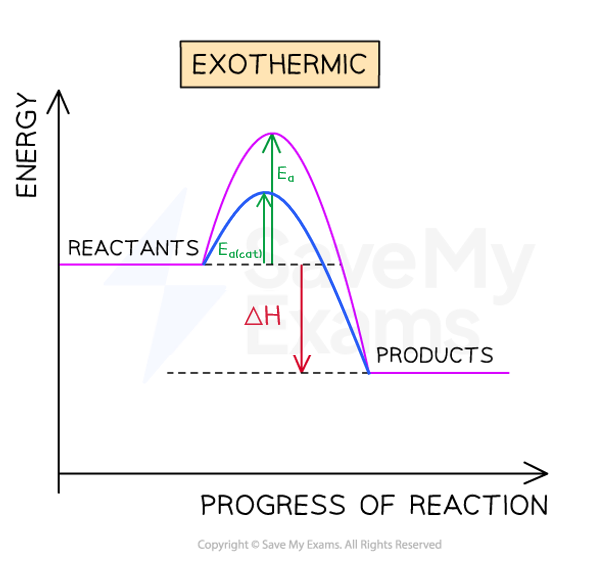

# What is activation energy?- IGCSE Revision Notes

> ## Excerpt
> Use our notes to understand what activation energy is for your IGCSE chemistry exam. Label it in reaction profiles for exothermic and endothermic reactions.

---
## Reaction profiles

#### Reaction profiles showing ∆H and Ea

-   Reaction profiles are similar to [energy level diagrams](https://www.savemyexams.com/igcse/chemistry/edexcel/19/revision-notes/3-physical-chemistry/3-1-energetics/3-1-4-energy-level-diagrams/) seen in a previous topic, but in addition to showing the relative energies of the reactants and products in chemical reactions, they also show how the energy changes as the reaction progresses
    
-   The difference in height between the energy of reactants and products represents the **overall enthalpy change** of a reaction
    
    -   For an **exothermic** reaction, the value of $\Delta$_H_ is **negative** and the arrow point **downwards**
        
    -   For an **endothermic** reaction, the value of $\Delta$_H_ is **positive** and the arrow point **upwards**
        
-   The initial increase in energy, from the reactants to the peak of the curve, represents the **activation energy,** _**E**_<b>a</b>**,**  required to start the reaction
    
    -   Activation energy is the minimum amount of energy that reacting particles must have in order for a reaction to occur.
        
-   The greater the initial rise then the more energy that is required to get the reaction going e.g., more heat needed
    

#### Reaction profiles of exothermic and endothermic reactions

_**Reaction profiles show enthalpy change and activation energy for the reaction**_

### Catalysts and reaction profiles

-   **Catalysts** provide the reactants with an alternative pathway for the reaction which has a lower activation energy
    
-   By lowering the activation energy a **greater proportion** of molecules in the reaction mixture have sufficient energy for an **effective collision**
    
-   As a result of this, the rate of the catalysed reaction is increased compared to the uncatalysed reaction
    

#### Diagram showing the effect of a catalyst on activation energy

_**Catalysts lower the activation energy**_
