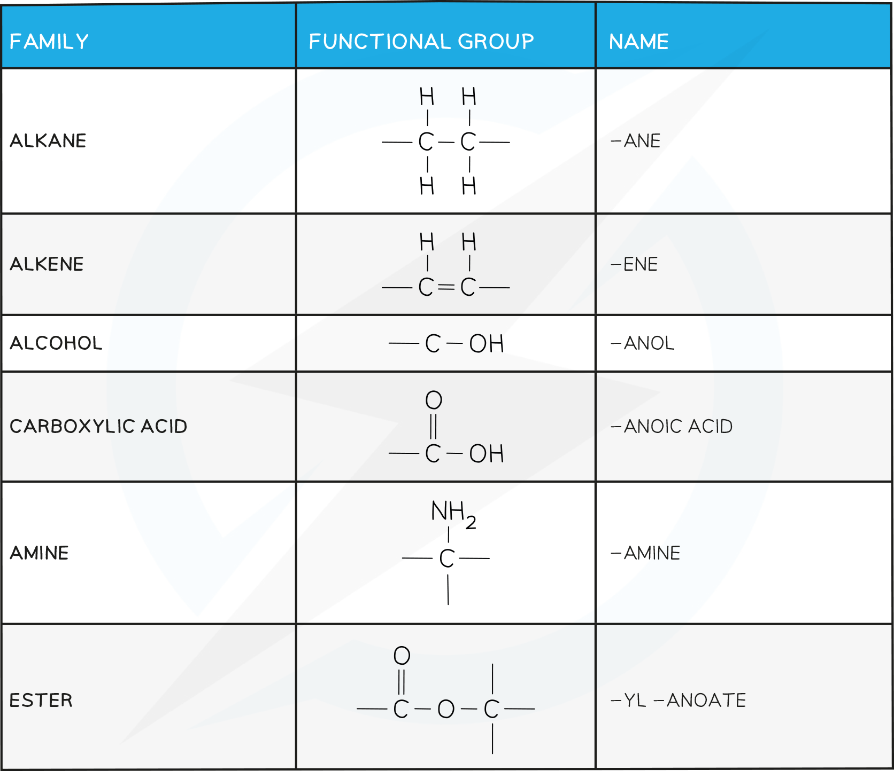
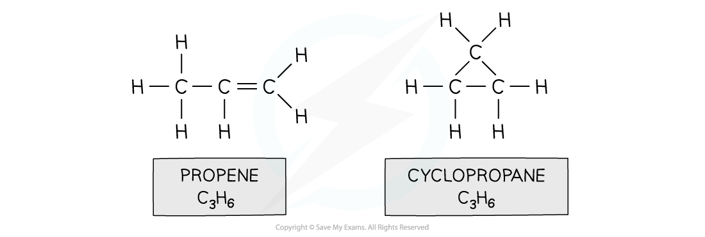

# Introduction to Organic Chemistry - IGCSE Revision Notes

> ## Excerpt
> Learn about organic compounds for IGCSE Chemistry. Understand how to represent organic molecules with formulas and identify functional groups and isomers.

---
## Organic compounds

### What is organic chemistry

-   Organic chemistry is the scientific study of the structure, properties, and reactions of organic compounds. Organic compounds are those which contain carbon
    
-   For conventional reasons metal carbonates, carbon dioxide and carbon monoxide are **not** included in organic compounds
    

### What is a hydrocarbon?

-   A compound that contains **only** hydrogen and carbon atoms
    

### Representing Organic Molecules

-   Organic compounds can be represented in a number of ways:
    
    -   **Empirical Formulae**
        
    -   **Molecular Formulae**
        
    -   **General Formulae**
        
    -   **Structural Formulae**
        
    -   **Condensed Structural Formulae**
        

#### Empirical formulae

The **empirical formula** shows the **simplest possible ratio** of the atoms in a molecule

-   For example: Hydrogen peroxide is H2O2 but the empirical formula is HO
    

#### Molecular formulae

-   The **molecular formula** shows the **actual number** of atoms in a molecule
    

#### Molecular formula of butane

_**The molecular formula shows the actual number of atoms in a molecule**_

#### General formula

-   The **general formula** shows a ratio of atoms in a family of compounds in terms of 'n' where n is a varying whole number
    
    -   For example, the general formula of a molecule that belong to the alkane family is CnH2n+2
        

#### Displayed formulae

-   The **displayed formulae** shows the spatial arrangement of all the atoms and bonds in a molecule
    
-   This is also known as the **graphical formula**
    

#### Displayed formula of 2-methylbutane

_**The displayed formula must show every bond in the molecule**_

#### Structural formulae

-   In a **structural formulae** enough information is shown to make the structure clear, but most of the actual covalent bonds are omitted
    
-   Only important bonds are always shown, such as double and triple bonds
    
-   Identical groups can be bracketed together
    
-   Side groups are also shown using brackets
    

#### Structural formula of pentane

_**The structural formula of pentane makes it clear that there are five carbon atoms in the chain and no other functional groups**_

#### Examiner Tips and Tricks

For defining a hydrocarbon, you must specify that they are compounds which contain hydrogen and carbon atoms **only**, no other element is present. You may not be asked to name branched chain organic compounds but you will come across them. It is useful to know that the numbers in the names of these compounds refer to the position of the side chains with respect to the main chain.

## Organic terminology

-   Three important terms to know in this topic are **homologous series**, **functional group** and **isomerism**
    

### Homologous Series

-   This is a series or family of organic compounds that have similar features and chemical properties due to them having the same functional group
    
-   All members of a homologous series have:
    
    -   The same general formula
        
    -   Same functional group
        
    -   Similar chemical properties
        
    -   **Gradation** in their physical properties
        
    -   The difference in the molecular formula between one member and the next is CH2
        

### Functional Group

-   **Functional group:** A group of atoms bonded in a specific arrangement that influences the properties of the homologous series
    
-   Some examples are shown here
    

#### Structures and Names of Common Functional Groups

### Isomerism

-   **Isomers** are compounds that have the same **molecular** formula but different **displayed** formulae
    
    -   Eg. propene and cyclopropane
        

#### Isomers of C3H6

_**Isomers of C**_<i><b>3</b></i>_**H**_<i><b>6 </b></i> _**show the same molecular formula but different structures. Isomers can show similar physical and chemical properties or if they have different functional groups, the properties can be different.**_
