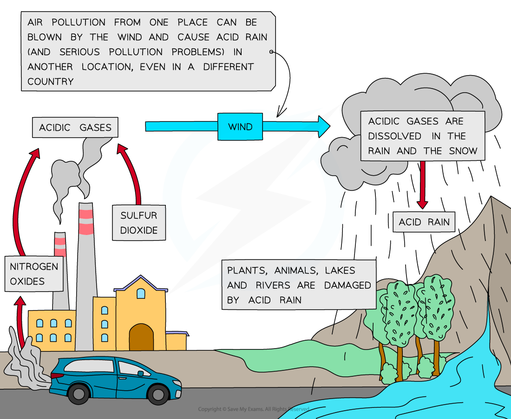

# Nitrogen Oxides & Sulfur Dioxide | Edexcel IGCSE Chemistry Revision Notes 2017

> ## Excerpt
> Revision notes on Nitrogen Oxides & Sulfur Dioxide for the Edexcel IGCSE Chemistry syllabus, written by the Chemistry experts at Save My Exams.

---
## Formation of nitrogen oxides

### Nitrogen Oxides

-   These compounds (NO and NO2) are formed when nitrogen and oxygen react in the **high pressure** and **temperature** conditions of **internal combustion engines** and blast furnaces
    
-   Exhaust gases also contain unburned hydrocarbons and carbon monoxide
    
-   Cars are fitted with catalytic converters which form a part of their exhaust systems
    
-   Their function is to render these exhaust gases harmless
    
-   The adverse effects of nitrogen oxides include acid rain as well as producing photochemical smog and breathing difficulties, in particular for people suffering from asthma.
    

## Acid rain

### How is acid rain formed?

#### From sulfur dioxide

-   The sulfur dioxide produced from the combustion of fossil fuels dissolves in rainwater droplets to form **sulfuric acid**
    

**2SO**<b>2 </b> **(g) + O**<b>2 </b> **(g) + 2H**<b>2</b>**O (l) → 2H**<b>2</b>**SO**<b>4&nbsp;</b> **(aq)**

-   Sulfuric acid is one of the components of acid rain which has several damaging impacts on the environment
    

#### From nitrogen dioxide

-   **Nitrogen dioxide** produced from car engines reacts with rain water to form a mixture of **nitrous** and **nitric acids**, which contribute to **acid rain**:
    

**2NO**<b>2&nbsp;</b> **(g) + H**<b>2</b>**O (l)  → HNO**<b>2&nbsp;</b> **(aq) + HNO**<b>3&nbsp;</b> **(aq)**

-   Lightning strikes can also trigger the formation of nitrogen monoxide and nitrogen dioxides in air
    
-   Nitrogen dioxide gas reacts with rain water and more oxygen to form **nitric acid**
    

**4NO**<b>2&nbsp;</b> **(g) + 2H**<b>2</b>**O (l) + O**<b>2&nbsp;</b> **(g) → 4HNO**<b>3&nbsp;</b> **(aq)**

-   When the clouds rise, the temperature decreases, and the droplets get larger
    
-   When the droplets containing these acids are heavy enough, they will fall down as **acid rain**
    

#### The formation of acid rain

_**Formation of acid rain from nitrogen and sulfur oxides**_
