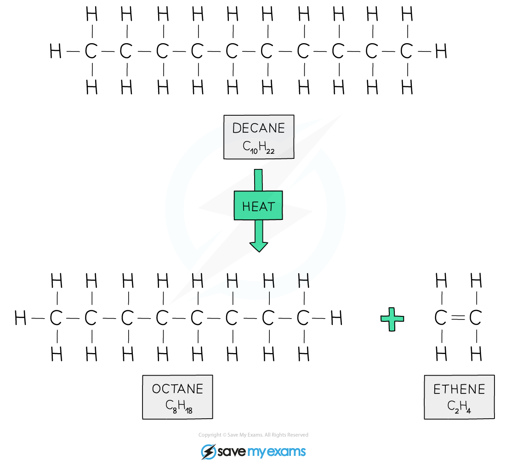
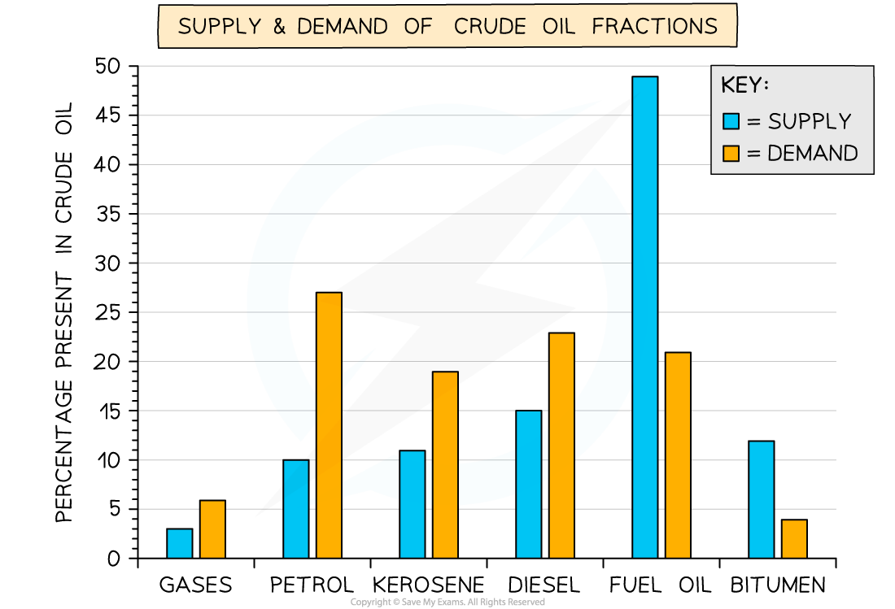

# What is cracking? - IGCSE Chemistry Revision Notes

> ## Excerpt
> Use our revision notes to learn what cracking is for your IGCSE chemistry exam. Understand why cracking is important and what the products are. Learn more.

---
## Cracking hydrocarbons

### What is cracking?

-   Cracking is an industrial process used to break **low demand, long chain hydrocarbon molecules** into more **useful, small chain hydrocarbon molecules**
    
    -   Any long chain hydrocarbon can be cracked into smaller chain hydrocarbons
        
    -   For example, kerosene and diesel oil are often cracked to produce petrol, alkenes and hydrogen
        

#### Conditions for catalytic cracking

-   **Catalytic cracking** involves heating the hydrocarbon molecules to around 600 – 700 °C to **vaporise** them
    
-   The vapours then pass over a hot powdered **catalyst** of aluminium oxide
    
-   This process breaks covalent bonds in the molecules as they come into contact with the surface of the catalyst, causing **thermal decomposition** reactions
    

#### Products of cracking

-   The molecules are broken up in a random way which produces a mixture of shorter alkanes and alkenes
    
    -   [Alkanes](https://www.savemyexams.com/igcse/chemistry/edexcel/19/revision-notes/4-organic-chemistry/4-3-alkanes/4-3-1-alkanes/) are **saturated** molecules containing carbon-carbon **single** bonds only
        
    -   [Alkenes](https://www.savemyexams.com/igcse/chemistry/edexcel/19/revision-notes/4-organic-chemistry/4-4-alkenes/4-4-1-alkenes/) are **unsaturated** molecules containing carbon=carbon **double** bonds
        

#### Example of cracking

_**Decane is cracked to produce octane for petrol and ethene for ethanol synthesis**_

## Fraction supply & demand

-   [Fractional distillation](https://www.savemyexams.com/igcse/chemistry/edexcel/19/revision-notes/4-organic-chemistry/4-2-crude-oil/4-2-1-crude-oil--fractional-distillation/) separates crude oil into fractions containing hydrocarbons of similar chain lengths
    
-   Each fraction has different values for its supply and demand
    
    -   **Supply** is how much of a particular fraction can be produced from refining the crude oil
        
    -   **Demand** is how much customers want to buy
        
-   The demand for certain fractions outstrips the supply so **cracking** is used to convert excess unwanted fractions into more useful ones
    
-   You can see from the chart that fuel oil and bitumen are surplus fractions so they are cracked and modified to produce petrol, kerosene and diesel
    

#### Supply & demand of crude oil fractions

_**Demand for short chain hydrocarbon molecules such as petrol, kerosene and diesel is greater than the supply, while demand for long chain hydrocarbons such as fuel oil is less than the supply**_

#### Examiner Tips and Tricks

Remember that cracking is an **endothermic** reaction.

Was this revision note helpful?
