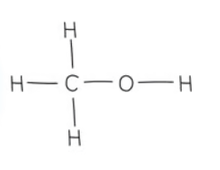
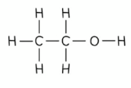
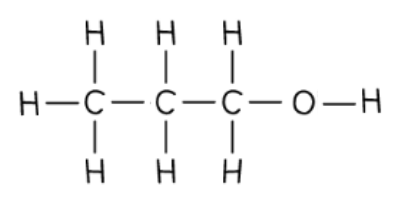

# Alcohols | Edexcel IGCSE Chemistry Revision Notes 2017

> ## Excerpt
> Edexcel IGCSE ChemistryRevision NotesAlcohols Exam code: 4CH1Download PDFWritten by: Stewart HirdReviewed by: Lucy KirkhamUpdated on 22 August 2024Guided study available on this topicUnderstand this t

---
[Edexcel IGCSE Chemistry](https://www.savemyexams.com/igcse/chemistry/edexcel/)[Revision Notes](https://www.savemyexams.com/igcse/chemistry/edexcel/19/revision-notes/)

# Alcohols

**Exam code:** 4CH1

Download PDF

**Written by:** [Stewart Hird](https://www.savemyexams.com/authors/stewart-hird/)

**Reviewed by:** [Lucy Kirkham](https://www.savemyexams.com/authors/lucy-kirkham/)

Updated on 22 August 2024

Guided study available on this topic

Understand this topic with deeper explanations and understanding checks.

Start guided study

## Alcohols

-   Alcohols are colourless liquids that dissolve in water to form **neutral** solutions
    
-   The first four alcohols are commonly used as **fuels**
    
-   All alcohols contain the hydroxyl (**\-OH**) functional group which is the part of alcohol molecules that is responsible for their **characteristic reactions**
    

#### A molecule of ethanol

_**Diagram of the side chain and -OH group in ethanol which characterises its chemistry**_

-   The names and structures of the first four alcohols in the homologous series are shown below
    
-   In terms of naming, the same system is used as for alkanes and alkenes, with the final ‘**e**’ being replaced with ‘**ol**’
    

| **Name** | **Formula** | **Displayed formula** |
|-------------|---------|------------------------------|
| Methanol | CH3OH |  |
| Ethanol | C2H5OH |  |
| Propan-1-ol | C3H7OH |  |
| Butan-1-ol | C4H9OH |  |

#### Examiner Tips and Tricks

In your exam it is acceptable to write propan-1-ol and butan-1-ol as propanol and butanol respectively. 

The 1 indicates that the -OH group is located on the first carbon atom in the molecule as it is possible to have it located on a different carbon atom, but you do not need to know this for your exam.

[Test yourself](https://www.savemyexams.com/igcse/chemistry/edexcel/19/topic-questions/4-organic-chemistry/4-5-alcohols/exam-questions/)[Flashcards](https://www.savemyexams.com/igcse/chemistry/edexcel/19/flashcards/4-organic-chemistry/4-5-alcohols/)

Was this revision note helpful?

YesNo

[

Previous:Bromine & Alkenes](https://www.savemyexams.com/igcse/chemistry/edexcel/19/revision-notes/4-organic-chemistry/4-4-alkenes/4-4-2-bromine-and-alkenes/)[Next:Oxidation of Ethanol

](https://www.savemyexams.com/igcse/chemistry/edexcel/19/revision-notes/4-organic-chemistry/4-5-alcohols/4-5-2-oxidation-of-ethanol/)

Ask about this

Download notes on Alcohols
