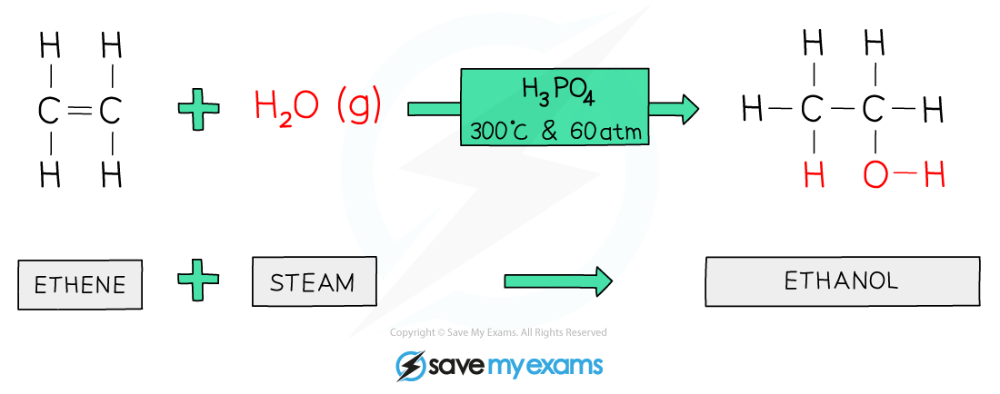

# Manufacture of Ethanol | Edexcel IGCSE Chemistry Revision Notes 2017

> ## Excerpt
> Revision notes on Manufacture of Ethanol for the Edexcel IGCSE Chemistry syllabus, written by the Chemistry experts at Save My Exams.

---
## Hydration of ethene

-   Ethanol can be synthesised by the **hydration** of ethene
    
-   Ethene is a by-product of the **cracking** of hydrocarbons and is a valuable feedstock for making many chemicals
    
-   The hydration reaction is very important industrially for the production of alcohols and it occurs using the following conditions:
    
    -   Temperature of around **300ºC**
        
    -   Pressure of **60 – 70 atm**
        
    -   Concentrated phosphoric **acid catalyst**
        
-   When the reaction is complete, the reaction chamber holds unreacted ethene, ethanol and water
    
-   The contents are transferred to a **condenser** where ethene is separated easily as it has a **much lower boiling point** than ethanol and water:
    
    -   Ethanol: 78oC
        
    -   Ethene: -103oC
        
    -   Water: 100oC
        
-   The ethanol and water are separated afterwards by **fractional distillation**
    

#### Hydration of ethene

_**A water molecule adds across the C=C in the hydration of ethene to produce ethanol**_

#### Examiner Tips and Tricks

Make sure you learn the conditions for the hydration of ethene. 

## Fermentation

-   Ethanol can also be produced by fermentation where sugar or starch is dissolved in water and yeast is added
    
-   The mixture is then fermented between **25** and **35°C** (the optimum temperature is **30 °C**) with the **absence** of oxygen for a few days
    
-   Yeast contains enzymes that break down sugar to alcohol
    
-   If the temperature is too **low** the reaction rate will be too slow and if it is too **high** the enzymes will become denatured
    
-   The yeast respires anaerobically using the glucose to form ethanol and carbon dioxide:
    

**C**<b>6</b>**H**<b>12</b>**O**<b>6</b> **→ 2CO**<b>2</b> **+ 2C**<b>2</b>**H**<b>5</b>**OH**

-   The yeast is killed off once the concentration of alcohol reaches around 15%, hence the reaction vessel is emptied and the process is started again
    
-   This is the reason that ethanol production by fermentation is a **batch** process
    
-   At the end, there is a mixture of ethanol and water which is separated by **fractional distillation**
    

#### Examiner Tips and Tricks

Fermentation is an anaerobic process. Oxygen is not required for ethanol to be produced by fermentation.

Was this revision note helpful?
