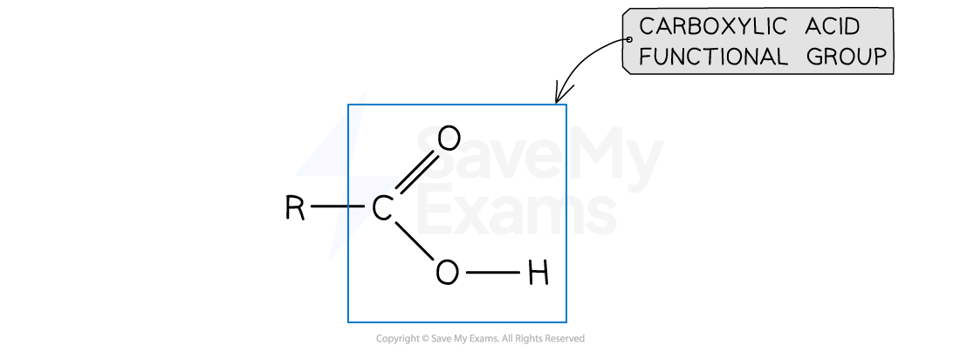

# Carboxylic Acids | Edexcel IGCSE Chemistry Revision Notes 2017

> ## Excerpt
> Revision notes on Carboxylic Acids for the Edexcel IGCSE Chemistry syllabus, written by the Chemistry experts at Save My Exams.

---
## Carboxylic acids

-   **Carboxylic acids** is the name given to compounds containing the functional group **carboxyl, -COOH**
    

#### Carboxylic acid functional group

_**Diagram of the general structure of a carboxylic acid. The R- represents a varying hydrocarbon chain**_

-   The general formula of a carboxylic acid is **C**<b>n</b>**H**<b>2n+1</b>**COOH** which can be shortened to just **RCOOH**
    

#### Examiner Tips and Tricks

**Careful:** When using the general formula **C**<b>n</b>**H**<b>2n+1</b>**COOH**, the 'n' **does not** represent the total number of carbons in the molecule.

It only counts the carbons in the alkyl chain.

This is a common point of confusion. For example, methanoic acid (HCOOH), n = 0!

#### Worked Example

Use the general formula to find the molecular formula for propanoic acid.

**Answer:**

-   The name "prop-" means the molecule has **3 carbon atoms in total**
    
-   One carbon is part of the -COOH functional group
    
-   Therefore, the number of carbons in the alkyl group is 3 - 1 = 2
    
    -   So, **n = 2**
        
-   Substitute n=2 into the general formula **C**<b>n</b>**H**<b>2n+1</b>**COOH**:
    
    -   C2H(2 x 2) + 1COOH simplifies to **C**<b>2</b>**H**<b>5</b>**COOH**
        
-   This gives the final molecular formula of **C**<b>3</b>**H**<b>6</b>**O**<b>2</b>
    

#### Worked Example

Use the general formula to find the molecular formula for pentanoic acid.

**Answer:**

-   The name "pent-" means the molecule has **5 carbon atoms in total**
    
-   One carbon is part of the -COOH functional group
    
-   Therefore, the number of carbons in the alkyl group is 5 - 1 = 4
    
    -   So, **n = 4**
        
-   Substitute n=4 into the general formula **C**<b>n</b>**H**<b>2n+1</b>**COOH**:
    
    -   C4H(2 x 4) + 1COOH simplifies to **C**<b>4</b>**H**<b>9</b>**COOH**
        
-   This gives the final molecular formula of **C**<b>5</b>**H**<b>10</b>**O**<b>2</b>
    

### Naming carboxylic acids

-   The naming of a **carboxylic acid** follows the pattern **alkan + oic acid**
    
-   The names and structure of the first four carboxylic acids are shown below
    
-   Vinegar is an aqueous solution of ethanoic acid and contains about 5% of the acid by volume.
    

_**The structures and formulae of the first four carboxylic acids**_

-   The formula for each carboxylic acid is:
    
    -   Methanoic acid- HCOOH
        
    -   Ethanoic acid- CH3COOH
        
    -   Propanoic acid- CH3CH2COOH
        
    -   Butanoic acid- CH3CH2CH2COOH
        

Was this revision note helpful?
