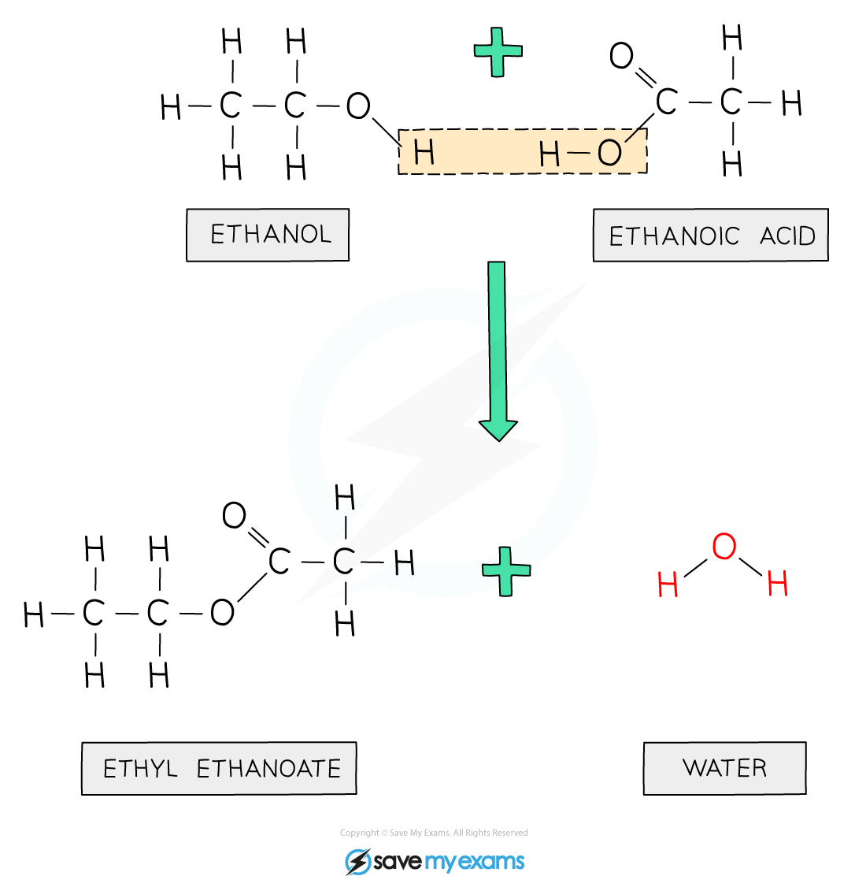
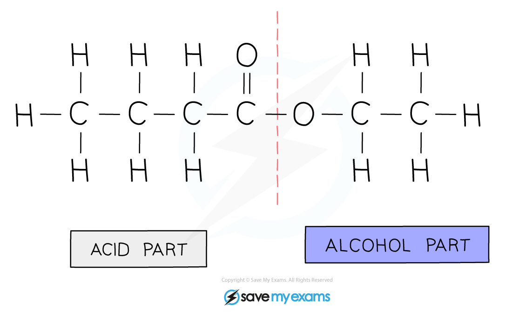

# Making and naming esters - IGCSE Chemistry Revision Notes

> ## Excerpt
> Understand the process of making and naming esters in IGCSE Chemistry and their significance in food flavorings and perfumes, along with examples.

---
## Esters

### Making esters

-   Alcohols and carboxylic acids react to make esters in **esterification** reactions
    
-   Esters are compounds with the functional group R-COO-R  
    
    
    
-   Esters are sweet-smelling oily liquids used in **food flavourings** and **perfumes**
    
-   Ethanoic acid will react with ethanol in the presence of concentrated sulfuric acid (catalyst) to form the ester, **ethyl ethanoate:**
    

**CH**<b>3</b>**COOH + C**<b>2</b>**H**<b>5</b>**OH → CH**<b>3</b>**COOC**<b>2</b>**H**<b>5</b> **+ H**<b>2</b>**O**

#### Diagram showing the formation of ethyl ethanoate

_**During this esterification reaction, a molecule of water is also produced**_

### Naming Esters

-   An ester is made from an alcohol and carboxylic acid
    
-   The first part of the name indicates the length of the carbon chain in the alcohol, and it ends with the letters ‘- yl’
    
-   The second part of the name indicates the length of the carbon chain in the carboxylic acid, and it ends with the letters ‘- oate’
    
    -   E.g. The ester formed from **pent**anol and **butan**oic acid is called **pent**yl **butan**oate
        

_**Diagram showing the origin of each carbon chain in ester**_

-   Some examples of common esters:
    

#### Examples of Esters Table

