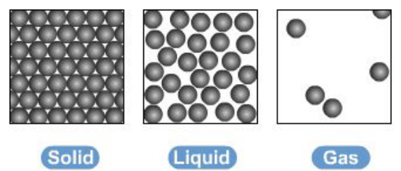

<u>Edexcel</u> IGCSE Chemistry Topic 1: Principles of chemistry **States**   **of**   **matter** 

**Notes** 

- _<mark>1.1 understand</mark>_   _<mark>the</mark>_   _<mark>three</mark>_   _<mark>states</mark>_   _<mark>of</mark>_   _<mark>matter</mark>_   _<mark>in</mark>_   _<mark>terms</mark>_   _<mark>of</mark>_   _<mark>the</mark>_   _<mark>arrangement, movement</mark>_   _<mark>and</mark>_   _<mark>energy</mark>_   _<mark>of</mark>_   _<mark>the</mark>_   _<mark>particles</mark>_ 

   - The three states of matter are solid, liquid and gas 

   - They can be represented by the simple model above, particles are represented by small solid spheres 

   - Gas: particles have the most energy – shown by the diagram, as the particles are the most spread apart with a random arrangement 

   - Liquid: particles have more energy than those in a solid, but less than those in a gas and the particles are closer together but have a random arrangement 

   - solid has least energy – particles are not moving/are just vibrating and they are arranged regularly and very closely together 

- _1.2_ _<mark>understand</mark>_   _<mark>the</mark>_   _<mark>interconversions</mark>_   _<mark>between</mark>_   _<mark>the</mark>_   _<mark>three</mark>_   _<mark>states</mark>_   _<mark>of</mark>_   _<mark>matter in</mark>_   _<mark>terms</mark>_   _<mark>of:</mark>_   _<mark>the</mark>_   _<mark>names</mark>_   _<mark>of</mark>_   _<mark>the</mark>_   _<mark>interconversions,</mark>_   _<mark>how</mark>_   _<mark>they</mark>_   _<mark>are achieved,</mark>_   _<mark>the</mark>_   _<mark>changes</mark>_   _<mark>in</mark>_   _<mark>arrangement,</mark>_   _<mark>movement</mark>_   _<mark>and</mark>_   _<mark>energy</mark>_   _<mark>of</mark>_   _<mark>the particles</mark>_ 

   - Physical changes – therefore involves the forces between the particles of the substances, instead of these interconversions being chemical changes 

   - Melting and freezing take place at the melting point: 

      - solid → liquid: melting 

      - liquid → solid: freezing 

   - Boiling and condensing take place at the boiling point: 

      - liquid → gas: boiling 

      - gas → liquid: condensing 

   - when you change from solid to liquid to gas: the particles gain more kinetic energy, move around more and become more randomly arranged and further apart 

   - when you change from gas to liquid to solid: the particles lose kinetic energy, move less and become more regularly arranged and closer together 

© www.pmt.education wwwomteducation 

# _<mark>1.3 understand</mark>_   _<mark>how</mark>_   _<mark>the</mark>_   _<mark>results</mark>_   _<mark>of</mark>_   _<mark>experiments</mark>_   _<mark>involving</mark>_   _<mark>the</mark>_   _<mark>dilution</mark>_   _<mark>of coloured</mark>_   _<mark>solutions</mark>_   _<mark>and</mark>_   _<mark>diffusion</mark>_   _<mark>of</mark>_   _<mark>gases</mark>_   _<mark>can</mark>_   _<mark>be</mark>_   _<mark>explained</mark>_ {#pmt-4ch1-notes-unit-1-1a-states-of-matter-s1}
- Diffusion 

   - Movement of particles from an area of high concentration to an area of low concentration 

   - For this to work, particles must be able to move 

      - Therefore, diffusion does not occur in solids, since the particles cannot move from place to place (only vibrate) 

   - Therefore, colored solutions are diluted when water is added. The particles of color move from their area of high concentration (the original solution) to an area of low concentration (the added water), mixing with the water molecules and causing the concentration of the color to decrease. 

# _<mark>1.4 know</mark>_   _<mark>what</mark>_   _<mark>is</mark>_   _<mark>meant</mark>_   _<mark>by</mark>_   _<mark>the</mark>_   _<mark>terms:</mark>_   _<mark>solvent,</mark>_   _<mark>solute,</mark>_   _<mark>solution</mark>_   _<mark>and saturated</mark>_   _<mark>solution</mark>_ {#pmt-4ch1-notes-unit-1-1a-states-of-matter-s2}
- Solvent� �=� �liquid� �in� �which� �a� �solute� �dissolves 

- Solute� �=� �substance� �that� �dissolves� �in� �a� �liquid� �to� �form� �a� �solution 

- Solution� �=� �mixture� �formed� �when� �a� �solute� �has� �dissolved� �in� �a� �solvent 

- Saturated� �solution� �=� �solution� �in� �which� �no� �more� solute �can� �be� �dissolved in a solvent. 

# _<mark>1.5 (chemistry</mark>_   _<mark>only)</mark>_   _<mark>know</mark>_   _<mark>what</mark>_   _<mark>is</mark>_   _<mark>meant</mark>_   _<mark>by</mark>_   _<mark>the</mark>_   _<mark>term</mark>_   _<mark>solubility</mark>_   _<mark>in</mark>_   _<mark>the units</mark>_   _<mark>g</mark>_   _<mark>per</mark>_   _<mark>100</mark>_   _<mark>g</mark>_   _<mark>of</mark>_   _<mark>solvent</mark>_ {#pmt-4ch1-notes-unit-1-1a-states-of-matter-s3}
   - Solubility is shown as the grams of a solute that will dissolve in 100 g of water 

- _<mark>1.6 (chemistry</mark>_   _<mark>only)</mark>_   _<mark>understand</mark>_   _<mark>how</mark>_   _<mark>to</mark>_   _<mark>plot</mark>_   _<mark>and</mark>_   _<mark>interpret</mark>_   _<mark>solubility curves</mark>_ 

   - generally: 

         - solubility of solids increases when temperature increases 

         - solubility of gases increases when pressure increases 

         - any mass below the line for a solute at a specific temperature would mean the solution was unsaturated 

         - any mass above the line for a solute at a specific temperature would mean the solution was supersaturated and unstable 

- _<mark>1.7 (chemistry</mark>_   _<mark>only)</mark>_   _<mark>practical:</mark>_   _<mark>investigate</mark>_   _<mark>the</mark>_ 

      - _<mark>solubility</mark>_   _<mark>of</mark>_   _<mark>a</mark>_   _<mark>solid</mark>_   _<mark>in</mark>_   _<mark>water</mark>_   _<mark>at</mark>_   _<mark>a</mark>_   _<mark>specific</mark>_   _<mark>temperature</mark>_
