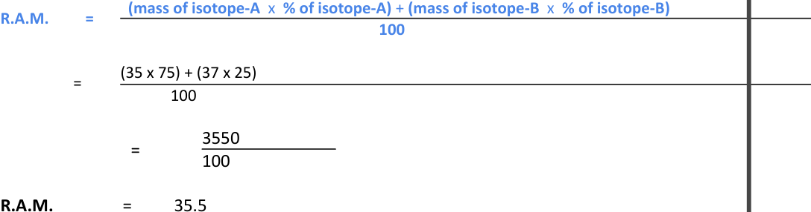

<u>Edexcel</u> IGCSE Chemistry Topic 1: Principles of chemistry **Atomic**   **structure** 

**Notes** 

# _<mark>1.14</mark>_   _<mark>know</mark>_   _<mark>what</mark>_   _<mark>is</mark>_   _<mark>meant</mark>_   _<mark>by</mark>_   _<mark>the</mark>_   _<mark>terms</mark>_   _<mark>atom</mark>_   _<mark>and</mark>_   _<mark>molecule</mark>_ {#pmt-4ch1-notes-unit-1-1c-atomic-structure-s1}
- All substances are made of atoms 

- A substance with only one sort of atom = element 

   - An atom is the smallest piece of an element that can exist 

- A molecule = formed when atoms join together by chemical bonds (can be made of atoms of the same element) 

# _<mark>1.15</mark>_   _<mark>know</mark>_   _<mark>that</mark>_   _<mark>the</mark>_   _<mark>structure</mark>_   _<mark>of</mark>_   _<mark>an</mark>_   _<mark>atom</mark>_   _<mark>in</mark>_   _<mark>terms</mark>_   _<mark>of</mark>_   _<mark>the</mark>_   _<mark>positions,</mark>_   _<mark>relative masses</mark>_   _<mark>and</mark>_   _<mark>relative</mark>_   _<mark>charges</mark>_   _<mark>of</mark>_   _<mark>sub-atomic</mark>_   _<mark>particles</mark>_ {#pmt-4ch1-notes-unit-1-1c-atomic-structure-s2}
|subatomic particle|relative mass|relative charge|position|
| _[structure figure — see source PDF]_ | _[structure figure — see source PDF]_ | _[structure figure — see source PDF]_ | _[structure figure — see source PDF]_ |
|proton|1| _[structure figure — see source PDF]_ |in the nucleus|
|neutron|1|0|in the nucleus|
|electron| _[structure figure — see source PDF]_ | _[structure figure — see source PDF]_ |in shells around nucleus|

# _<mark>1.16</mark>_   _<mark>know</mark>_   _<mark>what</mark>_   _<mark>is</mark>_   _<mark>meant</mark>_   _<mark>by</mark>_   _<mark>the</mark>_   _<mark>terms</mark>_   _<mark>atomic</mark>_   _<mark>number,</mark>_   _<mark>mass</mark>_   _<mark>number, isotopes</mark>_   _<mark>and</mark>_   _<mark>relative</mark>_   _<mark>atomic</mark>_   _<mark>mass</mark>_   _<mark>(Ar)</mark>_ {#pmt-4ch1-notes-unit-1-1c-atomic-structure-s3}
- Atomic (proton) Number = number of protons (= number of electrons if it’s an atom, because atoms are neutral) 

- Mass (nucleon) Number = number of protons + neutrons 

- Isotopes = different atoms of the same element containing the same number of protons but different numbers of neutrons in their nuclei 

- Relative atomic mass (of an element) = an average value that takes account of the abundance of the isotopes of the element 

_<mark>1.17</mark>_   _<mark>be</mark>_   _<mark>able</mark>_   _<mark>to</mark>_   _<mark>calculate</mark>_   _<mark>the</mark>_   _<mark>relative</mark>_   _<mark>atomic</mark>_   _<mark>mass</mark>_   _<mark>of</mark>_   _<mark>an</mark>_   _<mark>element</mark>_   _<mark>(Ar)</mark>_   _<mark>from isotopic</mark>_   _<mark>abundances</mark>_ 

_e.g._ 

A sample of chlorine gas is a mixture of 2 isotopes, chlorine-35 and chlorine-37. These isotopes occur in specific proportions in the sample i.e. 75% chlorine-35 and 25% chlorine-37. Calculate the R.A.M. of chlorine in the sample. 

The average mass, or R.A.M. of chlorine can be calculated using the following equation: 

