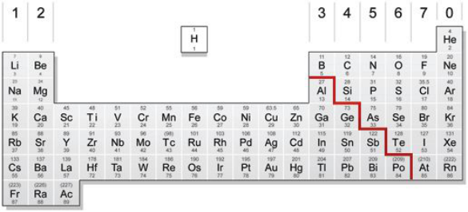
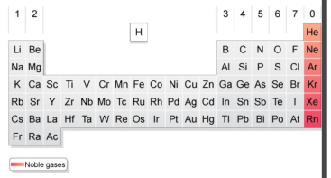

<u>Edexcel</u> IGCSE Chemistry Topic 1: Principles of chemistry **The**   **Periodic**   **Table** 

**Notes** 

## _<mark>1.18</mark>_   _<mark>understand</mark>_   _<mark>how</mark>_   _<mark>elements</mark>_   _<mark>are</mark>_   _<mark>arranged</mark>_   _<mark>in</mark>_   _<mark>the</mark>_   _<mark>Periodic</mark>_   _<mark>Table:</mark>_   _<mark>in</mark>_   _<mark>order of</mark>_   _<mark>atomic</mark>_   _<mark>number,</mark>_   _<mark>in</mark>_   _<mark>groups</mark>_   _<mark>and</mark>_   _<mark>periods</mark>_ {#pmt-4ch1-notes-unit-1-1d-the-periodic-table-s1}
- Elements are arranged in order of atomic (proton) number (bottom number) and so that elements with similar properties are in columns, known as groups. 

- Elements in the same periodic group have the same amount of electrons in their outer shell, which gives them similar chemical properties. 

- elements with the same number of shells of electrons are arranged in rows called periods 

## _<mark>1.19</mark>_   _<mark>understand</mark>_   _<mark>how</mark>_   _<mark>to</mark>_   _<mark>deduce</mark>_   _<mark>the</mark>_   _<mark>electronic</mark>_   _<mark>configurations</mark>_   _<mark>of</mark>_   _<mark>the</mark>_   _<mark>first</mark>_   _<mark>20 elements</mark>_   _<mark>from</mark>_   _<mark>their</mark>_   _<mark>positions</mark>_   _<mark>in</mark>_   _<mark>the</mark>_   _<mark>Periodic</mark>_   _<mark>Table</mark>_ {#pmt-4ch1-notes-unit-1-1d-the-periodic-table-s2}
- the electronic configuration of an element tells you how many electrons are in each shell around an electron’s nucleus 

- for example, sodium has 11 electrons: 2 in its most inner shell, then 8, then 1 in its outermost shell. 

   - you can represent sodium’s electronic configuration as: 2.8.1 

- remember- electrons fill the shells closer to the nucleus before filling any further out. 1st shell holds 2 electrons, 2nd and 3rd hold 8 

## _<mark>1.20</mark>_   _<mark>understand</mark>_   _<mark>how</mark>_   _<mark>to</mark>_   _<mark>use</mark>_   _<mark>electrical</mark>_   _<mark>conductivity</mark>_   _<mark>and</mark>_   _<mark>the</mark>_   _<mark>acid-base character</mark>_   _<mark>of</mark>_   _<mark>oxides</mark>_   _<mark>to</mark>_   _<mark>classify</mark>_   _<mark>elements</mark>_   _<mark>as</mark>_   _<mark>metals</mark>_   _<mark>or</mark>_   _<mark>non-metals</mark>_ {#pmt-4ch1-notes-unit-1-1d-the-periodic-table-s3}
- Metals are generally conductive (of electricity) 

- Non metals (excluding graphite) are not conductive 

- If an element is conductive and its oxide is basic then the element is a metal 

- If an element is not conductive and its oxide is acidic then it’s a non metal 

© www.pmt.education wwopmteducation 

## _<mark>1.21</mark>_   _<mark>identify</mark>_   _<mark>an</mark>_   _<mark>element</mark>_   _<mark>as</mark>_   _<mark>a</mark>_   _<mark>metal</mark>_   _<mark>or</mark>_   _<mark>a</mark>_   _<mark>non-metal</mark>_   _<mark>according</mark>_   _<mark>to</mark>_   _<mark>its</mark>_   _<mark>position in</mark>_   _<mark>the</mark>_   _<mark>Periodic</mark>_   _<mark>Table</mark>_ {#pmt-4ch1-notes-unit-1-1d-the-periodic-table-s4}
- Metals = elements that react to form positive ions. o Majority of elements are metals. 

   - Found to the left and towards the bottom of the periodic table. 

- Non-metals = elements that do not form positive ions. 

   - Found towards the right and top of the periodic table 

- divide can be seen by the red line in the periodic table at the top 

# _<mark>1.22</mark>_   _<mark>understand</mark>_   _<mark>how</mark>_   _<mark>the</mark>_   _<mark>electronic</mark>_   _<mark>configuration</mark>_   _<mark>of</mark>_   _<mark>a</mark>_   _<mark>main</mark>_   _<mark>group element</mark>_   _<mark>is</mark>_   _<mark>related</mark>_   _<mark>to</mark>_   _<mark>its</mark>_   _<mark>position</mark>_   _<mark>in</mark>_   _<mark>the</mark>_   _<mark>Periodic</mark>_   _<mark>Table</mark>_ {#pmt-4ch1-notes-unit-1-1d-the-periodic-table-s5}
- group number: gives number of electrons in outer shell e.g. group 3 has 3 electrons in outer shell 

- period number: gives number of electron shells e.g. period 1 has 1 shell of electrons 

## _<mark>1.23</mark>_   _<mark>understand</mark>_   _<mark>why</mark>_   _<mark>elements</mark>_   _<mark>in</mark>_   _<mark>the</mark>_   _<mark>same</mark>_   _<mark>group</mark>_   _<mark>of</mark>_   _<mark>the</mark>_   _<mark>Periodic</mark>_   _<mark>Table</mark>_   _<mark>have similar</mark>_   _<mark>chemical</mark>_   _<mark>properties</mark>_ {#pmt-4ch1-notes-unit-1-1d-the-periodic-table-s6}
- number of electrons in outer shell is responsible for the way different elements react 

- this means elements with the same number of electrons in the outer shell will undergo similar reactions 

- therefore elements in the same group have similar chemical properties 

## _<mark>1.24</mark>_   _<mark>understand</mark>_   _<mark>why</mark>_   _<mark>the</mark>_   _<mark>noble</mark>_   _<mark>gases</mark>_   _<mark>(Group</mark>_   _<mark>0)</mark>_   _<mark>do</mark>_   _<mark>not</mark>_   _<mark>readily</mark>_   _<mark>react</mark>_ {#pmt-4ch1-notes-unit-1-1d-the-periodic-table-s7}
- They have 8 electrons in their outer shell (except helium, which has 2). 

- They are unreactive and do not easily form molecules, because they have a stable arrangement of electrons. 

© www.pmt.education wwopmteducation
