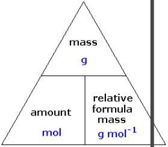

<u>Edexcel</u> IGCSE Chemistry 

Topic 1: Principles of chemistry **Chemical**   **formulae,**   **equations**   **and**   **calculations** 

**Notes** 

_<mark>1.25</mark>_   _<mark>write</mark>_   _<mark>word</mark>_   _<mark>equations</mark>_   _<mark>and</mark>_   _<mark>balanced</mark>_   _<mark>chemical</mark>_   _<mark>equations</mark>_   _<mark>(including</mark>_   _<mark>state symbols):</mark>_   _<mark>for</mark>_   _<mark>reactions</mark>_   _<mark>studied</mark>_   _<mark>in</mark>_   _<mark>this</mark>_   _<mark>specification,</mark>_   _<mark>for</mark>_   _<mark>unfamiliar</mark>_   _<mark>reactions where</mark>_   _<mark>suitable</mark>_   _<mark>information</mark>_   _<mark>is</mark>_   _<mark>provided</mark>_ 

- (g) means gas, (s) means solid, (l) means liquid, (aq) means aqueous 

- Example of word equation: hydrochloric acid + sodium hydroxide -> sodium chloride + water 

- Example of balanced chemical equation: HCl + NaOH -> NaCl + H2O  

- to balance an equation: you need to make sure there are the same number of each element on each side of the equation and if there isn’t use big numbers at the front of a compound to balance it e.g. 3H2O  

# _<mark>1.26</mark>_   _<mark>calculate</mark>_   _<mark>relative</mark>_   _<mark>formula</mark>_   _<mark>masses</mark>_   _<mark>(including</mark>_   _<mark>relative</mark>_   _<mark>molecular</mark>_   _<mark>masses) (Mr)</mark>_   _<mark>from</mark>_   _<mark>relative</mark>_   _<mark>atomic</mark>_   _<mark>masses</mark>_   _<mark>(Ar)</mark>_ {#pmt-4ch1-notes-unit-1-1e-chemical-formulae-equations-and-calculations-s1}
- Relative formula mass (Mr) of a compound: sum of the relative atomic masses of the atoms in the numbers shown in the formula 

- In a balanced chemical equation: 

sum of Mr of reactants in quantities shown = sum of Mr of products in quantities 

- shown 

_<mark>1.27</mark>_   _<mark>know</mark>_   _<mark>that</mark>_   _<mark>the</mark>_   _<mark>mole</mark>_   _<mark>(mol)</mark>_   _<mark>is</mark>_   _<mark>the</mark>_   _<mark>unit</mark>_   _<mark>for</mark>_   _<mark>the</mark>_   _<mark>amount</mark>_   _<mark>of</mark>_   _<mark>a</mark>_   _<mark>substance</mark>_ 

- Chemical amounts are measured in moles (therefore it is the amount of substance). The symbol for the unit mole is mol. 

- The mass of one mole of a substance in grams is numerically equal to its relative formula mass. 

- For example, the Ar of Iron is 56, so one mole of iron weighs 56g. 

- The Mr of nitrogen gas (N2)  is 28 (2x14), so one mole is 28g. 

- One mole of a substance contains the same number of the stated particles, atoms, molecules or ions as one mole of any other substance 

# _<mark>1.28</mark>_   _<mark>understand</mark>_   _<mark>how</mark>_   _<mark>to</mark>_   _<mark>carry</mark>_   _<mark>out</mark>_   _<mark>calculations</mark>_   _<mark>involving</mark>_   _<mark>amount</mark>_   _<mark>of substance,</mark>_   _<mark>relative</mark>_   _<mark>atomic</mark>_   _<mark>mass</mark>_   _<mark>(Ar)</mark>_   _<mark>and</mark>_   _<mark>relative</mark>_   _<mark>formula</mark>_   _<mark>mass</mark>_   _<mark>(Mr)</mark>_ {#pmt-4ch1-notes-unit-1-1e-chemical-formulae-equations-and-calculations-s2}
- You can convert between moles and grams by using this triangle or the equation: 

moles = mass ÷ relative atomic mass 

mass = moles x relative atomic mass 

- E.g how many moles are there in 42g of carbon? 

   - Moles = Mass / Mr = 42/12 = 3.5 moles 

# _<mark>1.29</mark>_   _<mark>calculate</mark>_   _<mark>reacting</mark>_   _<mark>masses</mark>_   _<mark>using</mark>_   _<mark>experimental</mark>_   _<mark>data</mark>_   _<mark>and</mark>_   _<mark>chemical equations</mark>_ {#pmt-4ch1-notes-unit-1-1e-chemical-formulae-equations-and-calculations-s3}
- Chemical equations can be interpreted in terms of moles 

   - E.g. Mg + 2HCl →MgCl2 + H2 shows that 1 mol. Mg reacts with 2 mol. HCl to produce 1 mol. MgCl2 and 1 mol. H2 

- Masses of reactants & products can be calculated from balanced symbol equations. If you are given the reacting mass of one reactant and asked to find the mass of one product formed: 

   - Find moles of that one substance: moles = mass /molar mass 

   - Use balancing numbers to find the moles of desired reactant or product (e.g. if you had the equation:2NaOH + Mg → Mg(OH)2 + 2Na, if you had 2 moles of Mg, you would form 2x2=4 moles of Na) 

   - Mass = moles x molar mass(of the product) to find mass 

_<mark>1.30</mark>_   _<mark>calculate</mark>_   _<mark>percentage</mark>_   _<mark>yield</mark>_ 

**Percentage**   **yield**   **=**  **       ** **<u>Amount</u>**   **<u>of</u>**   **<u>product</u>**   **<u>produced</u>               **  **x**   **100** 

         -  **                  **  **Maximum**   **amount**   **of**   **product**   **possible** 

- It is not always possible to obtain the calculated amount of a product for 3 

   - reasons… 

      - Reaction may not go to completion because it is reversible 

      - Some of the product may be lost when it is separated from the reaction mixture 

      - Some of the reactants may react in ways different to the expected reaction 

- Amount of product obtained is known as yield 

# _<mark>1.31</mark>_   _<mark>understand</mark>_   _<mark>how</mark>_   _<mark>the</mark>_   _<mark>formulae</mark>_   _<mark>of</mark>_   _<mark>simple</mark>_   _<mark>compounds</mark>_   _<mark>can</mark>_   _<mark>be</mark>_   _<mark>obtained experimentally,</mark>_   _<mark>including</mark>_   _<mark>metal</mark>_   _<mark>oxides,</mark>_   _<mark>water</mark>_   _<mark>and</mark>_   _<mark>salts</mark>_   _<mark>containing</mark>_   _<mark>water</mark>_   _<mark>of crystallisation</mark>_ {#pmt-4ch1-notes-unit-1-1e-chemical-formulae-equations-and-calculations-s4}
example experiment to find formula of magnesium oxide: 

- weigh some pure magnesium 

- Heat magnesium to burning in a crucible to form magnesium oxide, as the magnesium will react with the oxygen in the air 

- weigh the mass of the magnesium oxide 

- Known quantities: �mass of magnesium used & mass of magnesium oxide produced �� 

- Required calculations: � 

   - mass oxygen = mass magnesium oxide - mass magnesium 

   - moles magnesium = mass magnesium ÷ molar mass magnesium � 

   - moles oxygen = mass oxygen ÷ molar mass oxygen �� 

- calculate ratio of moles of magnesium to moles of oxygen 

- use ratio to form empirical formula 

# _<mark>1.32</mark>_   _<mark>know</mark>_   _<mark>what</mark>_   _<mark>is</mark>_   _<mark>meant</mark>_   _<mark>by</mark>_   _<mark>the</mark>_   _<mark>terms</mark>_   _<mark>empirical</mark>_   _<mark>formula</mark>_   _<mark>and</mark>_   _<mark>molecular formula</mark>_ {#pmt-4ch1-notes-unit-1-1e-chemical-formulae-equations-and-calculations-s5}
- molecular formula- the number of atoms of each element in a compound 

- ● empirical formula- the simplest whole number ratio of atoms of each element in a compound 

# _<mark>1.33</mark>_   _<mark>calculate</mark>_   _<mark>empirical</mark>_   _<mark>and</mark>_   _<mark>molecular</mark>_   _<mark>formulae</mark>_   _<mark>from</mark>_   _<mark>experimental</mark>_   _<mark>data</mark>_ {#pmt-4ch1-notes-unit-1-1e-chemical-formulae-equations-and-calculations-s6}
- Empirical formula from the formula of molecule: 

   - if you have a common multiple e.g. Fe2O4, the empirical formula is the simplest whole number ratio, which would be FeO2 

   - if there is no common multiple, you already have the empirical formula 

- Molecular formula from empirical formula and relative molecular mass 

   - Find relative molecular mass of the empirical formula 

   - Divide relative molecular mass of compound by that of the empirical formula 

   - Multiply the number of each type of atom in the empirical formula by this number 

   - e.g. if answer was 2 and the empirical formula was Fe2O3 then the molecular formula would be empirical formula x 2 = Fe4O6 

# _<mark>1.34</mark>_   _<mark>(chemistry</mark>_   _<mark>only)</mark>_   _<mark>understand</mark>_   _<mark>how</mark>_   _<mark>to</mark>_   _<mark>carry</mark>_   _<mark>out</mark>_   _<mark>calculations</mark>_   _<mark>involving amount</mark>_   _<mark>of</mark>_   _<mark>substance,</mark>_   _<mark>volume</mark>_   _<mark>and</mark>_   _<mark>concentration</mark>_   _<mark>(in</mark>_   _<mark>mol/dm</mark>_ _3_ _<mark>)</mark>_   _<mark>of</mark>_   _<mark>solution</mark>_ {#pmt-4ch1-notes-unit-1-1e-chemical-formulae-equations-and-calculations-s7}
   - Concentration of a solution can be measured in mass per given volume of solution e.g. grams per dm3  (g/dm3 ) 

- to calculate concentration of a solution use the equation a 

- concentration (g dm-3 ) = mass of solute (g)  `∆` =  volume (dm3 ) cs 

   - To calculate mass of solute in a given volume of a known concentration use the equation: ** ** mass = conc x vol **** i.e. g = g/dm3  x dm3  **** (think about the units!) 

_<mark>1.35</mark>_   _<mark>(chemistry</mark>_   _<mark>only)</mark>_   _<mark>understand</mark>_   _<mark>how</mark>_   _<mark>to</mark>_   _<mark>carry</mark>_   _<mark>out</mark>_   _<mark>calculations</mark>_   _<mark>involving</mark>_   _<mark>gas volumes</mark>_   _<mark>and</mark>_   _<mark>the</mark>_   _<mark>molar</mark>_   _<mark>volume</mark>_   _<mark>of</mark>_   _<mark>a</mark>_   _<mark>gas</mark>_   _<mark>(24dm</mark>_ _3_   _<mark>and</mark>_   _<mark>24000</mark>_   _<mark>cm</mark>_ _3_   _<mark>at</mark>_   _<mark>room temperature</mark>_   _<mark>and</mark>_   _<mark>pressure</mark>_   _<mark>(rtp))</mark>_ 

- Equal amounts in mol. of gases occupy the same volume under the same conditions of temperature and pressure (e.g. RTP) 

- Volume of 1 mol. of any gas at RTP (room temperature and pressure: 20 degrees C and 1 atmosphere pressure) is 24 dm3 

- This sets up the equation: 

Volume (dm3 )  of gas at RTP = Mol. x 24 

- Use this equation to calculate the volumes of gaseous reactants and products at RTP 

   - e.g. 5 moles of H2 would occupy a volume of 24 x 5 = 120 dm3   at RTP 

_<mark>1.36</mark>_   _<mark>practical:</mark>_   _<mark>know</mark>_   _<mark>how</mark>_   _<mark>to</mark>_   _<mark>determine</mark>_   _<mark>the</mark>_   _<mark>formula</mark>_   _<mark>of</mark>_   _<mark>a</mark>_   _<mark>metal</mark>_   _<mark>oxide</mark>_   _<mark>by combustion</mark>_   _<mark>(e.g.</mark>_   _<mark>magnesium</mark>_   _<mark>oxide)</mark>_   _<mark>or</mark>_   _<mark>by</mark>_   _<mark>reduction</mark>_   _<mark>(e.g.</mark>_   _<mark>copper(II)</mark>_   _<mark>oxide)</mark>_ 

- see 1.31
