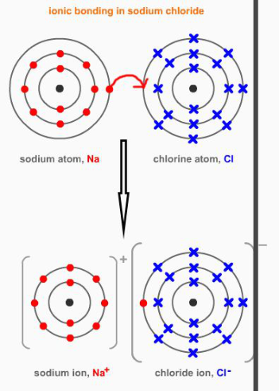
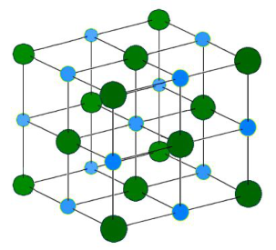

<u>Edexcel</u> IGCSE Chemistry Topic 1: Principles of chemistry **Ionic**   **bonding** 

**Notes** 

# _<mark>1.37</mark>_   _<mark>understand</mark>_   _<mark>how</mark>_   _<mark>ions</mark>_   _<mark>are</mark>_   _<mark>formed</mark>_   _<mark>by</mark>_   _<mark>electron</mark>_   _<mark>loss</mark>_   _<mark>or</mark>_   _<mark>gain</mark>_ {#pmt-4ch1-notes-unit-1-1f-ionic-bonding-s1}
- Ions ** ** – Atoms that have lost or gained electron/electrons. 

- Metal reacting with a nonmetal: electrons in the outer shell of the metal atom are transferred 

   - Metal atoms lose electrons to become positively charged ions 

   - Nonmetal atoms gain electrons to become negatively charged ions 

- Cation = positive ion (+ → ca+ion) 

- Anion = negative ion (Negative → aNion) 

_<mark>1.38</mark>_   _<mark>know</mark>_   _<mark>the</mark>_   _<mark>charges</mark>_   _<mark>of</mark>_   _<mark>these</mark>_   _<mark>ions:</mark>_   _<mark>metals</mark>_   _<mark>in</mark>_   _<mark>Groups</mark>_   _<mark>1,</mark>_   _<mark>2</mark>_   _<mark>and</mark>_   _<mark>3,</mark>_   _<mark>nonmetals in</mark>_   _<mark>Groups</mark>_   _<mark>5,</mark>_   _<mark>6</mark>_   _<mark>and</mark>_   _<mark>7,</mark>_   _<mark>Ag</mark>_ _+_ _<mark>,</mark>_   _<mark>Cu</mark>_ _2+_ _<mark>,</mark>_   _<mark>Fe</mark>_ _2+_ _<mark>,</mark>_   _<mark>Fe</mark>_ _3+_ _<mark>,</mark>_   _<mark>Pb</mark>_ _2+_ _<mark>,</mark>_   _<mark>Zn</mark>_ _2+_ _<mark>,</mark>_   _<mark>hydrogen</mark>_   _<mark>(H</mark>_ _+_ _<mark>),</mark>_   _<mark>hydroxide (OH</mark>_ _-_ _<mark>),</mark>_   _<mark>ammonium</mark>_   _<mark>(NH</mark>_  _4+_  _<mark>),</mark>_   _<mark>carbonate</mark>_   _<mark>(CO</mark>_  _32-)_  _<mark>,</mark>_   _<mark>nitrate</mark>_   _<mark>(NO</mark>_  _3-_  _<mark>),</mark>_   _<mark>sulfate</mark>_   _<mark>(SO</mark>_  _42-_  _<mark>)</mark>_ 

- group 1 → +1 

- group 2 → +2 

- group 3 → +3 

- group 5 → -3 

- group 6 → -2 

- group 7 → -1 

- the rest above just need to be learnt 

_<mark>1.39</mark>_   _<mark>write</mark>_   _<mark>formulae</mark>_   _<mark>for</mark>_   _<mark>compounds</mark>_   _<mark>formed</mark>_   _<mark>between</mark>_   _<mark>the</mark>_   _<mark>ions</mark>_   _<mark>listed</mark>_   _<mark>above</mark>_ 

- compounds have no overall charge, therefore charges of ions must cancel out 

_<mark>1.40</mark>_   _<mark>draw</mark>_   _<mark>dot-and-cross</mark>_   _<mark>diagrams</mark>_   _<mark>to</mark>_   _<mark>show</mark>_   _<mark>the</mark>_   _<mark>formation</mark>_   _<mark>of</mark>_   _<mark>ionic compounds</mark>_   _<mark>by</mark>_   _<mark>electron</mark>_   _<mark>transfer,</mark>_   _<mark>limited</mark>_   _<mark>to</mark>_   _<mark>combinations</mark>_   _<mark>of</mark>_   _<mark>elements</mark>_   _<mark>from Groups</mark>_   _<mark>1,</mark>_   _<mark>2,</mark>_   _<mark>3</mark>_   _<mark>and</mark>_   _<mark>5,</mark>_   _<mark>6,</mark>_   _<mark>7</mark>_   _<mark>only</mark>_   _<mark>outer</mark>_   _<mark>electrons</mark>_   _<mark>need</mark>_   _<mark>to</mark>_   _<mark>be</mark>_   _<mark>shown</mark>_ 

- ionic compounds are formed when a metal and nonmetal react. 

- Ionic bonds are formed by the transfer of electrons from the outer shell of the metal to the outer shell of the nonmetal. 

- The metal therefore forms a positive ion and the nonmetal forms a negative ion 

© www.pmt.education wwopmteducation 

# _<mark>1.41</mark>_   _<mark>understand</mark>_   _<mark>ionic</mark>_   _<mark>bonding</mark>_   _<mark>in</mark>_   _<mark>terms</mark>_   _<mark>of</mark>_   _<mark>electrostatic</mark>_   _<mark>attractions</mark>_ {#pmt-4ch1-notes-unit-1-1f-ionic-bonding-s2}
- A giant structure of ions = ionic compound 

- Held together by strong electrostatic forces of attraction between oppositely charged ions 

- The forces act in all directions in the lattice, and this is called ionic bonding. 

An example is sodium chloride (salt): 

Na+   (small blue particles) and Cl-  (larger green ones) 

# _<mark>1.42</mark>_   _<mark>understand</mark>_   _<mark>why</mark>_   _<mark>compounds</mark>_   _<mark>with</mark>_   _<mark>giant</mark>_   _<mark>ionic</mark>_   _<mark>lattices</mark>_   _<mark>have</mark>_   _<mark>high</mark>_   _<mark>melting and</mark>_   _<mark>boiling</mark>_   _<mark>points</mark>_ {#pmt-4ch1-notes-unit-1-1f-ionic-bonding-s3}
- Strong electrostatic forces of attraction between oppositely charged ions 

- Requires a lot of energy to overcome these forces of attraction 

- Therefore, the compounds have high melting and boiling points 

# _<mark>1.43</mark>_   _<mark>know</mark>_   _<mark>that</mark>_   _<mark>ionic</mark>_   _<mark>compounds</mark>_   _<mark>do</mark>_   _<mark>not</mark>_   _<mark>conduct</mark>_   _<mark>electricity</mark>_   _<mark>when</mark>_   _<mark>solid,</mark>_   _<mark>but do</mark>_   _<mark>conduct</mark>_   _<mark>electricity</mark>_   _<mark>when</mark>_   _<mark>molten</mark>_   _<mark>and</mark>_   _<mark>in</mark>_   _<mark>aqueous</mark>_   _<mark>solution</mark>_ {#pmt-4ch1-notes-unit-1-1f-ionic-bonding-s4}
- As a solid, the ions are in fixed positions so can’t conduct electricity 

- when molten or in aqueous solution the ions are free to move carrying charge and conducting electricity 

© www.pmt.education wwopmteducation
