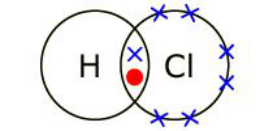
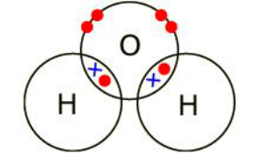
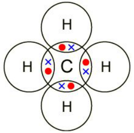
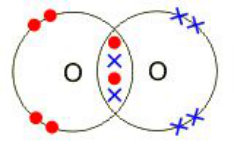
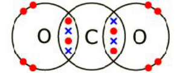
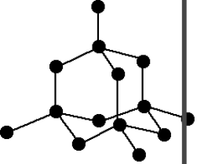

<u>Edexcel</u> IGCSE Chemistry 

Topic 1: Principles of chemistry **Covalent**   **bonding** 

**Notes** 

_<mark>1.44</mark>_   _<mark>know</mark>_   _<mark>that</mark>_   _<mark>a</mark>_   _<mark>covalent</mark>_   _<mark>bond</mark>_   _<mark>is</mark>_   _<mark>formed</mark>_   _<mark>between</mark>_   _<mark>atoms</mark>_   _<mark>by</mark>_   _<mark>the</mark>_   _<mark>sharing</mark>_   _<mark>of a</mark>_   _<mark>pair</mark>_   _<mark>of</mark>_   _<mark>electrons</mark>_ 

- Covalent bonding occurs in most non-metallic elements and in compounds of nonmetals 

- When atoms share pairs of electrons, they form covalent bonds. These bonds between atoms are strong. 

_<mark>1.45</mark>_   _<mark>understand</mark>_   _<mark>covalent</mark>_   _<mark>bonds</mark>_   _<mark>in</mark>_   _<mark>terms</mark>_   _<mark>of</mark>_   _<mark>electrostatic</mark>_   _<mark>attractions</mark>_ 

- Strong bonds between atoms that are covalently bonded are the result of electrostatic attraction between the positive nuclei of the atoms and the pairs of negative electrons that are shared between them 

_<mark>1.46</mark>_   _<mark>understand</mark>_   _<mark>how</mark>_   _<mark>to</mark>_   _<mark>use</mark>_   _<mark>dot-and-cross</mark>_   _<mark>diagrams</mark>_   _<mark>to</mark>_   _<mark>represent</mark>_   _<mark>covalent bonds</mark>_   _<mark>in:</mark>_   _<mark>diatomic</mark>_   _<mark>molecules,</mark>_   _<mark>including</mark>_   _<mark>hydrogen,</mark>_   _<mark>oxygen,</mark>_   _<mark>nitrogen, halogens</mark>_   _<mark>and</mark>_   _<mark>hydrogen</mark>_   _<mark>halides,</mark>_   _<mark>inorganic</mark>_   _<mark>molecules</mark>_   _<mark>including</mark>_   _<mark>water, ammonia</mark>_   _<mark>and</mark>_   _<mark>carbon</mark>_   _<mark>dioxide,</mark>_   _<mark>organic</mark>_   _<mark>molecules</mark>_   _<mark>containing</mark>_   _<mark>up</mark>_   _<mark>to</mark>_   _<mark>two carbon</mark>_   _<mark>atoms,</mark>_   _<mark>including</mark>_   _<mark>methane,</mark>_   _<mark>ethane,</mark>_   _<mark>ethene</mark>_   _<mark>and</mark>_   _<mark>those</mark>_   _<mark>containing halogen</mark>_   _<mark>atoms</mark>_ 

some from the above list: 

hydrogen **                                                                                  ** hydrogen chloride 

 **                  ** water **                                                                                            ** methane 

 **        ** oxygen **                                                         ** carbon dioxide 

- _<mark>1.47</mark>_   _<mark>explain</mark>_   _<mark>why</mark>_   _<mark>substances</mark>_   _<mark>with</mark>_   _<mark>a</mark>_   _<mark>simple</mark>_   _<mark>molecular</mark>_   _<mark>structures</mark>_   _<mark>are</mark>_   _<mark>gases</mark>_   _<mark>or liquids,</mark>_   _<mark>or</mark>_   _<mark>solids</mark>_   _<mark>with</mark>_   _<mark>low</mark>_   _<mark>melting</mark>_   _<mark>and</mark>_   _<mark>boiling</mark>_   _<mark>points;</mark>_   _<mark>the</mark>_   _<mark>term intermolecular</mark>_   _<mark>forces</mark>_   _<mark>of</mark>_   _<mark>attraction</mark>_   _<mark>can</mark>_   _<mark>be</mark>_   _<mark>used</mark>_   _<mark>to</mark>_   _<mark>represent</mark>_   _<mark>all</mark>_   _<mark>forces between</mark>_   _<mark>molecules</mark>_ 

   - Substances that consist of small molecules are usually gases or liquids that have low boiling and melting points. 

   - Substances that consist of small molecules have weak intermolecular forces between the molecules. These are broken in boiling or melting, not the covalent bonds. 

   - Substances that consist of small molecules don’t conduct electricity, because small molecules do not have an overall electric charge. 

- _<mark>1.48</mark>_   _<mark>explain</mark>_   _<mark>why</mark>_   _<mark>the</mark>_   _<mark>melting</mark>_   _<mark>and</mark>_   _<mark>boiling</mark>_   _<mark>points</mark>_   _<mark>of</mark>_   _<mark>substances</mark>_   _<mark>with</mark>_   _<mark>simple molecular</mark>_   _<mark>structures</mark>_   _<mark>increase,</mark>_   _<mark>in</mark>_   _<mark>general,</mark>_   _<mark>with</mark>_   _<mark>increasing</mark>_   _<mark>relative</mark>_   _<mark>molecular mass</mark>_ 

   - The intermolecular forces increase with the size of the molecules, so larger molecules (i.e. molecules with greater relative molecular masses) have higher melting and boiling points. 

_<mark>1.49</mark>_   _<mark>explain</mark>_   _<mark>why</mark>_   _<mark>substances</mark>_   _<mark>with</mark>_   _<mark>giant</mark>_   _<mark>covalent</mark>_   _<mark>structures</mark>_   _<mark>are</mark>_   _<mark>solids</mark>_   _<mark>with high</mark>_   _<mark>melting</mark>_   _<mark>and</mark>_   _<mark>boiling</mark>_   _<mark>points</mark>_ 

- Substances that consist of giant covalent structures are solids with very high melting points. 

- All of the atoms in these structures are linked to other atoms by strong covalent bonds. 

- These bonds must be overcome to melt or boil these substances. 

© www.pmt.education wwopmteducation 

# _<mark>1.50</mark>_   _<mark>explain</mark>_   _<mark>how</mark>_   _<mark>the</mark>_   _<mark>structures</mark>_   _<mark>of</mark>_   _<mark>diamond,</mark>_   _<mark>graphite</mark>_   _<mark>and</mark>_   _<mark>C60</mark>_   _<mark>fullerene influence</mark>_   _<mark>their</mark>_   _<mark>physical</mark>_   _<mark>properties,</mark>_   _<mark>including</mark>_   _<mark>electrical</mark>_   _<mark>conductivity</mark>_   _<mark>and hardness</mark>_ {#pmt-4ch1-notes-unit-1-1g-covalent-bonding-s1}
# <u>Diamond</u> {#pmt-4ch1-notes-unit-1-1g-covalent-bonding-s2}
- In diamond (right), each carbon is joined to 4 other carbons covalently. 

   - It’s very hard, has a very high melting point and does not conduct electricity. 

# <u>Graphite</u> {#pmt-4ch1-notes-unit-1-1g-covalent-bonding-s3}
- In graphite, each carbon is covalently bonded to 3 other carbons, forming layers of hexagonal rings, which have no covalent bonds between the layers. 

   - The layers can slide over each other due to no covalent bonds between the layers, but weak intermolecular forces. Meaning that graphite is soft and slippery. 

- One electron from each carbon atom is delocalised. 

   - This makes graphite similar to metals, because of its delocalised electrons. 

   - It can conduct electricity – unlike Diamond. 

## <u>Graphene</u> {#pmt-4ch1-notes-unit-1-1g-covalent-bonding-s4}
- Single layer of graphite 

- Has properties that make it useful in electronics and composites 

## <u>Carbon</u> can also form fullerenes with different numbers of carbon atoms. {#pmt-4ch1-notes-unit-1-1g-covalent-bonding-s5}
- Molecules of carbon atoms with hollow shapes 

- They are based on hexagonal rings of carbon atoms, but they may also contain rings with five or seven carbon atoms 

- The first fullerene to be discovered was Buckminsterfullerene (C60), which has a spherical shape 

## <u>Carbon</u> nanotubes {#pmt-4ch1-notes-unit-1-1g-covalent-bonding-s6}
   - Cylindrical fullerenes with very high length to diameter ratios 

   - Their properties make them useful for nanotechnology, electronics and materials 

- _<mark>1.51</mark>_   _<mark>know</mark>_   _<mark>that</mark>_   _<mark>covalent</mark>_   _<mark>compounds</mark>_   _<mark>do</mark>_   _<mark>not</mark>_   _<mark>usually</mark>_   _<mark>conduct</mark>_   _<mark>electricity</mark>_ 

   - exceptions include: graphite and graphene
