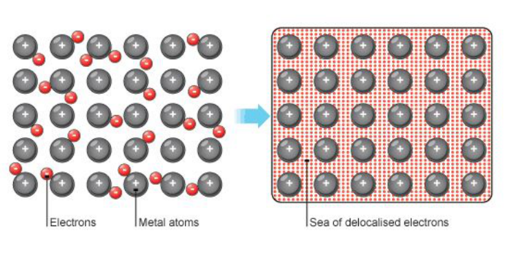

<u>Edexcel</u> IGCSE Chemistry Topic 1: Principles of chemistry **Metallic**   **bonding** 

**Notes** 

# _<mark>1.52</mark>_   _<mark>(chemistry</mark>_   _<mark>only)</mark>_   _<mark>know</mark>_   _<mark>how</mark>_   _<mark>to</mark>_   _<mark>represent</mark>_   _<mark>a</mark>_   _<mark>metallic</mark>_   _<mark>lattice</mark>_   _<mark>by</mark>_   _<mark>a</mark>_   _<mark>2-D diagram</mark>_ {#pmt-4ch1-notes-unit-1-1h-metallic-bonding-chemistry-only-s1}
- Metals consist of giant structures of atoms arranged in a regular pattern. 

- ● The electrons in the outer shell of metal atoms are delocalised and so are free to move through the whole structure. 

- The sharing of delocalised electrons gives rise to strong metallic bonds. 

# _<mark>1.53</mark>_   _<mark>(chemistry</mark>_   _<mark>only)</mark>_   _<mark>understand</mark>_   _<mark>metallic</mark>_   _<mark>bonding</mark>_   _<mark>in</mark>_   _<mark>terms</mark>_   _<mark>of</mark>_   _<mark>electrostatic attractions</mark>_ {#pmt-4ch1-notes-unit-1-1h-metallic-bonding-chemistry-only-s2}
- Strong electrostatic attraction between negatively charged electrons and positive metal ions 

# _<mark>1.54</mark>_   _<mark>(chemistry</mark>_   _<mark>only)</mark>_   _<mark>explain</mark>_   _<mark>typical</mark>_   _<mark>physical</mark>_   _<mark>properties</mark>_   _<mark>of</mark>_   _<mark>metals,</mark>_   _<mark>including electrical</mark>_   _<mark>conductivity</mark>_   _<mark>and</mark>_   _<mark>malleability</mark>_ {#pmt-4ch1-notes-unit-1-1h-metallic-bonding-chemistry-only-s3}
- Metals have giant structures of atoms with strong metallic bonding. 

   - Therefore, most metals have high melting and boiling points. 

   - They can conduct heat and electricity because of the delocalised electrons in their structures. 

   - The layers of atoms in metals are able to slide over each other, so metals can be bent and shaped. 

© www.pmt.education wwopmteducation
